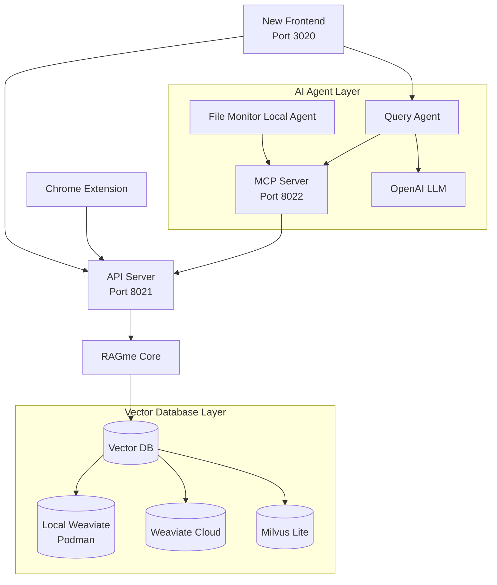

# RAGme.ai

A personalized agent to [RAG](https://en.wikipedia.org/wiki/Retrieval-augmented_generation) websites and documents you care about and let you query them in an agentic fashion.

## 🖼️ Screenshots

<div style="display: flex; gap: 20px; margin: 20px 0;">
  <a href="images/ragme1.png" target="_blank">
    
  </a>
  <a href="images/ragme2.png" target="_blank">
    
  </a>
  <a href="images/ragme3.png" target="_blank">
    
  </a>
</div>

*Click any image to view full size*

## 🆕 Latest Updates

### ✨ New Features (Latest Release)

- **🧪 Enhanced Testing Framework**: Comprehensive test suite with subcommands for unit, API, MCP, and integration tests
- **🧹 Smart Test Cleanup**: Integration tests now properly clean up test documents from vector database
- **💾 Save Chat Responses**: Save individual AI responses as markdown files with smart filename generation
- **📧 Email Chat Responses**: Send AI responses via email with pre-filled subject and content
- **📄 Smart Document Chunking**: Large documents are automatically split into manageable chunks while preserving readability
- **🎯 Enhanced Document Management**: Grouped document display with chunk counts and improved deletion functionality
- **📊 Interactive Visualizations**: D3.js-powered charts with click-to-scroll functionality and responsive resizing
- **🔄 Real-time Refresh**: Improved document list and visualization synchronization
- **🗑️ Bulk Document Operations**: Delete entire chunked documents with a single click
- **🔍 Pattern-Based Document Deletion**: Delete documents matching regex patterns
- **📱 Responsive Design**: Better mobile and desktop experience with collapsible sidebars

## 📚 Documentation

📖 **Complete documentation is available in the [docs/](docs/) directory:**

- **[📋 Project Overview](docs/PRESENTATION.md)** - Complete project overview with examples
- **[🔧 Vector Database Abstraction](docs/VECTOR_DB_ABSTRACTION.md)** - Guide to the vector database agnostic architecture  
- **[🤝 Contributing Guidelines](docs/CONTRIBUTING.md)** - How to contribute to the project
- **[📖 Documentation Index](docs/README.md)** - Full documentation structure

## 🚀 Quick Start

### Requirements

Install and/or update the following if needed:

1. Install [Python 3.12](https://www.python.org/downloads/) or later
2. Install [`uv`](https://docs.astral.sh/uv/getting-started/installation/) 
3. Install [`gh`](https://cli.github.com/) from GitHub
4. Install [Node.js 18+](https://nodejs.org/) (for new frontend)
5. Vector Database setup (**Weaviate recommended**, or Milvus Lite)

### Get code, setup dependencies

```bash
gh repo clone maximilien/ragme-ai
cd ragme-ai

# Setup virtual environment
uv venv
source .venv/bin/activate

# Install dependencies
uv sync --extra dev
```

### Vector Database Setup

#### Option 1: Weaviate (Recommended)

For local development with Weaviate:

```bash
# Start local Weaviate
./tools/weaviate-local.sh start

# Check status
./tools/weaviate-local.sh status
```

Or use Weaviate Cloud:
1. Create an account at [Weaviate Cloud](https://console.weaviate.cloud/)
2. Create a `Sandbox` cluster (free for 14 days)
3. Create a collection named "RagMeDocs"
4. Get your `WEAVIATE_URL` and `WEAVIATE_API_KEY`

#### Option 2: Milvus Lite (Alternative - Local Development)

No setup required - automatically creates a local database file:

```bash
VECTOR_DB_TYPE=milvus
MILVUS_URI=milvus_demo.db
```

### Configuration

Create a `.env` file with your API keys:

```bash
# Copy the example configuration
cp env.example .env

# Edit .env with your values:
OPENAI_API_KEY=sk-proj-*****-**
VECTOR_DB_TYPE=weaviate-local  # Recommended for local development
# VECTOR_DB_TYPE=weaviate  # For cloud Weaviate
# VECTOR_DB_TYPE=milvus  # For Milvus Lite

# For Local Weaviate (only if VECTOR_DB_TYPE=weaviate-local):
WEAVIATE_LOCAL_URL=http://localhost:8080

# For Weaviate Cloud (only if VECTOR_DB_TYPE=weaviate):
WEAVIATE_API_KEY=*****
WEAVIATE_URL=*****.weaviate.cloud

RAGME_API_URL=http://localhost:8021
RAGME_MCP_URL=http://localhost:8022
```

## 🏃‍♂️ Run RAGme.ai

### Quick Start (All Services)

Use the provided startup script to launch all services:

```bash
chmod +x start.sh
./start.sh
```

This will start all services and you can access the **new frontend** at `http://localhost:3020`

### Process Management

```bash
# Stop all services
./stop.sh

# Restart all services
./stop.sh restart

# Check service status
./stop.sh status
```

### Debugging and Log Monitoring

```bash
# Monitor all service logs
./tools/tail-logs.sh all

# Monitor specific services
./tools/tail-logs.sh api        # API logs (port 8021)
./tools/tail-logs.sh mcp        # MCP logs (port 8022)
./tools/tail-logs.sh frontend   # Frontend logs (port 3020)
```

For detailed process management, see [Process Management Guide](docs/PROCESS_MANAGEMENT.md).

## 🎯 Use Cases and Features

1. **Interactive personal RAG** - Add websites and documents and query them with an LLM agent
2. **Content collection** - Collect websites or documents on a particular topic
3. **Blog processing** - Collect posts from a blog and search them
4. **Daily activity tracking** - Collect visited sites from daily activities
5. **Document management** - Collect and process documents from users
6. **Automatic processing** - Add documents by copying to a watch directory
7. **Browser integration** - Add web pages with a Chrome extension

## 🛠️ Components

### New Frontend UI ⭐ **DEFAULT**

A modern, responsive web interface with three-pane layout:

- **Left Sidebar**: Chat history (collapsible)
- **Center**: Main chat area with input
- **Right Sidebar**: Recent documents with D3.js visualization (resizable)

**Key Features**:
- **Real-time chat** with markdown support and copy functionality
- **Quick New Chat**: "+" button in chat history sidebar for instant new chat creation
- **Save and Email**: Save individual responses as markdown files or send via email
- **Smart document management** with automatic chunking and grouped display
- **Date filtering**: Filter documents by Current, This Month, This Year, or All
- **Interactive visualizations** with D3.js charts (bar, pie, network graphs)
- **Click-to-scroll functionality** - click on visualization nodes to scroll to documents
- **Responsive design** with collapsible sidebars and smooth animations
- **Content addition** via URLs, file uploads, or JSON data
- **WebSocket communication** for real-time updates

**Access**: `http://localhost:3020` (default when running `./start.sh`)

### Chrome Extension

A Chrome extension to easily add web pages to your collection:

1. **Load the extension**:
   - Open Chrome and go to `chrome://extensions/`
   - Enable "Developer mode"
   - Click "Load unpacked" and select the `chrome_ext/` directory

2. **Use the extension**:
   - Navigate to any webpage you want to add
   - Click the RAGme extension icon
   - Click "Capture Page" to add the current page

**Note**: The extension requires the API server to be running on `http://localhost:8021`

### Watch Directory

The system can automatically process PDF and DOCX files by monitoring a watch directory:

1. **Add files**: Copy PDF or DOCX files to the `watch_directory/` folder
2. **Automatic processing**: The agent will detect new files and add them to your collection
3. **Smart chunking**: Large documents are automatically split into manageable chunks
4. **Supported formats**: PDF and DOCX files are automatically processed and indexed

**Note**: The file monitoring agent must be running for this feature to work.

## 📖 Example Usage

### Current affairs

1. Go to [Google News](https://news.google.com/home?hl=en-US&gl=US&ceid=US:en) and add a few articles you care about
2. Ask RAGme.ai to summarize or ask any question about the article

### Blogs 

1. Ask `Crawl my <favorite.blog.url> up to 10 posts and add to my collection`
2. Ask RAGme.ai questions about the blog posts ingested

### Code

1. Find your favorite OSS GitHub project and ask `Crawl my <favorite.oss.github.url> up to 10 deep and add to my collection`
2. Ask RAGme.ai questions about the project, e.g., give a quick user guide

## 🏗️ Architecture

RAGme.ai uses a multi-service architecture:



### Components

- **New Frontend** (port 3020): Modern web interface with three-pane layout ⭐ **DEFAULT**
- **API Server** (port 8021): REST API for URL and JSON ingestion
- **MCP Server** (port 8022): Document processing for PDF and DOCX files
- **File Monitor Agent**: Watches `watch_directory/` for new files
- **Chrome Extension**: Browser extension for capturing web pages
- **RAGme Core**: Main RAG processing logic using LlamaIndex and vector database abstraction
- **Vector Database Layer**: Modular support for multiple vector databases (Weaviate, Milvus, etc.)

## 🚧 Current Limitations

1. Uses the same collection for all users
2. Tied to LlamaIndex as agent and RAG

## 🔮 Next Steps

1. ✅ ~~Decouple the Weaviate vector database dependency~~ - **Completed!** See [Vector Database Abstraction](docs/VECTOR_DB_ABSTRACTION.md)
2. ✅ ~~Add modern frontend UI~~ - **Completed!** New three-pane interface with real-time features
3. ✅ ~~Add local Weaviate support~~ - **Completed!** Podman-based local deployment
4. ✅ ~~Add debugging and monitoring tools~~ - **Completed!** Comprehensive log monitoring
5. Decouple [LlamaIndex](https://www.llamaindex.ai/) for parsing and RAG-ing of documents. Allow others like [docling](https://github.com/docling-project)
6. Decouple LlamaIndex as the query agent
7. Add security at minimum HTTPS
8. Add ability to add images and videos
9. Allow multiple users (SaaS)
10. Support other types of content: images, audio, and video
11. Add ability to ingest emails by forwarding to a xyz@ragme.io email
12. Add ability to ingest content from Slack
13. Add ability to ingest content from X / Twitter

## 🛠️ Development

### Code Quality

We maintain high code quality standards using automated linting and formatting:

```bash
# Run linting checks (required before submitting PRs)
./tools/lint.sh

# Auto-fix linting issues where possible
uv run ruff check --fix src/ tests/

# Format code
uv run ruff format src/ tests/ examples/
```

### Testing

```bash
# Run all tests (unit + API + MCP + integration)
./test.sh all

# Run specific test categories
./test.sh unit         # Unit tests only
./test.sh api          # API tests only  
./test.sh mcp          # MCP server tests only
./test.sh integration  # Integration tests only

# Run tests with coverage
uv run pytest --cov=src/ragme tests/

# Show test help
./test.sh help
```

**Test Categories**:
- **Unit Tests**: Core functionality, vector databases, agents, utilities
- **API Tests**: FastAPI endpoints, response validation, request handling
- **MCP Tests**: Model Context Protocol server, endpoint validation, protocol compliance
- **Integration Tests**: End-to-end system testing, service communication, file monitoring

For detailed development guidelines, see [CONTRIBUTING.md](docs/CONTRIBUTING.md).

## 🤝 How can I help

I welcome any PRs, especially when solving an open issue or fixing a new problem.

Additionally, I would love to hear your feedback on new use cases or usage patterns.

📖 **For detailed contribution guidelines, see [CONTRIBUTING.md](docs/CONTRIBUTING.md)**

Created with ❤️ by @maximilien

## Vector Database Support

RagMe supports multiple vector database backends with a modular architecture:

### Weaviate (Recommended) ⭐ **RECOMMENDED**
- **Cloud-based**: Managed vector database service
- **Local support**: Podman-based local deployment
- **Automatic vectorization**: Built-in embedding capabilities
- **Query agents**: Advanced query capabilities
- **Easy setup**: No server setup required for local development

#### Configuring Local Weaviate

```bash
# Choose local Weaviate as the vector database
VECTOR_DB_TYPE=weaviate-local
WEAVIATE_LOCAL_URL=http://localhost:8080

# Start local Weaviate
./tools/weaviate-local.sh start
```

See `examples/weaviate_local_example.py` for a complete example.

### Milvus (Alternative)
- **Milvus Lite**: Local development with no server setup required
- **High-performance**: Vector search and similarity matching
- **Easy setup**: Automatic local database file creation
- **Production ready**: Can scale to Milvus Server for production

#### Configuring Milvus

```bash
# Choose Milvus as the vector database
VECTOR_DB_TYPE=milvus
MILVUS_URI=milvus_demo.db
```

See `examples/milvus_example.py` for a complete example.

For detailed information about the vector database abstraction, see [VECTOR_DB_ABSTRACTION.md](docs/VECTOR_DB_ABSTRACTION.md).
