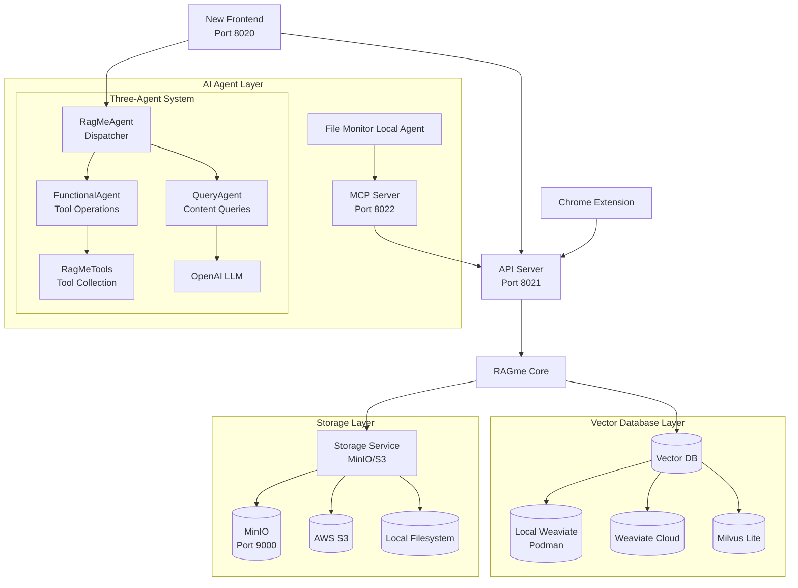

# RAGme.io

A personalized agent to [RAG](https://en.wikipedia.org/wiki/Retrieval-augmented_generation) websites and documents you care about and let you query them in an agentic fashion.

## 🖼️ Screenshots

<div style="display: flex; gap: 20px; margin: 20px 0;">
  <a href="images/ragme1.png" target="_blank">
    
  </a>
  <a href="images/ragme2.png" target="_blank">
    
  </a>
  <a href="images/ragme3.png" target="_blank">
    
  </a>
  <a href="images/ragme4.png" target="_blank">
    
  </a>
  </div>

*Click any image to view full size*

## 🆕 Latest Updates

### ✨ Recent Features (Last 2 Weeks)

- **🔐 OAuth Authentication System**: Complete OAuth authentication system with support for Google, GitHub, and Apple providers. Features include beautiful login modal, JWT-based session management, secure cookie storage, user management, and development bypass mode. All authentication flows are properly implemented with comprehensive error handling and mobile-responsive design! ⭐ **NEW!**
- **🌍 Internationalization (i18n) Support**: Comprehensive internationalization support ensuring LLM agents respond consistently in the configured language. Features automatic system language detection, 80+ language support, and frontend speech recognition integration. All system prompts now include language specification to prevent mixed-language responses! ⭐ **NEW!**
- **🔄 AI Summary Force Refresh**: Added force refresh button next to AI Summary titles allowing users to regenerate summaries on demand. Features include proper HTTP request handling, UI state management, and visual feedback during regeneration. Bypasses cached summaries to generate fresh content! ⭐ **NEW!**
- **🧠 AI Summary Caching**: Intelligent caching system that stores AI-generated summaries in document metadata to prevent redundant generation. Features include automatic cache checking, visual "Cached Summary" indicators, and seamless integration with both document and image collections! ⭐ **NEW!**
- **⏳ Frontend Progress Indicator**: Added a spinning wheel progress indicator next to the "Add Content" button that shows during document and image processing. Provides visual feedback for upload, text extraction, AI analysis, and OCR stages. The "Add Content" button is disabled during processing with automatic timeout protection! ⭐ **NEW!**
- **🖼️ PDF Image Extraction Bug Fixes**: Fixed three critical bugs with PDF image extraction: missing date/time information, storage integration issues, and "Unknown Image" display in AI summaries. Extracted images now have proper metadata, are stored correctly, and show meaningful filenames! ⭐ **FIXED!**
- **🎯 Query Threshold Optimizer**: Automated binary search tool to find optimal `text_relevance_threshold` values for your specific document collection. Tests multiple query scenarios and automatically updates `config.yaml` with the best performing threshold! ⭐ **NEW!**
- **🔧 Watch Directory Duplicate Processing Fix**: Fixed critical bug where large documents added via watch directory were being processed multiple times, creating duplicate files in storage and vector database. Now ensures single document creation with proper chunking! ⭐ **FIXED!**
- **📄 Robust PDF Processing**: Enhanced PDF processing with multiple library fallbacks (PyMuPDF, pdfplumber, PyPDF2) to handle corrupted PDFs and "EOF marker not found" errors. Automatic PDF repair and graceful error handling! ⭐ **NEW!**
- **🎯 Intelligent Image Ranking**: Enhanced image relevance scoring with intelligent pre-filtering and improved LLM reranking to exclude irrelevant images. Now properly filters out UI elements, screenshots, and documents when searching for content (e.g., Vectras PDF screenshots won't appear in dog queries)! ⭐ **NEW!**
- **🔧 Weaviate UUID Bug Fix**: Fixed critical bug where Weaviate UUID objects were causing "'_WeaviateUUIDInt' object is not subscriptable" errors in logging utilities. Now properly handles Weaviate UUID types for safe logging! ⭐ **FIXED!**
- **⚙️ Configuration Structure Reorganization**: Reorganized the `query` section in `config.yaml` with a nested `rerank` structure for better organization. Updated config manager, QueryAgent, and frontend to use the new nested structure with proper defaults and UI controls for rerank settings. ⭐ **IMPROVED!**

> **📚 For complete feature history and detailed documentation, see the [docs/](docs/) directory.**

## 📚 Documentation

📖 **Complete documentation is available in the [docs/](docs/) directory:**

- **[📖 User Guide](docs/USER_GUIDE.md)** - Complete user guide with installation, configuration, and usage
- **[🎛️ Configuration Reference](docs/CONFIGURATION.md)** - Detailed configuration options and examples
- **[🏗️ Architecture Guide](docs/ARCHITECTURE.md)** - System architecture, three-agent system, and technical design
- **[🛠️ Development Guide](docs/DEVELOPMENT.md)** - Development setup, testing, and contribution guidelines
- **[🔧 Troubleshooting Guide](docs/TROUBLESHOOTING.md)** - Common issues, solutions, and debugging techniques
- **[📖 Documentation Index](docs/README.md)** - Documentation overview and navigation

## ☸️ Kubernetes Deployment ⭐ **PRODUCTION READY!**

RAGme now supports full Kubernetes deployment with high availability, automatic load balancing, and comprehensive troubleshooting:

- **🐳 Containerized Services** - All RAGme services packaged as containers
- **⚓ Kubernetes Manifests** - Production-ready deployment configurations with 2-replica high availability
- **🎛️ Custom Operator** - Declarative RAGme management with Go-based operator
- **🚀 One-Click Deployment** - Deploy to local Kind cluster with single command
- **🔄 Automatic Load Balancing** - Built-in Kubernetes Services with health checking and failover
- **🛠️ Comprehensive Troubleshooting** - Detailed debugging guides and recovery procedures

### Quick Kubernetes Setup

```bash
# Deploy to local Kind cluster with high availability
cd deployment
./deploy.sh deploy

# Access services (with automatic load balancing)
# Frontend: http://localhost:30020 (2 replicas)
# API: http://localhost:30021 (2 replicas)
# MinIO Console: http://localhost:30901
```

### High Availability Features

- **Multi-Replica Services**: Frontend and API run with 2 replicas for fault tolerance
- **Automatic Load Balancing**: Kubernetes Services distribute traffic across healthy pods
- **Health Checking**: Readiness and liveness probes ensure only healthy pods receive traffic
- **Zero-Downtime Deployments**: Rolling updates maintain service availability
- **Automatic Failover**: Failed pods are removed from rotation without manual intervention

### Advanced Deployment Options

```bash
# Use RAGme Operator for declarative management
kubectl apply -f deployment/operator/config/samples/ragme_v1_ragme.yaml

# Production deployment with custom configuration
kubectl apply -f my-production-ragme.yaml

# Scale services for higher load
kubectl scale deployment ragme-frontend --replicas=3 -n ragme
kubectl scale deployment ragme-api --replicas=3 -n ragme
```

**📚 Complete Kubernetes Documentation:**
- **[🚀 Deployment Guide](deployment/README.md)** - Complete Kubernetes deployment guide with troubleshooting
- **[🐳 Containerization](docs/DEPLOYMENT_CONTAINERS.md)** - Container build and management
- **[⚓ Kubernetes Manifests](docs/DEPLOYMENT_KUBERNETES.md)** - Kubernetes resource definitions
- **[🎛️ Operator Guide](docs/DEPLOYMENT_OPERATOR.md)** - Custom operator usage and development
- **[🔧 Troubleshooting](docs/DEPLOYMENT_TROUBLESHOOTING.md)** - Common issues and solutions

## 🚀 Quick Start

### Requirements

Install and/or update the following if needed:

1. Install [Python 3.12](https://www.python.org/downloads/) or later
2. Install [`uv`](https://docs.astral.sh/uv/getting-started/installation/) 
3. Install [`gh`](https://cli.github.com/) from GitHub
4. Install [Node.js 18+](https://nodejs.org/) (for new frontend)
5. Vector Database setup (**Weaviate recommended**, or Milvus Lite)

### 🛠️ Quick Setup (Recommended)

For the fastest setup experience, use our automated setup script:

```bash
# Clone the repository
gh repo clone maximilien/ragme-io
cd ragme-io

# Run the automated setup script
./setup.sh
```

The setup script will:
- ✅ Install system dependencies (Homebrew, Node.js, Python)
- ✅ Install Python dependencies using uv
- ✅ Install Node.js dependencies for the frontend
- ✅ Create .env file from template
- ✅ Run initial tests to verify setup
- ✅ Provide next steps and useful commands

**Options:**
```bash
./setup.sh --help              # Show all options
./setup.sh --skip-python       # Skip Python setup
./setup.sh --skip-node         # Skip Node.js setup
./setup.sh --force             # Force reinstall everything
```

### Manual Setup (Alternative)

```bash
gh repo clone maximilien/ragme-io
cd ragme-io

# Setup virtual environment
uv venv
source .venv/bin/activate

# Install dependencies
uv sync --extra dev
```

### Storage Service Setup

RAGme.io now includes a comprehensive S3-compatible file storage service using MinIO for local development and production-ready S3 support.

#### MinIO Local Development (Recommended)

MinIO is automatically installed and configured during setup:

```bash
# MinIO is automatically started with ./start.sh
./start.sh

# Access MinIO Console: http://localhost:9001
# Default credentials: minioadmin / minioadmin
# Default bucket: ragme-storage
```

**Features:**
- **Local Development**: MinIO runs on port 9000 with console on port 9001
- **Automatic Setup**: Installed via Homebrew during `./setup.sh`
- **Bucket Management**: Automatic bucket creation and management
- **File Operations**: Upload, download, list, delete, and presigned URLs
- **Multiple Backends**: Support for MinIO, S3, and local filesystem storage
- **Service Architecture**: MinIO runs as an independent service - RAGme never modifies MinIO source code

#### S3 Production Configuration

For production deployments, configure S3 storage in `config.yaml`:

```yaml
storage:
  type: "s3"
  s3:
    endpoint: "${S3_ENDPOINT}"
    access_key: "${S3_ACCESS_KEY}"
    secret_key: "${S3_SECRET_KEY}"
    bucket_name: "${S3_BUCKET_NAME}"
    region: "${S3_REGION:-us-east-1}"
    secure: true
```

### Vector Database Setup

#### Option 1: Weaviate (Recommended)

For local development with Weaviate:

```bash
# Start local Weaviate
./tools/weaviate-local.sh start

# Check status
./tools/weaviate-local.sh status
```

Or use Weaviate Cloud:
1. Create an account at [Weaviate Cloud](https://console.weaviate.cloud/)
2. Create a `Sandbox` cluster (free for 14 days)
3. Create a collection named "RagMeDocs"
4. Get your `WEAVIATE_URL` and `WEAVIATE_API_KEY`

#### Option 2: Milvus Lite (Alternative - Local Development)

No setup required - automatically creates a local database file:

```bash
VECTOR_DB_TYPE=milvus
MILVUS_URI=milvus_demo.db
```

### Configuration

Create a `.env` file with your API keys:

```bash
# Copy the example configuration
cp env.example .env

# Edit .env with your values:
OPENAI_API_KEY=sk-proj-*****-**
VECTOR_DB_TYPE=weaviate-local  # Recommended for local development
# VECTOR_DB_TYPE=weaviate  # For cloud Weaviate
# VECTOR_DB_TYPE=milvus  # For Milvus Lite

# For Local Weaviate (only if VECTOR_DB_TYPE=weaviate-local):
WEAVIATE_LOCAL_URL=http://localhost:8080

# For Weaviate Cloud (only if VECTOR_DB_TYPE=weaviate):
WEAVIATE_API_KEY=*****
WEAVIATE_URL=*****.weaviate.cloud

RAGME_API_URL=http://localhost:8021
RAGME_MCP_URL=http://localhost:8022

# Optional: Custom ports for services
RAGME_API_PORT=8021
RAGME_MCP_PORT=8022

# OAuth Authentication (Optional - for production deployments)
# Google OAuth
GOOGLE_OAUTH_CLIENT_ID=your-google-oauth-client-id
GOOGLE_OAUTH_CLIENT_SECRET=your-google-oauth-client-secret
GOOGLE_OAUTH_REDIRECT_URI=http://localhost:3020/auth/google/callback

# GitHub OAuth
GITHUB_OAUTH_CLIENT_ID=your-github-oauth-client-id
GITHUB_OAUTH_CLIENT_SECRET=your-github-oauth-client-secret
GITHUB_OAUTH_REDIRECT_URI=http://localhost:3020/auth/github/callback

# Apple OAuth
APPLE_OAUTH_CLIENT_ID=your-apple-oauth-client-id
APPLE_OAUTH_CLIENT_SECRET=your-apple-oauth-client-secret
APPLE_OAUTH_REDIRECT_URI=http://localhost:3020/auth/apple/callback

# Session Configuration
SESSION_SECRET_KEY=your-session-secret-key-change-in-production
RAGME_FRONTEND_PORT=8020
```

### 🎛️ Advanced Configuration (NEW!)

RAGme now supports comprehensive configuration management through `config.yaml` for easy customization and client deployment:

```bash
# Copy the example configuration to project root
cp config.yaml.example config.yaml

# Edit the configuration file (located in project root)
nano config.yaml
```

> **📁 Developer Note:** The `config.yaml` file is located in the project root and is automatically ignored by git (added to `.gitignore`), allowing each developer to maintain their own local configuration without affecting the repository.

The configuration system allows you to customize:

- **🌐 Network settings** (ports, CORS, hosts)
- **🗄️ Vector database configurations** (multiple databases, connection settings)
- **🤖 LLM settings** (models, temperature, tokens)
- **🔧 MCP server configurations** (authentication, enabled services)
- **🎨 Frontend customization** (UI settings, branding, colors)
- **🔐 OAuth authentication** (Google, GitHub, Apple providers, session management)
- **🚩 Feature flags** (enable/disable functionality)
- **🔒 Security settings** (file upload limits, CSP)
- **📊 Client branding** (logos, colors, welcome messages)

**📚 Complete Configuration Guide:** See **[docs/CONFIG.md](docs/CONFIG.md)** for detailed configuration options, examples, and best practices.

**🔄 Environment Switching:** Switch between different application environments (e.g., RAGme ↔ YourFancyRAG) by simply changing the `.env` file and restarting with `./stop.sh && ./start.sh`. All configuration changes (APPLICATION_*, VECTOR_DB_TYPE, collection names) take effect immediately.

### 🎨 UI Settings Configuration ⭐ **ENHANCED!**

RAGme now features a completely redesigned Settings interface with organized tabbed layout and comprehensive configuration options from `config.yaml`:

#### 📋 Enhanced Settings Interface

**⚙️ Tabbed Organization:**
- **General Tab**: Application info, auto-refresh settings, display preferences
- **Interface Tab**: Layout settings, panel visibility, visualization preferences  
- **Documents Tab**: Document processing, search & filtering options
- **Chat Tab**: AI model settings, chat history management

**🔧 General Settings:**
- **Application Information**: View app name, version, and vector database type
- **Auto-Refresh**: Enable/disable automatic content refresh with configurable intervals
- **Max Documents**: Maximum number of documents to display (1-100)
- **Show Vector DB Info**: Display vector database type and collection information in the header

**📱 Interface Settings:**
- **Layout Controls**: Adjustable panel widths with live preview sliders
- **Panel Visibility**: Configure which panels start collapsed/expanded
- **Visualization Options**: Default chart types (graph/chart/table) and date filters
- **Document List Width**: Width of the document list pane (20-60%, default: 35%)
- **Chat History Width**: Width of the chat history pane (5-30%, default: 10%)

**📄 Document Settings:**
- **Document Overview**: Enable/disable document visualization features
- **Display Limits**: Configure max documents and pagination size
- **Content Filtering**: Default content type filters (documents/images/both)

**🤖 Chat Settings:**
- **AI Model Parameters**: Max tokens (1000-16000) and temperature (0-2) with live sliders
- **Chat History Management**: History limits and auto-save preferences

#### ⚙️ Configuration Methods

**1. Backend Configuration (`config.yaml`):**
```yaml
frontend:
  ui:
    show_vector_db_info: true
    document_overview_enabled: true
    document_overview_visible: true
    document_list_collapsed: false
    document_list_width: 35
    chat_history_collapsed: false
    chat_history_width: 10
    default_date_filter: "current"
    default_visualization: "graph"
```

**2. Enhanced Frontend Settings Menu:**
- Access via the hamburger menu → Settings
- **Tabbed Interface**: Organized into logical categories for better usability
- **Live Previews**: Range sliders with real-time value updates
- **Proper Spacing**: Professional modal design matching other system dialogs
- **Reset to Defaults**: One-click reset functionality
- All settings automatically saved to browser localStorage
- Settings persist across browser sessions
- Changes take effect immediately

**3. Improved User Experience:**
- **Better Organization**: Settings grouped logically by functionality
- **Visual Feedback**: Clear labels, help text, and proper form validation
- **Responsive Design**: Works well on both desktop and mobile devices
- **Consistent Styling**: Matches the overall application design language

### 🔐 OAuth Authentication Setup ⭐ **NEW!**

RAGme now supports OAuth authentication with Google, GitHub, and Apple providers for secure user authentication in production deployments.

#### OAuth Provider Setup

1. **Google OAuth Setup**:
   - Go to [Google Cloud Console](https://console.cloud.google.com/)
   - Create a new project or select existing one
   - Enable Google+ API
   - Create OAuth 2.0 credentials
   - Add authorized redirect URI: `http://localhost:3020/auth/google/callback` (or your domain)

2. **GitHub OAuth Setup**:
   - Go to GitHub Settings → Developer settings → OAuth Apps
   - Create a new OAuth App
   - Set Authorization callback URL: `http://localhost:3020/auth/github/callback` (or your domain)

3. **Apple OAuth Setup**:
   - Go to [Apple Developer Console](https://developer.apple.com/)
   - Create a new App ID and Service ID
   - Configure Sign in with Apple
   - Set redirect URI: `http://localhost:3020/auth/apple/callback` (or your domain)

#### Configuration

Add OAuth credentials to your `.env` file:

```bash
# OAuth Authentication
GOOGLE_OAUTH_CLIENT_ID=your-google-oauth-client-id
GOOGLE_OAUTH_CLIENT_SECRET=your-google-oauth-client-secret
GOOGLE_OAUTH_REDIRECT_URI=http://localhost:3020/auth/google/callback

GITHUB_OAUTH_CLIENT_ID=your-github-oauth-client-id
GITHUB_OAUTH_CLIENT_SECRET=your-github-oauth-client-secret
GITHUB_OAUTH_REDIRECT_URI=http://localhost:3020/auth/github/callback

APPLE_OAUTH_CLIENT_ID=your-apple-oauth-client-id
APPLE_OAUTH_CLIENT_SECRET=your-apple-oauth-client-secret
APPLE_OAUTH_REDIRECT_URI=http://localhost:3020/auth/apple/callback

SESSION_SECRET_KEY=your-session-secret-key-change-in-production
```

#### Authentication Features

- **🔐 Secure Login**: Beautiful login modal with OAuth provider buttons
- **🍪 Session Management**: JWT-based sessions with secure cookie storage
- **👤 User Management**: User data storage and activity tracking
- **🔄 Development Mode**: Bypass login option for development (`bypass_login: true` in config.yaml)
- **📱 Mobile Responsive**: Works seamlessly on desktop and mobile devices
- **🛡️ Security**: CSRF protection, secure cookies, and token validation

#### Usage

- **Development**: Set `bypass_login: true` in `config.yaml` to skip authentication
- **Production**: Configure OAuth providers and set `bypass_login: false`
- **User Experience**: Users see a login modal on first visit, then seamless access
- **Logout**: Users can logout via the hamburger menu

### Multiple Collections Support (Text + Images)

RAGme supports multiple collections per vector database to enable different content types such as text documents and images. Configure in `config.yaml` under each database as a `collections` array:

```yaml
vector_databases:
  default: "weaviate-cloud"
  databases:
    - name: "weaviate-cloud"
      type: "weaviate"
      url: "${WEAVIATE_URL}"
      api_key: "${WEAVIATE_API_KEY}"
      collections:
        - name: "RagMeDocs"
          type: "text"
        - name: "RagMeImages"
          type: "image"
```

#### 🖼️ Image Processing Features

RAGme now includes comprehensive image support with AI-powered analysis:

**📤 Image Upload:**
- Support for JPG, PNG, GIF, WebP, BMP, HEIC, and HEIF formats
- Frontend drag-and-drop image upload interface
- Dedicated `/upload-images` API endpoint

**🤖 AI-Powered Processing:**
- **PyTorch Classification**: Uses ResNet50 trained on ImageNet to classify image content
- **OCR Text Extraction**: Automatically extracts text from images containing text (websites, documents, slides, etc.)
- **EXIF Metadata Extraction**: Extracts camera settings, GPS data, and other technical metadata
- **Smart Storage**: Images stored as base64 BLOB data in Weaviate with rich metadata including OCR content

**📦 Dependencies:**
```bash
# For full AI classification and OCR features (optional)
pip install ragme-ai[ml]

# Or install dependencies separately
pip install torch>=2.0.0 torchvision>=0.15.0
pip install easyocr pytesseract opencv-python Pillow
```

> **Note**: AI classification requires PyTorch, and OCR requires EasyOCR or pytesseract. These are optional dependencies. Images will still be processed and stored without them, but won't include AI-generated labels or extracted text.

**💬 Agent Tools:**
- `write_image_to_collection(image_url)` - Add images from URLs to the collection
- `list_image_collection(limit, offset)` - List images with AI classifications
- `delete_image_from_collection(image_id)` - Remove images from the collection

**Example Usage:**
```
User: "Add this image to my collection: https://example.com/photo.jpg"
Agent: Processes image with AI classification (e.g., "Golden Retriever, 94% confidence")

User: "Add this screenshot to my collection: https://example.com/screenshot.png"
Agent: Processes image with AI classification + OCR text extraction (e.g., "web site, 98% confidence" + extracted text content)

User: "List my images"
Agent: Shows images with classifications, confidence scores, metadata, and OCR content

User: "What images do I have of dogs?"
Agent: Searches image collection for dog-related classifications

User: "Find images containing the text 'RAGme'"
Agent: Searches image collection using OCR-extracted text content
```

The backend automatically routes image operations to the image collection. The frontend shows separate upload tabs for files and images, and the agent intelligently handles both text and image content.

The backend automatically uses the text collection for document operations. The `/config` endpoint returns the list of collections, and the frontend top bar shows `Collections:` with icons.

#### 📄 PDF Image Extraction

RAGme now automatically extracts and processes images from PDF documents:

**🔍 Automatic Extraction:**
- **PyMuPDF Integration**: Uses PyMuPDF (fitz) to extract embedded images from PDF pages as 8-bit/color RGB PNG
- **Smart Filtering**: Configurable size and format constraints to filter relevant images
- **Page-Level Tracking**: Each extracted image includes page number and PDF source information
- **Caption Detection**: Attempts to extract captions from OCR content when available
- **Web-Compatible Format**: Extracts images in proper color format (no more "black rectangle" display issues)

**⚙️ Configuration:**
```yaml
# PDF Image Extraction Configuration
pdf_image_extraction:
  enabled: true  # Enable/disable PDF image extraction
  min_image_size_kb: 1  # Minimum image size to extract (in KB)
  max_image_size_mb: 10  # Maximum image size to extract (in MB)
  supported_formats: ["jpeg", "jpg", "png", "gif", "bmp", "tiff"]  # Supported image formats
  extract_captions: true  # Try to extract captions from OCR content
  process_with_ai: true  # Apply AI classification and OCR to extracted images
```

**🔄 Processing Pipeline:**
1. **PDF Upload**: When a PDF is uploaded, RAGme extracts text content as usual
2. **Image Detection**: PyMuPDF scans each page for embedded images
3. **Image Extraction**: Images are extracted as 8-bit/color RGB PNG with metadata (page number, PDF filename)
4. **AI Processing**: Extracted images go through the same AI pipeline as uploaded images
5. **Storage**: Images are stored in the image collection with rich metadata
6. **Integration**: Extracted images are searchable alongside other images

**📊 Metadata Structure:**
```json
{
  "source_type": "pdf_extracted_image",
  "pdf_filename": "document.pdf",
  "pdf_page_number": 3,
  "pdf_image_name": "X39.png",
  "pdf_storage_path": "documents/20250826_123456_document.pdf",
  "extraction_timestamp": "2025-08-26T14:21:22",
  "extracted_caption": "Figure 1: System Architecture",
  "classification": {
    "top_prediction": {
      "label": "diagram",
      "confidence": 0.95
    }
  },
  "ocr_content": {
    "text": "System Architecture Diagram",
    "confidence": 0.88
  }
}
```

**💡 Use Cases:**
- **Technical Documentation**: Extract diagrams, charts, and screenshots from technical PDFs
- **Research Papers**: Extract figures, graphs, and tables from academic papers
- **Reports**: Extract visualizations and charts from business reports
- **Presentations**: Extract slides and graphics from PDF presentations

**🔍 Search Capabilities:**
- Search extracted images by PDF source: "Show me images from document.pdf"
- Search by page number: "Find images from page 5 of the report"
- Search by content: "Find diagrams or charts in my PDFs"
- Search by extracted text: "Find images containing 'architecture' text"

**Example Workflow:**
```
User: "Upload this technical document: architecture.pdf"
RAGme: 
  - Extracts text content (20 pages, 15,000 characters)
  - Extracts 8 images (diagrams, screenshots, charts)
  - Processes images with AI classification
  - Stores everything in respective collections

User: "Show me the diagrams from the architecture document"
RAGme: Lists 3 images classified as "diagram" from architecture.pdf

User: "Find images with 'API' in the text"
RAGme: Searches OCR content and finds 2 images containing "API" text

**📚 Image Stacking Interface:**
When PDFs contain many images, RAGme groups them into a single stack item in the document list for better user experience:

- **Stack Badge**: Purple badge showing total image count (e.g., "4 images")
- **Dropdown Selection**: Easy navigation between individual images with page numbers and classifications
- **Dynamic Updates**: All content updates when selecting different images:
  - Image preview
  - File download details
  - OCR text content
  - AI summary
  - All metadata
- **Bulk Operations**: Delete entire image stacks with one action

**Example Stack Interface:**
```
Document List: "ragme-io.pdf [4 images] NEW"
Modal Title: "ragme-io.pdf [4 images] NEW"
Dropdown: "Page 3: image_1 (diagram)", "Page 4: image_1 (web site)", etc.
```
```

## 🏃‍♂️ Run RAGme.io

### Quick Start (All Services)

Use the provided startup script to launch all services:

```bash
chmod +x start.sh
./start.sh
```

This will start all services and you can access the **new frontend** at `http://localhost:8020`

### Process Management

```bash
# Stop all services
./stop.sh

# Restart all services
./stop.sh restart

# Check service status
./stop.sh status

# Stop specific services
./stop.sh frontend    # Stop frontend only
./stop.sh api         # Stop API only
./stop.sh mcp         # Stop MCP only
./stop.sh minio       # Stop MinIO only
```

### Frontend Development

```bash
# Compile frontend after configuration or code changes
./start.sh compile-frontend

# Restart only the frontend server
./start.sh restart-frontend

# Restart only backend services (API, MCP, Agent)
./start.sh restart-backend
```

**Use Cases:**
- **Configuration Changes**: After modifying `config.yaml`, run `./start.sh compile-frontend` to rebuild the frontend
- **Frontend Development**: Use `compile-frontend` for faster iteration when working on UI changes
- **Selective Restarts**: Restart only the services you need without affecting others

### Debugging and Log Monitoring

```bash
# Monitor all service logs
./tools/tail-logs.sh all

# Monitor specific services
./tools/tail-logs.sh api        # API logs (port 8021)
./tools/tail-logs.sh mcp        # MCP logs (port 8022)
./tools/tail-logs.sh frontend   # Frontend logs (port 8020)
./tools/tail-logs.sh minio      # MinIO logs (port 9000)

# Storage management and health checks
./tools/storage.sh health       # Check storage service health and show available buckets
./tools/storage.sh buckets      # List all available buckets
./tools/storage.sh info         # Show storage configuration and status
./tools/storage.sh list         # List all files in storage
./tools/storage.sh list --all   # List files from all buckets
./tools/storage.sh list --bucket <name>  # List files from specific bucket
./tools/storage.sh help         # Show all storage management commands

# Performance optimization tools
./tools/optimize.sh query-threshold     # Find optimal text_relevance_threshold
./tools/optimize.sh query-threshold 0.3 0.9  # Custom range
./tools/optimize.sh help                # Show all optimization commands

# Vector database management tools
./tools/vdb.sh virtual-structure       # Show virtual structure (chunks, grouped images, documents)
./tools/vdb.sh document-groups         # Show how documents are grouped into chunks
./tools/vdb.sh image-groups            # Show how images are grouped by PDF source
./tools/vdb.sh delete-document <file>  # Delete document and all its chunks/images
./tools/vdb.sh health                  # Check VDB health and connectivity
./tools/vdb.sh --show                  # Show current VDB configuration
./tools/vdb.sh help                    # Show all VDB management commands
```

For detailed process management, see [Process Management Guide](docs/PROCESS_MANAGEMENT.md).

## 🎯 Use Cases and Features

1. **Interactive personal RAG** - Add websites and documents and query them with an LLM agent
2. **Content collection** - Collect websites or documents on a particular topic
3. **Blog processing** - Collect posts from a blog and search them
4. **Daily activity tracking** - Collect visited sites from daily activities
5. **Document management** - Collect and process documents from users
6. **Automatic processing** - Add documents by copying to a watch directory
7. **Browser integration** - Add web pages with a Chrome extension

## 🛠️ Components

### New Frontend UI ⭐ **DEFAULT**

A modern, responsive web interface with three-pane layout:

- **Left Sidebar**: Chat history (collapsible)
- **Center**: Main chat area with input
- **Right Sidebar**: Recent documents with D3.js visualization (resizable)

**Key Features**:
- **Real-time chat** with markdown support and copy functionality
- **🎤 Voice-to-Text Input**: Microphone button for voice input using browser's Web Speech API
- **🔧 MCP Server Tools**: Configure and enable/disable MCP tool servers (Google Drive, Dropbox, Gmail, Twilio, RAGme Test)
- **💡 Recent Prompts & Ideas**: Quick access to sample prompts and recent chat history
- **Quick New Chat**: "+" button in chat history sidebar for instant new chat creation
- **Save and Email**: Save individual responses as markdown files or send via email
- **Smart document management** with automatic chunking and grouped display
- **Date filtering**: Filter documents by Current, This Month, This Year, or All
- **Interactive visualizations** with D3.js charts (bar, pie, network graphs)
- **Click-to-scroll functionality** - click on visualization nodes to scroll to documents
- **Responsive design** with collapsible sidebars and smooth animations
- **Content addition** via URLs, file uploads, or JSON data
- **WebSocket communication** for real-time updates

**Access**: `http://localhost:8020` (default when running `./start.sh`)

### Chrome Extension

A Chrome extension to easily add web pages to your collection:

1. **Load the extension**:
   - Open Chrome and go to `chrome://extensions/`
   - Enable "Developer mode"
   - Click "Load unpacked" and select the `chrome_ext/` directory

2. **Use the extension**:
   - Navigate to any webpage you want to add
   - Click the RAGme extension icon
   - Click "Capture Page" to add the current page

**Note**: The extension requires the API server to be running on `http://localhost:8021`

### Watch Directory

The system can automatically process PDF and DOCX files by monitoring a watch directory:

1. **Add files**: Copy PDF or DOCX files to the `watch_directory/` folder
2. **Automatic processing**: The agent will detect new files and add them to your collection
3. **Smart chunking**: Large documents are automatically split into manageable chunks
4. **Supported formats**: PDF and DOCX files are automatically processed and indexed

**Note**: The file monitoring agent must be running for this feature to work.

## 📖 Example Usage

### Current affairs

1. Go to [Google News](https://news.google.com/home?hl=en-US&gl=US&ceid=US:en) and add a few articles you care about
2. Ask RAGme.io to summarize or ask any question about the article

### Blogs 

1. Ask `Crawl my <favorite.blog.url> up to 10 posts and add to my collection`
2. Ask RAGme.io questions about the blog posts ingested

### Code

1. Find your favorite OSS GitHub project and ask `Crawl my <favorite.oss.github.url> up to 10 deep and add to my collection`
2. Ask RAGme.io questions about the project, e.g., give a quick user guide

## 🏗️ Architecture

RAGme.io uses a multi-service architecture with a sophisticated three-agent system:



### Three-Agent Architecture ⭐ **NEW!**

RAGme.io now features a sophisticated three-agent architecture that provides intelligent query routing and specialized processing:

#### 1. **RagMeAgent (Dispatcher)**
- **Purpose**: Routes user queries to appropriate specialized agents
- **Capabilities**: 
  - Intelligent query classification (functional vs. content queries)
  - Seamless routing to specialized agents
  - Provides agent information and capabilities
- **Location**: `src/ragme/agents/ragme_agent.py`

#### 2. **FunctionalAgent**
- **Purpose**: Handles tool-based operations and document management
- **Capabilities**:
  - Document collection operations (add, delete, list, reset)
  - URL crawling and web page processing
  - Vector database management
  - Uses LlamaIndex FunctionAgent for reliable tool execution
- **Location**: `src/ragme/agents/functional_agent.py`

#### 3. **QueryAgent**
- **Purpose**: Answers questions about document content using advanced RAG
- **Capabilities**:
  - Vector similarity search across documents
  - LLM-powered content summarization and question answering
  - Intelligent document retrieval and context building
  - Configurable document retrieval (top-k documents)
- **Location**: `src/ragme/agents/query_agent.py`

#### 4. **RagMeTools**
- **Purpose**: Centralized tool collection for all RagMe operations
- **Capabilities**:
  - Unified tool interface for all operations
  - Clean separation of tools from agent logic
  - Easy extensibility for new tools
- **Location**: `src/ragme/agents/tools.py`

### Query Routing Intelligence

The system automatically routes queries based on content:

- **Functional Queries** → FunctionalAgent
  - "add this URL to my collection"
  - "list all documents"
  - "delete document 123"
  - "reset the collection"

- **Content Queries** → QueryAgent
  - "who is maximilien"
  - "what is the content of this document"
  - "explain the architecture"
  - "summarize the project"

### Components

- **New Frontend** (port 8020): Modern web interface with three-pane layout ⭐ **DEFAULT**
- **API Server** (port 8021): REST API for URL and JSON ingestion
- **MCP Server** (port 8022): Document processing for PDF and DOCX files
- **File Monitor Agent**: Watches `watch_directory/` for new files
- **Chrome Extension**: Browser extension for capturing web pages
- **RAGme Core**: Main RAG processing logic using LlamaIndex and vector database abstraction
- **Vector Database Layer**: Modular support for multiple vector databases (Weaviate, Milvus, etc.)

## 🚧 Current Limitations

1. Uses the same collection for all users
2. Tied to LlamaIndex as agent and RAG

## 🔮 Next Steps

1. ✅ ~~Decouple the Weaviate vector database dependency~~ - **Completed!** See [Vector Database Abstraction](docs/VECTOR_DB_ABSTRACTION.md)
2. ✅ ~~Add modern frontend UI~~ - **Completed!** New three-pane interface with real-time features
3. ✅ ~~Add local Weaviate support~~ - **Completed!** Podman-based local deployment
4. ✅ ~~Add debugging and monitoring tools~~ - **Completed!** Comprehensive log monitoring
5. Decouple [LlamaIndex](https://www.llamaindex.ai/) for parsing and RAG-ing of documents. Allow others like [docling](https://github.com/docling-project)
6. Decouple LlamaIndex as the query agent
7. Add security at minimum HTTPS
8. Add ability to add images and videos
9. Allow multiple users (SaaS)
10. Support other types of content: images, audio, and video
11. Add ability to ingest emails by forwarding to a xyz@ragme.io email
12. Add ability to ingest content from Slack
13. Add ability to ingest content from X / Twitter

## 🛠️ Development

### Code Quality

We maintain high code quality standards using automated linting and formatting:

```bash
# Run linting checks (required before submitting PRs)
./tools/lint.sh

# Auto-fix linting issues where possible
uv run ruff check --fix src/ tests/

# Format code
uv run ruff format src/ tests/ examples/

# Validate configuration file
./tools/config-validator.sh
```

### Testing

```bash
# Run all tests (unit + API + MCP + integration)
./test.sh all

# Run specific test categories
./test.sh unit         # Unit tests only
./test.sh api          # API tests only  
./test.sh mcp          # MCP server tests only
./test.sh integration  # Integration tests only

# Run tests with coverage
uv run --active python -m pytest --cov=src/ragme tests/

# Show test help
./test.sh help
```

**Safe Integration Testing** (Recommended for integration tests):
```bash
# Run integration tests with automatic environment backup/restore
./tools/test-with-backup.sh integration-fast  # Fast integration tests (recommended)
./tools/test-with-backup.sh integration       # Full integration tests
./tools/test-with-backup.sh agents           # Agent integration tests
```

The safe testing approach automatically:
- Backs up your current `.env` and `config.yaml`
- Sets collections to `test_integration` and `test_integration_images`
- Runs the specified tests
- Restores your original configuration (regardless of test outcome)

**Test Categories**:
- **Unit Tests**: Core functionality, vector databases, agents, utilities
- **API Tests**: FastAPI endpoints, response validation, request handling
- **MCP Tests**: Model Context Protocol server, endpoint validation, protocol compliance
- **Integration Tests**: End-to-end system testing, service communication, file monitoring

For detailed development guidelines, see [CONTRIBUTING.md](docs/CONTRIBUTING.md).

## 🤝 How can I help

I welcome any PRs, especially when solving an open issue or fixing a new problem.

Additionally, I would love to hear your feedback on new use cases or usage patterns.

📖 **For detailed contribution guidelines, see [CONTRIBUTING.md](docs/CONTRIBUTING.md)**

Created with ❤️ by @maximilien

## Vector Database Support

RagMe supports multiple vector database backends with a modular architecture:

### Weaviate (Recommended) ⭐ **RECOMMENDED**
- **Cloud-based**: Managed vector database service
- **Local support**: Podman-based local deployment
- **Automatic vectorization**: Built-in embedding capabilities
- **Query agents**: Advanced query capabilities
- **Easy setup**: No server setup required for local development

#### Configuring Local Weaviate

```bash
# Choose local Weaviate as the vector database
VECTOR_DB_TYPE=weaviate-local
WEAVIATE_LOCAL_URL=http://localhost:8080

# Start local Weaviate
./tools/weaviate-local.sh start
```

See `examples/weaviate_local_example.py` for a complete example.

### Milvus (Alternative)
- **Milvus Lite**: Local development with no server setup required
- **High-performance**: Vector search and similarity matching
- **Easy setup**: Automatic local database file creation
- **Production ready**: Can scale to Milvus Server for production

#### Configuring Milvus

```bash
# Choose Milvus as the vector database
VECTOR_DB_TYPE=milvus
MILVUS_URI=milvus_demo.db
```

See `examples/milvus_example.py` for a complete example.

For detailed information about the vector database abstraction, see [VECTOR_DB_ABSTRACTION.md](docs/VECTOR_DB_ABSTRACTION.md).
