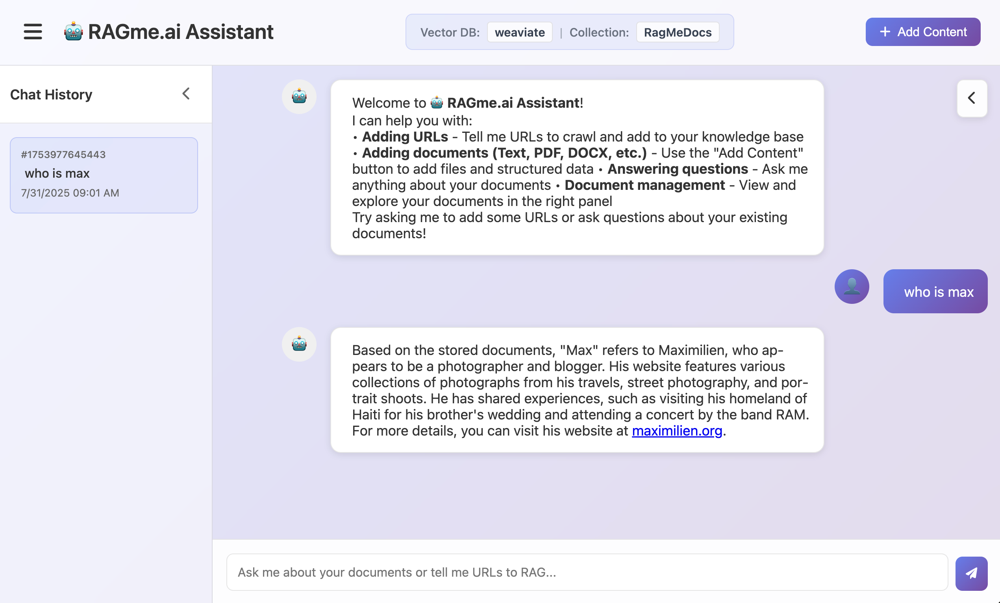
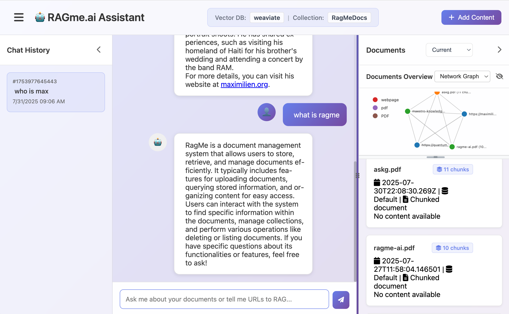
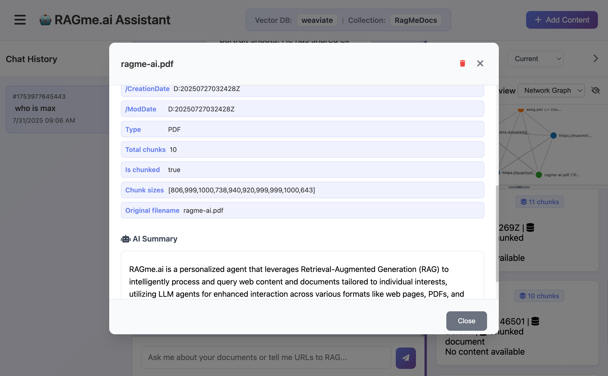
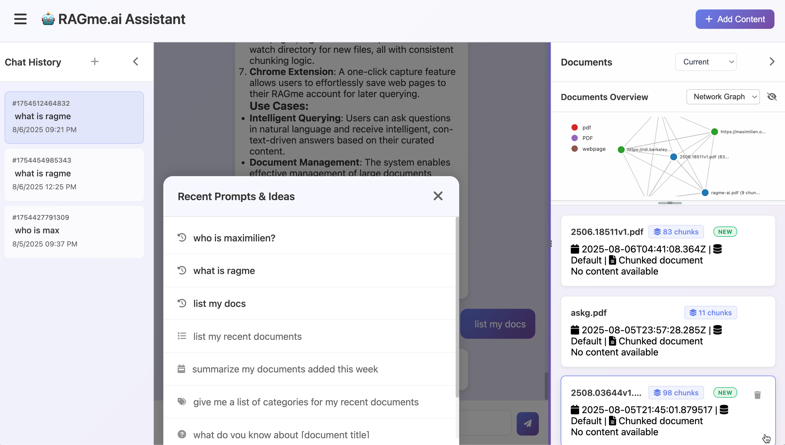
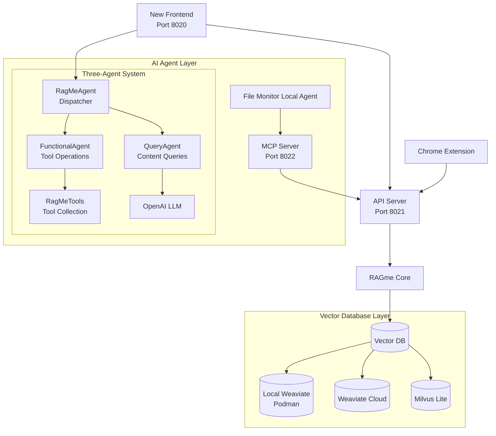

# RAGme.io

A personalized agent to [RAG](https://en.wikipedia.org/wiki/Retrieval-augmented_generation) websites and documents you care about and let you query them in an agentic fashion.

## 🖼️ Screenshots

<div style="display: flex; gap: 20px; margin: 20px 0;">
  <a href="images/ragme1.png" target="_blank">
    
  </a>
  <a href="images/ragme2.png" target="_blank">
    
  </a>
  <a href="images/ragme3.png" target="_blank">
    
  </a>
  <a href="images/ragme4.png" target="_blank">
    
  </a>
  </div>

*Click any image to view full size*

## 🆕 Latest Updates

### ✨ New Features (Latest Release)

- **🎤 Voice-to-Text Input**: Microphone button for voice input using browser's Web Speech API. Click the microphone button to speak your queries instead of typing! ⭐ **NEW!**
- **🖼️ AI-Powered Image Support**: Complete image processing pipeline with PyTorch ResNet50 classification, EXIF metadata extraction, and intelligent agent tools. Upload images via drag-and-drop interface and query them using natural language! ⭐ **NEW!**
- **🎯 Enhanced AI Image Summaries**: Fixed image summary generation to show rich classification data with confidence scores and file information. Images now display meaningful summaries like "Yorkshire terrier with 95.1% confidence" ⭐ **FIXED!**
- **🧹 Clean PyTorch Codebase**: Removed all TensorFlow dependencies and updated to PyTorch-only implementation with proper dependency management ⭐ **CLEANED!**
- **🔧 Enhanced VDB Management**: Improved `vdb.sh` tool to show source information, AI classifications, and better metadata for image documents ⭐ **ENHANCED!**
- **🔄 Environment Switching Fix**: Fixed critical bug where changing `.env` files (APPLICATION_*, VECTOR_DB_TYPE, collection names) wasn't taking effect after restart. Now seamlessly switch between different application environments (e.g., RAGme ↔ Viewfinder.ai) ⭐ **FIXED!**
- **🤖 Three-Agent Architecture**: Sophisticated agent system with intelligent query routing and specialized processing ⭐ **NEW!**
- **🎛️ Comprehensive Configuration System**: Complete `config.yaml` based configuration for easy client customization and deployment
- **🔐 MCP Servers Integration & Authentication**: Complete MCP server management with authentication flow and security controls
- **🔧 MCP Server Tools**: Configure and enable/disable MCP tool servers with a convenient toolbox button
- **💡 Recent Prompts & Ideas**: Quick access to sample prompts and recent chat history with a convenient popup button
- **🧪 Enhanced Testing Framework**: Comprehensive test suite with subcommands for unit, API, MCP, and integration tests
- **🧹 Smart Test Cleanup**: Integration tests now properly clean up test documents from vector database
- **🖼️ Image Collection Testing**: Complete integration test coverage for image collections including listing, adding, checking, and deleting images
- **💾 Save Chat Responses**: Save individual AI responses as markdown files with smart filename generation
- **📧 Email Chat Responses**: Send AI responses via email with pre-filled subject and content
- **📄 Smart Document Chunking**: Large documents are automatically split into manageable chunks while preserving readability
- **🎯 Enhanced Document Management**: Grouped document display with chunk counts and improved deletion functionality
- **📊 Interactive Visualizations**: D3.js-powered charts with click-to-scroll functionality and responsive resizing
- **🔄 Real-time Refresh**: Improved document list and visualization synchronization
- **🗑️ Bulk Document Operations**: Delete entire chunked documents with a single click
- **🔍 Pattern-Based Document Deletion**: Delete documents matching regex patterns
- **📱 Responsive Design**: Better mobile and desktop experience with collapsible sidebars
- **🔗 Enhanced URL-Based Document Deletion**: Improved document deletion by URL with support for various formats (full URLs, filenames, file:// URLs), confirmation prompts for destructive operations, and proper error handling
- **⚠️ Destructive Operation Confirmation**: All destructive operations (delete document, delete collection, etc.) now require user confirmation before execution to prevent accidental data loss

## 📚 Documentation

📖 **Complete documentation is available in the [docs/](docs/) directory:**

- **[📋 Project Overview](docs/PRESENTATION.md)** - Complete project overview with examples
- **[🎛️ Configuration Guide](docs/CONFIG.md)** - Comprehensive configuration system for client customization ⭐ **NEW!**
- **[🤖 Agent Architecture](docs/AGENT_REFACTOR.md)** - Three-agent architecture design and implementation ⭐ **NEW!**
- **[🔧 Vector Database Abstraction](docs/VECTOR_DB_ABSTRACTION.md)** - Guide to the vector database agnostic architecture  
- **[🤝 Contributing Guidelines](docs/CONTRIBUTING.md)** - How to contribute to the project
- **[📖 Documentation Index](docs/README.md)** - Full documentation structure

## 🚀 Quick Start

### Requirements

Install and/or update the following if needed:

1. Install [Python 3.12](https://www.python.org/downloads/) or later
2. Install [`uv`](https://docs.astral.sh/uv/getting-started/installation/) 
3. Install [`gh`](https://cli.github.com/) from GitHub
4. Install [Node.js 18+](https://nodejs.org/) (for new frontend)
5. Vector Database setup (**Weaviate recommended**, or Milvus Lite)

### 🛠️ Quick Setup (Recommended)

For the fastest setup experience, use our automated setup script:

```bash
# Clone the repository
gh repo clone maximilien/ragme-io
cd ragme-io

# Run the automated setup script
./setup.sh
```

The setup script will:
- ✅ Install system dependencies (Homebrew, Node.js, Python)
- ✅ Install Python dependencies using uv
- ✅ Install Node.js dependencies for the frontend
- ✅ Create .env file from template
- ✅ Run initial tests to verify setup
- ✅ Provide next steps and useful commands

**Options:**
```bash
./setup.sh --help              # Show all options
./setup.sh --skip-python       # Skip Python setup
./setup.sh --skip-node         # Skip Node.js setup
./setup.sh --force             # Force reinstall everything
```

### Manual Setup (Alternative)

```bash
gh repo clone maximilien/ragme-io
cd ragme-io

# Setup virtual environment
uv venv
source .venv/bin/activate

# Install dependencies
uv sync --extra dev
```

### Vector Database Setup

#### Option 1: Weaviate (Recommended)

For local development with Weaviate:

```bash
# Start local Weaviate
./tools/weaviate-local.sh start

# Check status
./tools/weaviate-local.sh status
```

Or use Weaviate Cloud:
1. Create an account at [Weaviate Cloud](https://console.weaviate.cloud/)
2. Create a `Sandbox` cluster (free for 14 days)
3. Create a collection named "RagMeDocs"
4. Get your `WEAVIATE_URL` and `WEAVIATE_API_KEY`

#### Option 2: Milvus Lite (Alternative - Local Development)

No setup required - automatically creates a local database file:

```bash
VECTOR_DB_TYPE=milvus
MILVUS_URI=milvus_demo.db
```

### Configuration

Create a `.env` file with your API keys:

```bash
# Copy the example configuration
cp env.example .env

# Edit .env with your values:
OPENAI_API_KEY=sk-proj-*****-**
VECTOR_DB_TYPE=weaviate-local  # Recommended for local development
# VECTOR_DB_TYPE=weaviate  # For cloud Weaviate
# VECTOR_DB_TYPE=milvus  # For Milvus Lite

# For Local Weaviate (only if VECTOR_DB_TYPE=weaviate-local):
WEAVIATE_LOCAL_URL=http://localhost:8080

# For Weaviate Cloud (only if VECTOR_DB_TYPE=weaviate):
WEAVIATE_API_KEY=*****
WEAVIATE_URL=*****.weaviate.cloud

RAGME_API_URL=http://localhost:8021
RAGME_MCP_URL=http://localhost:8022

# Optional: Custom ports for services
RAGME_API_PORT=8021
RAGME_MCP_PORT=8022
RAGME_FRONTEND_PORT=8020
```

### 🎛️ Advanced Configuration (NEW!)

RAGme now supports comprehensive configuration management through `config.yaml` for easy customization and client deployment:

```bash
# Copy the example configuration to project root
cp config.yaml.example config.yaml

# Edit the configuration file (located in project root)
nano config.yaml
```

> **📁 Developer Note:** The `config.yaml` file is located in the project root and is automatically ignored by git (added to `.gitignore`), allowing each developer to maintain their own local configuration without affecting the repository.

The configuration system allows you to customize:

- **🌐 Network settings** (ports, CORS, hosts)
- **🗄️ Vector database configurations** (multiple databases, connection settings)
- **🤖 LLM settings** (models, temperature, tokens)
- **🔧 MCP server configurations** (authentication, enabled services)
- **🎨 Frontend customization** (UI settings, branding, colors)
- **🚩 Feature flags** (enable/disable functionality)
- **🔒 Security settings** (file upload limits, CSP)
- **📊 Client branding** (logos, colors, welcome messages)

**📚 Complete Configuration Guide:** See **[docs/CONFIG.md](docs/CONFIG.md)** for detailed configuration options, examples, and best practices.

**🔄 Environment Switching:** Switch between different application environments (e.g., RAGme ↔ YourFancyRAG) by simply changing the `.env` file and restarting with `./stop.sh && ./start.sh`. All configuration changes (APPLICATION_*, VECTOR_DB_TYPE, collection names) take effect immediately.

### 🎨 UI Settings Configuration (NEW!)

RAGme now includes comprehensive UI settings that can be configured both in `config.yaml` and through the Settings menu in the frontend:

#### 📋 Configurable UI Settings

**🔧 General Settings:**
- **Max Documents**: Maximum number of documents to display (1-100)
- **Show Vector DB Info**: Display vector database type and collection information in the header

**📄 Document List Settings:**
- **Document Overview Enabled**: Enable or disable the document overview visualization
- **Document Overview Visible**: Show or hide the document overview by default
- **Document List Collapsed**: Start with the document list pane collapsed
- **Document List Width**: Width of the document list pane as percentage of total width (10-50%, default: 35%)

**💬 Chat History Settings:**
- **Chat History Collapsed**: Start with the chat history pane collapsed
- **Chat History Width**: Width of the chat history pane as percentage of total width (10-40%, default: 10%)

#### ⚙️ Configuration Methods

**1. Backend Configuration (`config.yaml`):**
```yaml
frontend:
  ui:
    show_vector_db_info: true
    document_overview_enabled: true
    document_overview_visible: true
    document_list_collapsed: false
    document_list_width: 35
    chat_history_collapsed: false
    chat_history_width: 10
```

**2. Frontend Settings Menu:**
- Access via the hamburger menu → Settings
- All settings are automatically saved to browser localStorage
- Settings persist across browser sessions
- Changes take effect immediately

**3. Default Values:**
- All settings have sensible defaults that work well for most users
- Settings can be overridden at any time through the UI or configuration file
- Backend configuration takes precedence over frontend settings on page load/refresh

### Multiple Collections Support (Text + Images)

RAGme supports multiple collections per vector database to enable different content types such as text documents and images. Configure in `config.yaml` under each database as a `collections` array:

```yaml
vector_databases:
  default: "weaviate-cloud"
  databases:
    - name: "weaviate-cloud"
      type: "weaviate"
      url: "${WEAVIATE_URL}"
      api_key: "${WEAVIATE_API_KEY}"
      collections:
        - name: "RagMeDocs"
          type: "text"
        - name: "RagMeImages"
          type: "image"
```

#### 🖼️ Image Processing Features

RAGme now includes comprehensive image support with AI-powered analysis:

**📤 Image Upload:**
- Support for JPG, PNG, GIF, WebP, BMP, HEIC, and HEIF formats
- Frontend drag-and-drop image upload interface
- Dedicated `/upload-images` API endpoint

**🤖 AI-Powered Processing:**
- **PyTorch Classification**: Uses ResNet50 trained on ImageNet to classify image content
- **OCR Text Extraction**: Automatically extracts text from images containing text (websites, documents, slides, etc.)
- **EXIF Metadata Extraction**: Extracts camera settings, GPS data, and other technical metadata
- **Smart Storage**: Images stored as base64 BLOB data in Weaviate with rich metadata including OCR content

**📦 Dependencies:**
```bash
# For full AI classification and OCR features (optional)
pip install ragme-ai[ml]

# Or install dependencies separately
pip install torch>=2.0.0 torchvision>=0.15.0
pip install easyocr pytesseract opencv-python Pillow
```

> **Note**: AI classification requires PyTorch, and OCR requires EasyOCR or pytesseract. These are optional dependencies. Images will still be processed and stored without them, but won't include AI-generated labels or extracted text.

**💬 Agent Tools:**
- `write_image_to_collection(image_url)` - Add images from URLs to the collection
- `list_image_collection(limit, offset)` - List images with AI classifications
- `delete_image_from_collection(image_id)` - Remove images from the collection

**Example Usage:**
```
User: "Add this image to my collection: https://example.com/photo.jpg"
Agent: Processes image with AI classification (e.g., "Golden Retriever, 94% confidence")

User: "Add this screenshot to my collection: https://example.com/screenshot.png"
Agent: Processes image with AI classification + OCR text extraction (e.g., "web site, 98% confidence" + extracted text content)

User: "List my images"
Agent: Shows images with classifications, confidence scores, metadata, and OCR content

User: "What images do I have of dogs?"
Agent: Searches image collection for dog-related classifications

User: "Find images containing the text 'RAGme'"
Agent: Searches image collection using OCR-extracted text content
```

The backend automatically routes image operations to the image collection. The frontend shows separate upload tabs for files and images, and the agent intelligently handles both text and image content.

The backend automatically uses the text collection for document operations. The `/config` endpoint returns the list of collections, and the frontend top bar shows `Collections:` with icons.

## 🏃‍♂️ Run RAGme.io

### Quick Start (All Services)

Use the provided startup script to launch all services:

```bash
chmod +x start.sh
./start.sh
```

This will start all services and you can access the **new frontend** at `http://localhost:8020`

### Process Management

```bash
# Stop all services
./stop.sh

# Restart all services
./stop.sh restart

# Check service status
./stop.sh status
```

### Frontend Development

```bash
# Compile frontend after configuration or code changes
./start.sh compile-frontend

# Restart only the frontend server
./start.sh restart-frontend

# Restart only backend services (API, MCP, Agent)
./start.sh restart-backend
```

**Use Cases:**
- **Configuration Changes**: After modifying `config.yaml`, run `./start.sh compile-frontend` to rebuild the frontend
- **Frontend Development**: Use `compile-frontend` for faster iteration when working on UI changes
- **Selective Restarts**: Restart only the services you need without affecting others

### Debugging and Log Monitoring

```bash
# Monitor all service logs
./tools/tail-logs.sh all

# Monitor specific services
./tools/tail-logs.sh api        # API logs (port 8021)
./tools/tail-logs.sh mcp        # MCP logs (port 8022)
./tools/tail-logs.sh frontend   # Frontend logs (port 8020)
```

For detailed process management, see [Process Management Guide](docs/PROCESS_MANAGEMENT.md).

## 🎯 Use Cases and Features

1. **Interactive personal RAG** - Add websites and documents and query them with an LLM agent
2. **Content collection** - Collect websites or documents on a particular topic
3. **Blog processing** - Collect posts from a blog and search them
4. **Daily activity tracking** - Collect visited sites from daily activities
5. **Document management** - Collect and process documents from users
6. **Automatic processing** - Add documents by copying to a watch directory
7. **Browser integration** - Add web pages with a Chrome extension

## 🛠️ Components

### New Frontend UI ⭐ **DEFAULT**

A modern, responsive web interface with three-pane layout:

- **Left Sidebar**: Chat history (collapsible)
- **Center**: Main chat area with input
- **Right Sidebar**: Recent documents with D3.js visualization (resizable)

**Key Features**:
- **Real-time chat** with markdown support and copy functionality
- **🎤 Voice-to-Text Input**: Microphone button for voice input using browser's Web Speech API
- **🔧 MCP Server Tools**: Configure and enable/disable MCP tool servers (Google Drive, Dropbox, Gmail, Twilio, RAGme Test)
- **💡 Recent Prompts & Ideas**: Quick access to sample prompts and recent chat history
- **Quick New Chat**: "+" button in chat history sidebar for instant new chat creation
- **Save and Email**: Save individual responses as markdown files or send via email
- **Smart document management** with automatic chunking and grouped display
- **Date filtering**: Filter documents by Current, This Month, This Year, or All
- **Interactive visualizations** with D3.js charts (bar, pie, network graphs)
- **Click-to-scroll functionality** - click on visualization nodes to scroll to documents
- **Responsive design** with collapsible sidebars and smooth animations
- **Content addition** via URLs, file uploads, or JSON data
- **WebSocket communication** for real-time updates

**Access**: `http://localhost:8020` (default when running `./start.sh`)

### Chrome Extension

A Chrome extension to easily add web pages to your collection:

1. **Load the extension**:
   - Open Chrome and go to `chrome://extensions/`
   - Enable "Developer mode"
   - Click "Load unpacked" and select the `chrome_ext/` directory

2. **Use the extension**:
   - Navigate to any webpage you want to add
   - Click the RAGme extension icon
   - Click "Capture Page" to add the current page

**Note**: The extension requires the API server to be running on `http://localhost:8021`

### Watch Directory

The system can automatically process PDF and DOCX files by monitoring a watch directory:

1. **Add files**: Copy PDF or DOCX files to the `watch_directory/` folder
2. **Automatic processing**: The agent will detect new files and add them to your collection
3. **Smart chunking**: Large documents are automatically split into manageable chunks
4. **Supported formats**: PDF and DOCX files are automatically processed and indexed

**Note**: The file monitoring agent must be running for this feature to work.

## 📖 Example Usage

### Current affairs

1. Go to [Google News](https://news.google.com/home?hl=en-US&gl=US&ceid=US:en) and add a few articles you care about
2. Ask RAGme.io to summarize or ask any question about the article

### Blogs 

1. Ask `Crawl my <favorite.blog.url> up to 10 posts and add to my collection`
2. Ask RAGme.io questions about the blog posts ingested

### Code

1. Find your favorite OSS GitHub project and ask `Crawl my <favorite.oss.github.url> up to 10 deep and add to my collection`
2. Ask RAGme.io questions about the project, e.g., give a quick user guide

## 🏗️ Architecture

RAGme.io uses a multi-service architecture with a sophisticated three-agent system:



### Three-Agent Architecture ⭐ **NEW!**

RAGme.io now features a sophisticated three-agent architecture that provides intelligent query routing and specialized processing:

#### 1. **RagMeAgent (Dispatcher)**
- **Purpose**: Routes user queries to appropriate specialized agents
- **Capabilities**: 
  - Intelligent query classification (functional vs. content queries)
  - Seamless routing to specialized agents
  - Provides agent information and capabilities
- **Location**: `src/ragme/agents/ragme_agent.py`

#### 2. **FunctionalAgent**
- **Purpose**: Handles tool-based operations and document management
- **Capabilities**:
  - Document collection operations (add, delete, list, reset)
  - URL crawling and web page processing
  - Vector database management
  - Uses LlamaIndex FunctionAgent for reliable tool execution
- **Location**: `src/ragme/agents/functional_agent.py`

#### 3. **QueryAgent**
- **Purpose**: Answers questions about document content using advanced RAG
- **Capabilities**:
  - Vector similarity search across documents
  - LLM-powered content summarization and question answering
  - Intelligent document retrieval and context building
  - Configurable document retrieval (top-k documents)
- **Location**: `src/ragme/agents/query_agent.py`

#### 4. **RagMeTools**
- **Purpose**: Centralized tool collection for all RagMe operations
- **Capabilities**:
  - Unified tool interface for all operations
  - Clean separation of tools from agent logic
  - Easy extensibility for new tools
- **Location**: `src/ragme/agents/tools.py`

### Query Routing Intelligence

The system automatically routes queries based on content:

- **Functional Queries** → FunctionalAgent
  - "add this URL to my collection"
  - "list all documents"
  - "delete document 123"
  - "reset the collection"

- **Content Queries** → QueryAgent
  - "who is maximilien"
  - "what is the content of this document"
  - "explain the architecture"
  - "summarize the project"

### Components

- **New Frontend** (port 8020): Modern web interface with three-pane layout ⭐ **DEFAULT**
- **API Server** (port 8021): REST API for URL and JSON ingestion
- **MCP Server** (port 8022): Document processing for PDF and DOCX files
- **File Monitor Agent**: Watches `watch_directory/` for new files
- **Chrome Extension**: Browser extension for capturing web pages
- **RAGme Core**: Main RAG processing logic using LlamaIndex and vector database abstraction
- **Vector Database Layer**: Modular support for multiple vector databases (Weaviate, Milvus, etc.)

## 🚧 Current Limitations

1. Uses the same collection for all users
2. Tied to LlamaIndex as agent and RAG

## 🔮 Next Steps

1. ✅ ~~Decouple the Weaviate vector database dependency~~ - **Completed!** See [Vector Database Abstraction](docs/VECTOR_DB_ABSTRACTION.md)
2. ✅ ~~Add modern frontend UI~~ - **Completed!** New three-pane interface with real-time features
3. ✅ ~~Add local Weaviate support~~ - **Completed!** Podman-based local deployment
4. ✅ ~~Add debugging and monitoring tools~~ - **Completed!** Comprehensive log monitoring
5. Decouple [LlamaIndex](https://www.llamaindex.ai/) for parsing and RAG-ing of documents. Allow others like [docling](https://github.com/docling-project)
6. Decouple LlamaIndex as the query agent
7. Add security at minimum HTTPS
8. Add ability to add images and videos
9. Allow multiple users (SaaS)
10. Support other types of content: images, audio, and video
11. Add ability to ingest emails by forwarding to a xyz@ragme.io email
12. Add ability to ingest content from Slack
13. Add ability to ingest content from X / Twitter

## 🛠️ Development

### Code Quality

We maintain high code quality standards using automated linting and formatting:

```bash
# Run linting checks (required before submitting PRs)
./tools/lint.sh

# Auto-fix linting issues where possible
uv run ruff check --fix src/ tests/

# Format code
uv run ruff format src/ tests/ examples/

# Validate configuration file
./tools/config-validator.sh
```

### Testing

```bash
# Run all tests (unit + API + MCP + integration)
./test.sh all

# Run specific test categories
./test.sh unit         # Unit tests only
./test.sh api          # API tests only  
./test.sh mcp          # MCP server tests only
./test.sh integration  # Integration tests only

# Run tests with coverage
uv run --active python -m pytest --cov=src/ragme tests/

# Show test help
./test.sh help
```

**Test Categories**:
- **Unit Tests**: Core functionality, vector databases, agents, utilities
- **API Tests**: FastAPI endpoints, response validation, request handling
- **MCP Tests**: Model Context Protocol server, endpoint validation, protocol compliance
- **Integration Tests**: End-to-end system testing, service communication, file monitoring

For detailed development guidelines, see [CONTRIBUTING.md](docs/CONTRIBUTING.md).

## 🤝 How can I help

I welcome any PRs, especially when solving an open issue or fixing a new problem.

Additionally, I would love to hear your feedback on new use cases or usage patterns.

📖 **For detailed contribution guidelines, see [CONTRIBUTING.md](docs/CONTRIBUTING.md)**

Created with ❤️ by @maximilien

## Vector Database Support

RagMe supports multiple vector database backends with a modular architecture:

### Weaviate (Recommended) ⭐ **RECOMMENDED**
- **Cloud-based**: Managed vector database service
- **Local support**: Podman-based local deployment
- **Automatic vectorization**: Built-in embedding capabilities
- **Query agents**: Advanced query capabilities
- **Easy setup**: No server setup required for local development

#### Configuring Local Weaviate

```bash
# Choose local Weaviate as the vector database
VECTOR_DB_TYPE=weaviate-local
WEAVIATE_LOCAL_URL=http://localhost:8080

# Start local Weaviate
./tools/weaviate-local.sh start
```

See `examples/weaviate_local_example.py` for a complete example.

### Milvus (Alternative)
- **Milvus Lite**: Local development with no server setup required
- **High-performance**: Vector search and similarity matching
- **Easy setup**: Automatic local database file creation
- **Production ready**: Can scale to Milvus Server for production

#### Configuring Milvus

```bash
# Choose Milvus as the vector database
VECTOR_DB_TYPE=milvus
MILVUS_URI=milvus_demo.db
```

See `examples/milvus_example.py` for a complete example.

For detailed information about the vector database abstraction, see [VECTOR_DB_ABSTRACTION.md](docs/VECTOR_DB_ABSTRACTION.md).
