# RAGme.ai

A personalized agent to [RAG](https://en.wikipedia.org/wiki/Retrieval-augmented_generation) websites and documents you care about and let you query them in an agentic fashion.

# Use Cases and Features

1. Interactive personal RAG adding websites and documents (PDFs and DOCX) and using an LLM agent to query
2. Collecting websites or documents on a particular topic and RAG-ing and searching them
3. Collecting posts from a blog and RAG-ing and searching them
4. Collecting visited sites from a user's daily activities and RAG-ing and searching them
5. Collecting documents from a user and RAG-ing and searching them
6. Automatically adding documents to your collection by copying to a watch directory
7. Easily add Web pages to your collection with a Chrome extension

RAG-ing and searching refers to adding documents into a vector database using some appropriate embedding (creates a vector for document) and then using an LLM agent to query and use that vector database as a source of knowledge.

# Getting Started

## Requirements

Install and/or update the following if needed:

1. Install [Python 3.12](https://www.python.org/downloads/) or later
2. Install [`uv`](https://docs.astral.sh/uv/getting-started/installation/) 
3. Install [`gh`](https://cli.github.com/) from GitHub
4. Weaviate Cloud (Vector DB) cluster and collection named: `RagMeDocs`

## Get code, setup dependencies

```bash
gh repo clone maximilien/ragme-ai
```

Setup your virtual environment:

```bash
uv venv
source .venv/bin/activate
```

Install dependencies:

```bash
uv sync
```

## Weaviate Cloud

Create an account and cluster at [Weaviate Cloud](https://console.weaviate.cloud/). You can select to create a `Sandbox` cluster which will allow you to create free clusters (for 14 days). In your cluster, create a collection named "RagMeDocs".

Once you have the cluster, Weaviate should give you a page with the cluster REST endpoint and the API key (select the Admin one).

These will be your `WEAVIATE_URL` and `WEAVIATE_API_KEY` respectively.

## API keys

The current version of RAGme.ai uses [OpenAI](https://auth.openai.com/log-in) as the LLM provider and [Weaviate](https://console.weaviate.cloud/) as the vector DB. 

You will need to have API keys for both. And for Weaviate, after creating a cluster and a collection, you will need the API key and cluster URL.

Create a `.env` file with the keys and URL:

```bash
cat .env
OPENAI_API_KEY=sk-proj-*****-**
WEAVIATE_API_KEY=*****
WEAVIATE_URL=*****.weaviate.cloud
```

Replace `*****` with appropriate values.

## Run Streamlit UI

```bash
# Run with project root in PYTHONPATH
PYTHONPATH=$PYTHONPATH:$(pwd) uv run streamlit run src/ragme/ui.py --server.port 8020

  You can now view your Streamlit app in your browser.

  Local URL: http://localhost:8020
  Network URL: http://xxx.xx.xxx.xxx:8020

  For better performance, install the Watchdog module:

  $ xcode-select --install
  $ pip install watchdog
```

This should launch the RAGme.ai UI on your default browser or go to `http://localhost:8020`

## Some example usage

### Current affairs

1. Go to [Google News](https://news.google.com/home?hl=en-US&gl=US&ceid=US:en) and add a few articles you care about
2. Ask RAGme.ai to summarize or ask any question about the article

### Blogs 

1. Ask `Crawl my <favorite.blog.url> up to 10 posts and add to my collection`
2. Ask RAGme.ai questions about the blog posts ingested

### Code

1. Find your favorite OSS GitHub project and ask `Crawl my <favorite.oss.github.url> up to 10 deep and add to my collection`
2. Ask RAGme.ai questions about the project, e.g., give a quick user guide

# Architecture

```mermaid
flowchart LR
    user((User)) -- "1 add URL" --> ragme-agent["RAGme agent 🤖"]

    ragme-agent -- "2 parse URL" --> llama-index-parse["🦙LlamaIndex parse 📄"]
    ragme-agent -- "3 chunk" --> llama-index-chunk["🦙LlamaIndex chunk 📑"]
    llama-index-parse --> vector-db[(DB)]
    llama-index-chunk --> vector-db[(DB)]

    user((User)) -- "4 query" --> ragme-agent["RAGme agent 🤖"]
    ragme-agent -- "5 find best document for query" --> vector-db[(DB)]
    
    ragme-agent -- "6 prompt llm with docs for response" --> llm["LLM 🤖"]
    llm -- "7 create a response" --> ragme-agent
    
    ragme-agent -- "8 final response" --> user((User))
```



### MCP

Built on top of existing [RAGme-ai](https://github.com/maximilien/ragme-ai)

1. MCP server to load and RAG files: PDFs and docs
2. Agent to load and pass these to RAGme
3. Agent to find websites using browserbase and add to the RAG
4. Agent to create insights from today's documents

```mermaid
flowchart LR
    user((User)) -- "1 add doc (PDF or DOCs)" --> monitor-agent["Monitor agent 🤖"]

    monitor-agent -- "2 parse doc" --> docling["🐥 Docling parse 📄"]
    monitor-agent --> mcp-server[(Server)]

    mcp-server--> ragme_api[(Server)]
    
    user((User)) -- "4 query" --> ragme-agent["RAGme agent 🤖"]
    ragme-agent -- "5 find best document for query" --> vector-db[(DB)]
    
    ragme-agent -- "6 prompt llm with docs for response" --> llm["LLM 🤖"]
    llm -- "7 create a response" --> ragme-agent
    
    ragme-agent -- "8 final response" --> user((User))
```



# Limitations

1. Uses the same collection for all users
2. Tied to Weaviate as vector database
3. Tied to LlamaIndex as agent and RAG


# Next steps

1. Decouple the Weaviate vector database dependency. Allow others like [OpenSearch](https://opensearch.org/)
2. Decouple [LlamaIndex](https://www.llamaindex.ai/) for parsing and RAG-ing of documents. Allow others like [docling](https://github.com/docling-project)
3. Decouple LlamaIndex as the query agent
4. Add security at minimum HTTPS
5. Add ability to add images and videos
6. Allow multiple users (SaaS)
7. Support other types of content: images, audio, and video
8. Add ability to injest emails by forwarding to a xyz@ragme.io email
9. Add ability to inject content from Slack

# How can I help

I welcome any PRs, especially when solving an open issue or fixing a new problem.

Additionally, I would love to hear your feedback on new use cases or usage patterns.

Created with ❤️ by @maximilien
