# RAGme.ai

A personalized agent to [RAG](https://en.wikipedia.org/wiki/Retrieval-augmented_generation) websites and documents you care about and let you query them in an agentic fashion.

## 🆕 Latest Updates

### ✨ New Features (Latest Release)

- **💾 Save Chat Responses**: Save individual AI responses as markdown files with smart filename generation
- **📧 Email Chat Responses**: Send AI responses via email with pre-filled subject and content
- **📄 Smart Document Chunking**: Large documents are automatically split into manageable chunks while preserving readability
- **🎯 Enhanced Document Management**: Grouped document display with chunk counts and improved deletion functionality
- **📊 Interactive Visualizations**: D3.js-powered charts with click-to-scroll functionality and responsive resizing
- **🔄 Real-time Refresh**: Improved document list and visualization synchronization
- **🗑️ Bulk Document Operations**: Delete entire chunked documents with a single click
- **🔍 Pattern-Based Document Deletion**: Delete documents matching regex patterns (e.g., "del all docs with name pattern test_integration.pdf")
- **📱 Responsive Design**: Better mobile and desktop experience with collapsible sidebars

### 🔧 Technical Improvements

- **Automatic Chunking**: Documents exceeding token limits are intelligently chunked at sentence boundaries
- **Unified Processing**: Consistent chunking across all input methods (upload, watch directory, API)
- **Enhanced Metadata**: Rich document metadata including chunk information and original filenames
- **Improved Performance**: Better handling of large documents and optimized visualization updates
- **Modern UI**: Streamlined interface with save and email functionality for individual chat responses

## 📚 Documentation

📖 **Complete documentation is available in the [docs/](docs/) directory:**

- **[📋 Project Overview](docs/PRESENTATION.md)** - Complete project overview with examples
- **[🔧 Vector Database Abstraction](docs/VECTOR_DB_ABSTRACTION.md)** - Guide to the vector database agnostic architecture  
- **[🤝 Contributing Guidelines](docs/CONTRIBUTING.md)** - How to contribute to the project
- **[📖 Documentation Index](docs/README.md)** - Full documentation structure

## 🚀 Quick Start

### Requirements

Install and/or update the following if needed:

1. Install [Python 3.12](https://www.python.org/downloads/) or later
2. Install [`uv`](https://docs.astral.sh/uv/getting-started/installation/) 
3. Install [`gh`](https://cli.github.com/) from GitHub
4. Install [Node.js 18+](https://nodejs.org/) (for new frontend)
5. Vector Database setup (**Weaviate recommended**, or Milvus Lite)

### Get code, setup dependencies

```bash
gh repo clone maximilien/ragme-ai
```

Setup your virtual environment:

```bash
uv venv
source .venv/bin/activate
```

Install dependencies:

```bash
# Install production dependencies
uv sync

# Install development dependencies (includes ruff, pytest, etc.)
uv sync --extra dev
```

### Vector Database Setup

#### Option 1: Weaviate (Recommended)

For local development with Weaviate, you can run Weaviate locally using Podman:

```bash
# Start local Weaviate
./tools/weaviate-local.sh start

# Check status
./tools/weaviate-local.sh status

# View logs
./tools/weaviate-local.sh logs

# Stop when done
./tools/weaviate-local.sh stop
```

Or use Weaviate Cloud:

Create an account and cluster at [Weaviate Cloud](https://console.weaviate.cloud/). You can select to create a `Sandbox` cluster which will allow you to create free clusters (for 14 days). In your cluster, create a collection named "RagMeDocs".

Once you have the cluster, Weaviate should give you a page with the cluster REST endpoint and the API key (select the Admin one).

These will be your `WEAVIATE_URL` and `WEAVIATE_API_KEY` respectively.

#### Option 2: Milvus Lite (Alternative - Local Development)

For local development, Milvus Lite is available and requires no server setup. The system will automatically create a local database file.

```bash
# Default configuration (no setup required)
VECTOR_DB_TYPE=milvus
MILVUS_URI=milvus_demo.db
```

### API keys

The current version of RAGme.ai uses [OpenAI](https://auth.openai.com/log-in) as the LLM provider and supports multiple vector databases.

You will need to have API keys for OpenAI and your chosen vector database.

Create a `.env` file with the keys and configuration:

```bash
# Copy the example configuration
cp env.example .env

# Edit .env with your values:
OPENAI_API_KEY=sk-proj-*****-**
VECTOR_DB_TYPE=weaviate-local  # Recommended for local development
# VECTOR_DB_TYPE=weaviate  # For cloud Weaviate
# VECTOR_DB_TYPE=milvus  # For Milvus Lite (alternative)

# For Local Weaviate (only if VECTOR_DB_TYPE=weaviate-local):
WEAVIATE_LOCAL_URL=http://localhost:8080

# For Weaviate Cloud (only if VECTOR_DB_TYPE=weaviate):
WEAVIATE_API_KEY=*****
WEAVIATE_URL=*****.weaviate.cloud

# For Milvus (optional, uses defaults if not set):
# MILVUS_URI=milvus_demo.db

RAGME_API_URL=http://localhost:8021
RAGME_MCP_URL=http://localhost:8022
```

Replace `*****` with appropriate values.

## 🏃‍♂️ Run RAGme.ai

RAGme.ai consists of multiple services that work together:

1. **API Server** (port 8021): Handles URL and JSON ingestion
2. **MCP Server** (port 8022): Processes PDF and DOCX files  
3. **Agent** (background): Monitors watch directory for new files
4. **New Frontend** (port 3020): Modern web interface with three-pane layout ⭐ **DEFAULT**

### Quick Start (All Services)

Use the provided startup script to launch all services:

```bash
chmod +x start.sh
./start.sh
```

This will start all services and you can access the **new frontend** at `http://localhost:3020`

### Process Management

The `./stop.sh` script now provides comprehensive process management capabilities:

#### Stop All Services

To stop all running services:

```bash
./stop.sh
# or
./stop.sh stop
```

#### Restart All Services

To restart all services (stop and start):

```bash
./stop.sh restart
```

#### Check Service Status

To check the status of all services:

```bash
./stop.sh status
```

This will show you:
- Which processes are running
- Port status for each service
- Service URLs when all are running
- PID information for debugging

### Debugging and Log Monitoring

The `./tools/tail-logs.sh` script provides real-time log monitoring and debugging capabilities:

#### Monitor All Service Logs

To tail logs from all running services:

```bash
./tools/tail-logs.sh all
```

#### Monitor Individual Service Logs

To monitor specific services:

```bash
./tools/tail-logs.sh api        # Monitor API logs (port 8021)
./tools/tail-logs.sh mcp        # Monitor MCP logs (port 8022)
./tools/tail-logs.sh agent      # Monitor Agent logs
./tools/tail-logs.sh frontend   # Monitor Frontend logs (port 3020)
```

#### Check Service Status

To check which services are running:

```bash
./tools/tail-logs.sh status
```

#### View Recent Logs

To see recent system logs related to RAGme:

```bash
./tools/tail-logs.sh recent
```

This will show:
- Recent system logs containing 'ragme', 'uvicorn', 'streamlit', or 'node'
- Recent application logs from RAGme processes
- Useful for debugging vector database and other issues

For detailed process management documentation, see [Process Management Guide](docs/PROCESS_MANAGEMENT.md).

### Manual Start (Individual Services)

If you prefer to start services individually:

```bash
# Start API server
uv run uvicorn src.ragme.api:app --reload --host 0.0.0.0 --port 8021

# Start MCP server (in another terminal)
uv run uvicorn src.ragme.mcp:app --reload --host 0.0.0.0 --port 8022

# Start file monitoring agent (in another terminal)
uv run python -m src.ragme.local_agent

# Start new frontend (in another terminal)
cd frontend
npm install
npm run build
npm start
```

## 🎯 Use Cases and Features

1. Interactive personal RAG adding websites and documents (PDFs and DOCX) and using an LLM agent to query
2. Collecting websites or documents on a particular topic and RAG-ing and searching them
3. Collecting posts from a blog and RAG-ing and searching them
4. Collecting visited sites from a user's daily activities and RAG-ing and searching them
5. Collecting documents from a user and RAG-ing and searching them
6. Automatically adding documents to your collection by copying to a watch directory
7. Easily add Web pages to your collection with a Chrome extension

RAG-ing and searching refers to adding documents into a vector database using some appropriate embedding (creates a vector for document) and then using an LLM agent to query and use that vector database as a source of knowledge.

## 💾 Save and Email Features

### Save Chat Responses

RAGme.ai now includes the ability to save individual AI responses as markdown files:

- **Smart Filename Generation**: Automatically creates meaningful filenames using the first 3 words of the query
- **Complete Context**: Saves both the original query and the AI response
- **Metadata Included**: Includes timestamp and generation information
- **Easy Access**: Hover over any AI response to reveal the save button (📥 icon)

**Example**: A query "What is machine learning?" will generate a file named `what-is-machine.md` containing the full conversation context.

### Email Chat Responses

Send AI responses directly via email:

- **Pre-filled Content**: Subject line uses the original query (truncated to 50 characters)
- **Message Body**: Contains the complete AI response
- **User-friendly**: Simply enter the recipient email address
- **Email Client Integration**: Opens your default email client with the prepared message
- **Easy Access**: Hover over any AI response to reveal the email button (📧 icon)

**Example**: Click the email button on an AI response, enter `colleague@company.com`, and your email client will open with the subject "What is machine learning?" and the AI response in the body.

## 🛠️ Components

### New Frontend UI ⭐ **DEFAULT**

A modern, responsive web interface with three-pane layout:

- **Left Sidebar**: Chat history (collapsible)
- **Center**: Main chat area with input
- **Right Sidebar**: Recent documents with D3.js visualization (resizable)

**Features**:
- **Real-time chat** with markdown support and copy functionality
- **Save and Email**: Save individual responses as markdown files or send via email
- **Smart document management** with automatic chunking and grouped display
- **Date filtering**: Filter documents by Current (this week), This Month, This Year, or All
- **Interactive visualizations** with D3.js charts (bar, pie, network graphs)
- **Click-to-scroll functionality** - click on visualization nodes to scroll to documents
- **Responsive design** with collapsible sidebars and smooth animations
- **Content addition** via URLs, file uploads, or JSON data
- **WebSocket communication** for real-time updates
- **Document deletion** from both list and detail views
- **Visualization refresh** with document list synchronization

**Advanced Features**:
- **Automatic chunking**: Large documents are intelligently split at sentence boundaries
- **Chunked document grouping**: Multiple chunks appear as single documents with chunk counts
- **Bulk operations**: Delete entire chunked documents with one click
- **Enhanced metadata display**: Shows document types, dates, and chunk information
- **Network graph visualization**: Interactive document relationship mapping
- **Save responses**: Download any AI response as a markdown file with smart naming
- **Email responses**: Send AI responses via email with pre-filled content
- **Date filtering**: Filter documents by time periods to manage large collections

**Access**: `http://localhost:3020` (default when running `./start.sh`)

### Document Date Filtering

The new frontend includes a powerful date filtering system to help manage large document collections:

**Filter Options**:
- **Current**: Shows documents added in the last 7 days (this week)
- **This Month**: Shows documents added in the current month
- **This Year**: Shows documents added in the current year  
- **All**: Shows all documents (no date filtering)

**Features**:
- **Persistent preferences**: Your date filter choice is saved and restored on page reload
- **Real-time filtering**: Documents are filtered instantly when you change the filter
- **Visual feedback**: The refresh button shows which filter is currently active
- **Smart defaults**: Defaults to "Current" to show recent documents first
- **Backend optimization**: Efficient server-side filtering for large collections

**Usage**:
1. Look for the dropdown in the Documents sidebar header (right panel)
2. Select your desired time period from the dropdown
3. The document list will update immediately to show only documents from that period
4. The visualization will also update to reflect the filtered documents
5. Your preference is automatically saved for future sessions

This feature is especially useful when you have hundreds of documents collected over many months and want to focus on recent content or explore documents from specific time periods.

### Chrome Extension

A Chrome extension is included to easily add web pages to your collection:

1. **Load the extension**:
   - Open Chrome and go to `chrome://extensions/`
   - Enable "Developer mode"
   - Click "Load unpacked" and select the `chrome_ext/` directory

2. **Use the extension**:
   - Navigate to any webpage you want to add to your collection
   - Click the RAGme extension icon
   - Click "Capture Page" to add the current page to your collection

**Note**: The extension requires the API server to be running on `http://localhost:8021`

### Watch Directory

The system can automatically process PDF and DOCX files by monitoring a watch directory:

1. **Add files**: Copy PDF or DOCX files to the `watch_directory/` folder
2. **Automatic processing**: The agent will detect new files and add them to your collection
3. **Smart chunking**: Large documents are automatically split into manageable chunks
4. **Supported formats**: PDF and DOCX files are automatically processed and indexed
5. **Consistent behavior**: Same chunking logic as manual uploads

**Note**: The file monitoring agent must be running for this feature to work.

## 📖 Example Usage

### Current affairs

1. Go to [Google News](https://news.google.com/home?hl=en-US&gl=US&ceid=US:en) and add a few articles you care about
2. Ask RAGme.ai to summarize or ask any question about the article

### Blogs 

1. Ask `Crawl my <favorite.blog.url> up to 10 posts and add to my collection`
2. Ask RAGme.ai questions about the blog posts ingested

### Code

1. Find your favorite OSS GitHub project and ask `Crawl my <favorite.oss.github.url> up to 10 deep and add to my collection`
2. Ask RAGme.ai questions about the project, e.g., give a quick user guide

## 🏗️ Architecture

RAGme.ai uses a multi-service architecture with the following components:

```mermaid
flowchart LR
    user((User)) -- "1 add URL" --> ragme-agent["RAGme agent 🤖"]

    ragme-agent -- "2 parse URL" --> llama-index-parse["🦙LlamaIndex parse 📄"]
    ragme-agent -- "3 chunk" --> llama-index-chunk["🦙LlamaIndex chunk 📑"]
    llama-index-parse --> vector-db[(Vector DB)]
    llama-index-chunk --> vector-db[(Vector DB)]

    user((User)) -- "4 query" --> ragme-agent["RAGme agent 🤖"]
    ragme-agent -- "5 find best document for query" --> vector-db[(Vector DB)]
    
    ragme-agent -- "6 prompt llm with docs for response" --> llm["LLM 🤖"]
    llm -- "7 create a response" --> ragme-agent
    
    ragme-agent -- "8 final response" --> user((User))
```



### Service Architecture


### Components

- **New Frontend** (port 3020): Modern web interface with three-pane layout ⭐ **DEFAULT**
- **API Server** (port 8021): REST API for URL and JSON ingestion
- **MCP Server** (port 8022): Document processing for PDF and DOCX files
- **File Monitor Agent**: Watches `watch_directory/` for new files
- **Chrome Extension**: Browser extension for capturing web pages
- **RAGme Core**: Main RAG processing logic using LlamaIndex and vector database abstraction
- **Vector Database Layer**: Modular support for multiple vector databases (Weaviate, Milvus, etc.)

### MCP

Built on top of existing [RAGme-ai](https://github.com/maximilien/ragme-ai)

1. MCP server to load and RAG files: PDFs and docs
2. Agent to load and pass these to RAGme
3. Agent to find websites using browserbase and add to the RAG
4. Agent to create insights from today's documents

```mermaid
flowchart LR
    user((User)) -- "1 add doc (PDF or DOCs)" --> monitor-agent["Monitor agent 🤖"]

    monitor-agent -- "2 parse doc" --> docling["🐥 Docling parse 📄"]
    monitor-agent --> mcp-server[(Server)]

    mcp-server--> ragme_api[(Server)]
    
    user((User)) -- "4 query" --> ragme-agent["RAGme agent 🤖"]
    ragme-agent -- "5 find best document for query" --> vector-db[(DB)]
    
    ragme-agent -- "6 prompt llm with docs for response" --> llm["LLM 🤖"]
    llm -- "7 create a response" --> ragme-agent
    
    ragme-agent -- "8 final response" --> user((User))
```



## 🚧 Current Limitations

1. Uses the same collection for all users
2. ~~Tied to Weaviate as vector database~~ ✅ **Fixed!** Now supports multiple vector databases with Milvus as default
3. Tied to LlamaIndex as agent and RAG

## 🔮 Next Steps

1. ✅ ~~Decouple the Weaviate vector database dependency~~ - **Completed!** See [Vector Database Abstraction](docs/VECTOR_DB_ABSTRACTION.md)
2. ✅ ~~Add modern frontend UI~~ - **Completed!** New three-pane interface with real-time features
3. ✅ ~~Add local Weaviate support~~ - **Completed!** Podman-based local deployment
4. ✅ ~~Add debugging and monitoring tools~~ - **Completed!** Comprehensive log monitoring
5. Decouple [LlamaIndex](https://www.llamaindex.ai/) for parsing and RAG-ing of documents. Allow others like [docling](https://github.com/docling-project)
6. Decouple LlamaIndex as the query agent
7. Add security at minimum HTTPS
8. Add ability to add images and videos
9. Allow multiple users (SaaS)
10. Support other types of content: images, audio, and video
11. Add ability to ingest emails by forwarding to a xyz@ragme.io email
12. Add ability to ingest content from Slack
13. Add ability to ingest content from X / Twitter

## 🛠️ Development

### Code Quality

We maintain high code quality standards using automated linting and formatting:

#### Running Linting and Formatting

```bash
# Run linting checks (required before submitting PRs)
./tools/lint.sh

# Auto-fix linting issues where possible
uv run ruff check --fix src/ tests/

# Format code
uv run ruff format src/ tests/ examples/
```

#### Linting Requirements

- **All code must pass linting checks** before submission
- **No linting errors** are allowed in source files
- **Consistent formatting** is enforced across the codebase
- **Type hints** are required for all function parameters and return values

#### Pre-commit Checklist

Before submitting a pull request, ensure:

1. ✅ **All tests pass**: `./test.sh`
2. ✅ **All linting checks pass**: `./tools/lint.sh`
3. ✅ **Code is properly formatted**: `uv run ruff format src/ tests/ examples/`
4. ✅ **No unused imports or variables**
5. ✅ **Proper exception handling** (using `raise ... from e` pattern)
6. ✅ **Consistent code style** throughout

### Testing

```bash
# Run unit tests
./test.sh

# Run tests with coverage
uv run pytest --cov=src/ragme tests/

# Run integration tests (requires services to be running)
./test-integration.sh
```

### Process Management

```bash
# Start all services (new frontend by default)
./start.sh

# Stop all services
./stop.sh

# Restart all services
./stop.sh restart

# Check service status
./stop.sh status
```

## 🤝 How can I help

I welcome any PRs, especially when solving an open issue or fixing a new problem.

Additionally, I would love to hear your feedback on new use cases or usage patterns.

📖 **For detailed contribution guidelines, see [CONTRIBUTING.md](docs/CONTRIBUTING.md)**

Created with ❤️ by @maximilien

## Vector Database Support

RagMe supports multiple vector database backends with a modular architecture:

### Weaviate (Recommended) ⭐ **RECOMMENDED**
- **Cloud-based**: Managed vector database service
- **Local support**: Podman-based local deployment
- **Automatic vectorization**: Built-in embedding capabilities
- **Query agents**: Advanced query capabilities
- **Easy setup**: No server setup required for local development

#### Configuring Local Weaviate

Set the following environment variables:

```bash
# Choose local Weaviate as the vector database
VECTOR_DB_TYPE=weaviate-local

# Local Weaviate URL (default)
WEAVIATE_LOCAL_URL=http://localhost:8080
```

Then start local Weaviate:

```bash
# Start local Weaviate
./tools/weaviate-local.sh start

# Check if it's ready
./tools/weaviate-local.sh status
```

#### Example Usage with Local Weaviate

```python
import os
from src.ragme import RagMe

# Configure for local Weaviate
os.environ["VECTOR_DB_TYPE"] = "weaviate-local"
os.environ["WEAVIATE_LOCAL_URL"] = "http://localhost:8080"

# Initialize RagMe
ragme = RagMe(db_type="weaviate-local")

# Add web pages
urls = ["https://example.com"]
ragme.write_webpages_to_weaviate(urls)

# Query the database
response = await ragme.run("What is this about?")
```

See `examples/weaviate_local_example.py` for a complete example.

### Milvus (Alternative)
- **Milvus Lite**: Local development with no server setup required
- **High-performance**: Vector search and similarity matching
- **Easy setup**: Automatic local database file creation
- **Production ready**: Can scale to Milvus Server for production

#### Configuring Milvus

Set the following environment variables:

```bash
# Choose Milvus as the vector database
VECTOR_DB_TYPE=milvus

# For local Milvus Lite
MILVUS_URI=milvus_demo.db

# For remote Milvus server
MILVUS_URI=http://localhost:19530
MILVUS_TOKEN=root:Milvus
```

See `examples/milvus_example.py` for a complete example.

## Project Structure

The vector database implementation is organized into modular files:

```
src/ragme/
├── vector_db.py              # Compatibility layer (imports from modules)
├── vector_db_base.py         # Abstract base class
├── vector_db_weaviate.py     # Weaviate Cloud implementation
├── vector_db_weaviate_local.py # Local Weaviate implementation
├── vector_db_milvus.py       # Milvus implementation
└── vector_db_factory.py      # Factory function

# Local Weaviate Management
├── tools/
│   ├── weaviate-local.sh      # Local Weaviate management script
│   ├── tail-logs.sh           # Log monitoring and debugging script
│   ├── lint.sh                # Code linting script
│   └── podman-compose.weaviate.yml # Podman Compose for local Weaviate
└── examples/
    ├── weaviate_local_example.py # Local Weaviate usage example
    └── milvus_example.py     # Milvus usage example
```

This modular structure makes it easy to:
- Add new vector database implementations
- Maintain clean separation of concerns
- Test each implementation independently
- Switch between databases without code changes

For detailed information about the vector database abstraction, see [VECTOR_DB_ABSTRACTION.md](docs/VECTOR_DB_ABSTRACTION.md).
