# RAGme.ai

A personalized agent to RAG web sites and documents you care about and let your query them in an agentic fashion.

# Use cases

1. Interractive personal RAG adding web sites and document and using an LLM agent to query
2. Collecting web sites or documents on a particular topic and RAGing and searching them
3. Collecting posts from a blog and RAGing and searching them
4. Collecting visited sites from a user's daily activities and RAGing and searching them
5. Collecting documents from a user and RAGing and searching them

RAGing and searching refers to adding documents into a Vector database using some appropriate embedding (process to RAG) and then using an LLM agent to query and use that database as source of knowledge.

# Getting started

## Requirements

Install and / or update the following if needed

1. Install [Python 3.12](https://www.python.org/downloads/) or later
2. Install [`uv`](https://docs.astral.sh/uv/getting-started/installation/) 
3. Install [`gh`](https://cli.github.com/) from github

## Get code, setup dependencies

```bash
gh repo clone maximilien/ragme-ai
```

Setup your virtual environment

```bash
uv venv
source .venv/bin/activate
```

Install dependencies

```bash
uv sync
```

## API keys

The current version of RAGme.ai uses OpenAI as the LLM provider and Weeviate as the vector DB. 

You will need to have API keys for both. And for weeviate after creating a cluser and a collection you will need the API key and cluster URL.

Create a `.env` file with the the keys and URL

```bash
cat .env
OPENAI_API_KEY=sk-proj-*****-gA
WEAVIATE_API_KEY=*****
WEAVIATE_URL=*****.weaviate.cloud%
```

Replace `*****` with appropriate values.


## Run streamlit UI

```bash
uv run streamlit run ./ragme_ui.py

  You can now view your Streamlit app in your browser.

  Local URL: http://localhost:8507
  Network URL: http://xxx.xx.xxx.xxx:8507

  For better performance, install the Watchdog module:

  $ xcode-select --install
  $ pip install watchdog
```

This should launch the RAGme.ai UI on your default browser or go to `http://localhost:8507`

## Some example usage

### Current affairs

1. Go to Google News and add a few articles you care about
2. Ask RAGme.ai to summarize or ask any question on the article

### Blogs 

1. Ask `Crawl my <favorite.blog.url" up to 10 posts and add to my collection`
2. Add RAGme.ai questions about the blog posts ingested

### Code

1. Find your favorite OSS Github project and ask `Crawl my <favorite.oss.github.url" up to 10 deep and add to my collection`
2. Add RAGme.ai questions about the project, e.g., give a quick user guide


# Architecture

```mermaid
flowchart LR
    user((User)) -- "1 add URL" --> ragme-agent["RAGme agent 🤖"]

    ragme-agent -- "2 parse URL" --> llama-index-parse["parse 📄"]
    ragme-agent -- "3 chunk" --> llama-index-chunk["chunk 📑"]
    llama-index-parse --> vector-db[(DB)]
    llama-index-chunk --> vector-db[(DB)]

    user((User)) -- "4 query" --> ragme-agent["RAGme agent 🤖"]
    ragme-agent -- "5 find best document for query" --> vector-db[(DB)]
    
    ragme-agent -- "6 prompt llm with docs for response" --> llm["LLM 🤖"]
    llm -- "7 create a response" --> ragme-agent
    
    ragme-agent -- "8 final response" --> user((User))
```



# Limitations

1. Uses the same collection for all users
2. Tied to weeviate as vector database
3. Tied to Llamaindex as agent and RAG


# Next steps

1. Decouple the weeviate vector database dependency. Allow others like OpenSearch
2. Decouple Llamaindex for the RAGing of document. Allow others like docling
3. Decouple Llamaindex as the query agent

# How can I help

I welcome any PRs, especially when solving an open issue or fixing a new problem.

Additionally, I would love to hear your feedback on new use cases or usages.

Created with ❤️ by @maximilien
