# RAGme.ai

A personalized agent to [RAG](https://en.wikipedia.org/wiki/Retrieval-augmented_generation) websites and documents you care about and let you query them in an agentic fashion.

## 📚 Documentation

📖 **Complete documentation is available in the [docs/](docs/) directory:**

- **[📋 Project Overview](docs/PRESENTATION.md)** - Complete project overview with examples
- **[🔧 Vector Database Abstraction](docs/VECTOR_DB_ABSTRACTION.md)** - Guide to the vector database agnostic architecture  
- **[🤝 Contributing Guidelines](docs/CONTRIBUTING.md)** - How to contribute to the project
- **[📖 Documentation Index](docs/README.md)** - Full documentation structure

## 🚀 Quick Start

### Requirements

Install and/or update the following if needed:

1. Install [Python 3.12](https://www.python.org/downloads/) or later
2. Install [`uv`](https://docs.astral.sh/uv/getting-started/installation/) 
3. Install [`gh`](https://cli.github.com/) from GitHub
4. Vector Database setup (Weaviate Cloud or Milvus)

### Get code, setup dependencies

```bash
gh repo clone maximilien/ragme-ai
```

Setup your virtual environment:

```bash
uv venv
source .venv/bin/activate
```

Install dependencies:

```bash
# Install production dependencies
uv sync

# Install development dependencies (includes ruff, pytest, etc.)
uv sync --extra dev
```

### Vector Database Setup

#### Option 1: Milvus (Default - Local Development)

For local development, Milvus Lite is used by default and requires no server setup. The system will automatically create a local database file.

#### Option 2: Weaviate Cloud

Create an account and cluster at [Weaviate Cloud](https://console.weaviate.cloud/). You can select to create a `Sandbox` cluster which will allow you to create free clusters (for 14 days). In your cluster, create a collection named "RagMeDocs".

Once you have the cluster, Weaviate should give you a page with the cluster REST endpoint and the API key (select the Admin one).

These will be your `WEAVIATE_URL` and `WEAVIATE_API_KEY` respectively.

### API keys

The current version of RAGme.ai uses [OpenAI](https://auth.openai.com/log-in) as the LLM provider and supports multiple vector databases.

You will need to have API keys for OpenAI and your chosen vector database.

Create a `.env` file with the keys and configuration:

```bash
# Copy the example configuration
cp env.example .env

# Edit .env with your values:
OPENAI_API_KEY=sk-proj-*****-**
VECTOR_DB_TYPE=milvus  # Default for local development
# VECTOR_DB_TYPE=weaviate  # For cloud Weaviate

# For Weaviate Cloud (only if VECTOR_DB_TYPE=weaviate):
# WEAVIATE_API_KEY=*****
# WEAVIATE_URL=*****.weaviate.cloud

# For Milvus (optional, uses defaults if not set):
# MILVUS_URI=milvus_demo.db

RAGME_API_URL=http://localhost:8021
RAGME_MCP_URL=http://localhost:8022
```

Replace `*****` with appropriate values.

## 🏃‍♂️ Run RAGme.ai

RAGme.ai consists of multiple services that work together:

1. **API Server** (port 8021): Handles URL and JSON ingestion
2. **MCP Server** (port 8022): Processes PDF and DOCX files  
3. **Agent** (background): Monitors watch directory for new files
4. **Streamlit UI** (port 8020): Web interface for interaction

### Quick Start (All Services)

Use the provided startup script to launch all services:

```bash
chmod +x start.sh
./start.sh
```

This will start all services and you can access the UI at `http://localhost:8020`

### Process Management

The `./stop.sh` script now provides comprehensive process management capabilities:

#### Stop All Services

To stop all running services:

```bash
./stop.sh
# or
./stop.sh stop
```

#### Restart All Services

To restart all services (stop and start):

```bash
./stop.sh restart
```

#### Check Service Status

To check the status of all services:

```bash
./stop.sh status
```

This will show you:
- Which processes are running
- Port status for each service
- Service URLs when all are running
- PID information for debugging

For detailed process management documentation, see [Process Management Guide](docs/PROCESS_MANAGEMENT.md).

### Manual Start (Individual Services)

If you prefer to start services individually:

```bash
# Start API server
uv run uvicorn src.ragme.api:app --reload --host 0.0.0.0 --port 8021

# Start MCP server (in another terminal)
uv run uvicorn src.ragme.mcp:app --reload --host 0.0.0.0 --port 8022

# Start file monitoring agent (in another terminal)
uv run python -m src.ragme.local_agent

# Start Streamlit UI (in another terminal)
PYTHONPATH=$PYTHONPATH:$(pwd) uv run streamlit run src/ragme/ui.py --server.port 8020
```

## 🎯 Use Cases and Features

1. Interactive personal RAG adding websites and documents (PDFs and DOCX) and using an LLM agent to query
2. Collecting websites or documents on a particular topic and RAG-ing and searching them
3. Collecting posts from a blog and RAG-ing and searching them
4. Collecting visited sites from a user's daily activities and RAG-ing and searching them
5. Collecting documents from a user and RAG-ing and searching them
6. Automatically adding documents to your collection by copying to a watch directory
7. Easily add Web pages to your collection with a Chrome extension

RAG-ing and searching refers to adding documents into a vector database using some appropriate embedding (creates a vector for document) and then using an LLM agent to query and use that vector database as a source of knowledge.

## 🛠️ Components

### Chrome Extension

A Chrome extension is included to easily add web pages to your collection:

1. **Load the extension**:
   - Open Chrome and go to `chrome://extensions/`
   - Enable "Developer mode"
   - Click "Load unpacked" and select the `chrome_ext/` directory

2. **Use the extension**:
   - Navigate to any webpage you want to add to your collection
   - Click the RAGme extension icon
   - Click "Capture Page" to add the current page to your collection

**Note**: The extension requires the API server to be running on `http://localhost:8021`

### Watch Directory

The system can automatically process PDF and DOCX files by monitoring a watch directory:

1. **Add files**: Copy PDF or DOCX files to the `watch_directory/` folder
2. **Automatic processing**: The agent will detect new files and add them to your collection
3. **Supported formats**: PDF and DOCX files are automatically processed and indexed

**Note**: The file monitoring agent must be running for this feature to work.

## 📖 Example Usage

### Current affairs

1. Go to [Google News](https://news.google.com/home?hl=en-US&gl=US&ceid=US:en) and add a few articles you care about
2. Ask RAGme.ai to summarize or ask any question about the article

### Blogs 

1. Ask `Crawl my <favorite.blog.url> up to 10 posts and add to my collection`
2. Ask RAGme.ai questions about the blog posts ingested

### Code

1. Find your favorite OSS GitHub project and ask `Crawl my <favorite.oss.github.url> up to 10 deep and add to my collection`
2. Ask RAGme.ai questions about the project, e.g., give a quick user guide

## 🏗️ Architecture

RAGme.ai uses a multi-service architecture with the following components:

```mermaid
flowchart LR
    user((User)) -- "1 add URL" --> ragme-agent["RAGme agent 🤖"]

    ragme-agent -- "2 parse URL" --> llama-index-parse["🦙LlamaIndex parse 📄"]
    ragme-agent -- "3 chunk" --> llama-index-chunk["🦙LlamaIndex chunk 📑"]
    llama-index-parse --> vector-db[(Vector DB)]
    llama-index-chunk --> vector-db[(Vector DB)]

    user((User)) -- "4 query" --> ragme-agent["RAGme agent 🤖"]
    ragme-agent -- "5 find best document for query" --> vector-db[(Vector DB)]
    
    ragme-agent -- "6 prompt llm with docs for response" --> llm["LLM 🤖"]
    llm -- "7 create a response" --> ragme-agent
    
    ragme-agent -- "8 final response" --> user((User))
```



### Service Architecture


### Components

- **Streamlit UI** (port 8020): Web interface for user interaction
- **API Server** (port 8021): REST API for URL and JSON ingestion
- **MCP Server** (port 8022): Document processing for PDF and DOCX files
- **File Monitor Agent**: Watches `watch_directory/` for new files
- **Chrome Extension**: Browser extension for capturing web pages
- **RAGme Core**: Main RAG processing logic using LlamaIndex and vector database abstraction
- **Vector Database Layer**: Modular support for multiple vector databases (Weaviate, Milvus, etc.)

### MCP

Built on top of existing [RAGme-ai](https://github.com/maximilien/ragme-ai)

1. MCP server to load and RAG files: PDFs and docs
2. Agent to load and pass these to RAGme
3. Agent to find websites using browserbase and add to the RAG
4. Agent to create insights from today's documents

```mermaid
flowchart LR
    user((User)) -- "1 add doc (PDF or DOCs)" --> monitor-agent["Monitor agent 🤖"]

    monitor-agent -- "2 parse doc" --> docling["🐥 Docling parse 📄"]
    monitor-agent --> mcp-server[(Server)]

    mcp-server--> ragme_api[(Server)]
    
    user((User)) -- "4 query" --> ragme-agent["RAGme agent 🤖"]
    ragme-agent -- "5 find best document for query" --> vector-db[(DB)]
    
    ragme-agent -- "6 prompt llm with docs for response" --> llm["LLM 🤖"]
    llm -- "7 create a response" --> ragme-agent
    
    ragme-agent -- "8 final response" --> user((User))
```



## 🚧 Current Limitations

1. Uses the same collection for all users
2. ~~Tied to Weaviate as vector database~~ ✅ **Fixed!** Now supports multiple vector databases
3. Tied to LlamaIndex as agent and RAG

## 🔮 Next Steps

1. ✅ ~~Decouple the Weaviate vector database dependency~~ - **Completed!** See [Vector Database Abstraction](docs/VECTOR_DB_ABSTRACTION.md)
2. Decouple [LlamaIndex](https://www.llamaindex.ai/) for parsing and RAG-ing of documents. Allow others like [docling](https://github.com/docling-project)
3. Decouple LlamaIndex as the query agent
4. Add security at minimum HTTPS
5. Add ability to add images and videos
6. Allow multiple users (SaaS)
7. Support other types of content: images, audio, and video
8. Add ability to ingest emails by forwarding to a xyz@ragme.io email
9. Add ability to ingest content from Slack
10. Add ability to ingest content from X / Twitter

## 🛠️ Development

### Code Quality

We maintain high code quality standards using automated linting and formatting:

#### Running Linting and Formatting

```bash
# Run linting checks (required before submitting PRs)
./lint.sh

# Auto-fix linting issues where possible
uv run ruff check --fix src/ tests/

# Format code
uv run ruff format src/ tests/ examples/
```

#### Linting Requirements

- **All code must pass linting checks** before submission
- **No linting errors** are allowed in source files
- **Consistent formatting** is enforced across the codebase
- **Type hints** are required for all function parameters and return values

#### Pre-commit Checklist

Before submitting a pull request, ensure:

1. ✅ **All tests pass**: `./test.sh`
2. ✅ **All linting checks pass**: `./lint.sh`
3. ✅ **Code is properly formatted**: `uv run ruff format src/ tests/ examples/`
4. ✅ **No unused imports or variables**
5. ✅ **Proper exception handling** (using `raise ... from e` pattern)
6. ✅ **Consistent code style** throughout

### Testing

```bash
# Run unit tests
./test.sh

# Run tests with coverage
uv run pytest --cov=src/ragme tests/

# Run integration tests (requires services to be running)
./test-integration.sh
```

### Process Management

```bash
# Start all services
./start.sh

# Stop all services
./stop.sh

# Restart all services
./stop.sh restart

# Check service status
./stop.sh status
```

## 🤝 How can I help

I welcome any PRs, especially when solving an open issue or fixing a new problem.

Additionally, I would love to hear your feedback on new use cases or usage patterns.

📖 **For detailed contribution guidelines, see [CONTRIBUTING.md](docs/CONTRIBUTING.md)**

Created with ❤️ by @maximilien

## Vector Database Support

RagMe supports multiple vector database backends with a modular architecture:

### Weaviate (Default)
- Cloud-based vector database
- Automatic vectorization
- Built-in query agents

### Milvus
- Local or cloud vector database
- High-performance vector search
- Support for both Milvus Lite (local) and Milvus Server

#### Configuring Milvus

Set the following environment variables:

```bash
# Choose Milvus as the vector database
VECTOR_DB_TYPE=milvus

# For local Milvus Lite (recommended for development)
MILVUS_URI=milvus_demo.db

# For remote Milvus server
MILVUS_URI=http://localhost:19530
MILVUS_TOKEN=root:Milvus
```

#### Example Usage with Milvus

```python
import os
from src.ragme import RagMe

# Configure for Milvus
os.environ["VECTOR_DB_TYPE"] = "milvus"
os.environ["MILVUS_URI"] = "milvus_demo.db"

# Initialize RagMe
ragme = RagMe(db_type="milvus")

# Add web pages
urls = ["https://example.com"]
ragme.write_webpages_to_weaviate(urls)

# Query the database
response = await ragme.run("What is this about?")
```

See `examples/vector_db_usage.py` for a complete example.

## Project Structure

The vector database implementation is organized into modular files:

```
src/ragme/
├── vector_db.py              # Compatibility layer (imports from modules)
├── vector_db_base.py         # Abstract base class
├── vector_db_weaviate.py     # Weaviate implementation
├── vector_db_milvus.py       # Milvus implementation
└── vector_db_factory.py      # Factory function
```

This modular structure makes it easy to:
- Add new vector database implementations
- Maintain clean separation of concerns
- Test each implementation independently
- Switch between databases without code changes

For detailed information about the vector database abstraction, see [VECTOR_DB_ABSTRACTION.md](docs/VECTOR_DB_ABSTRACTION.md).
