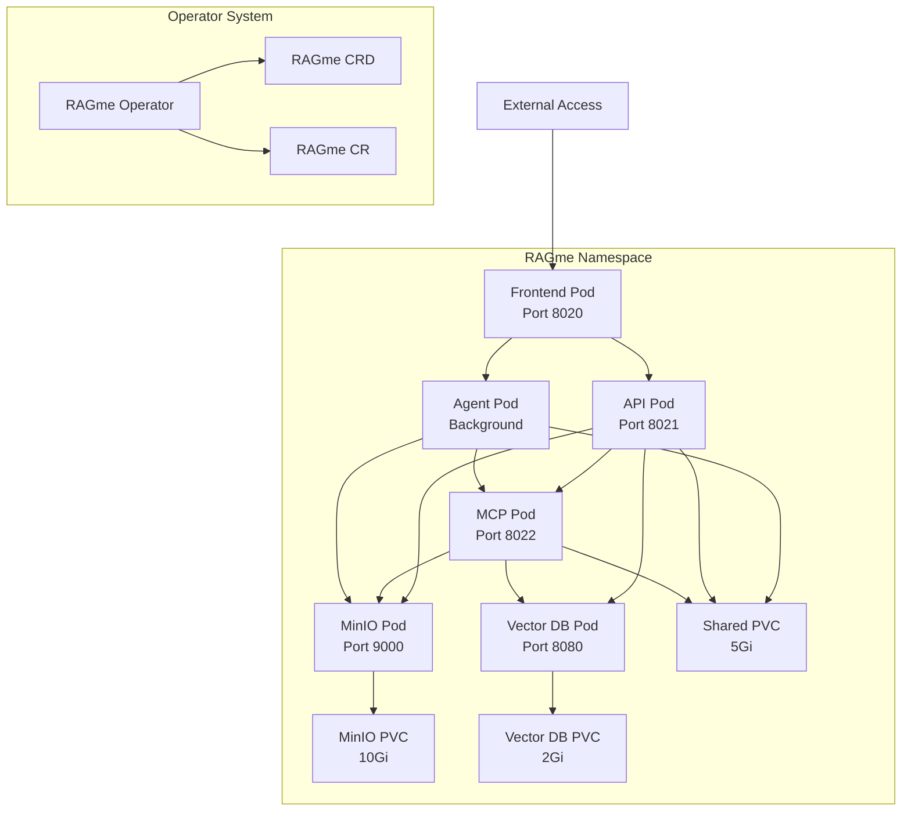

# RAGme Kubernetes Deployment

This directory contains everything needed to deploy RAGme on Kubernetes, including containerization, orchestration manifests, and a custom operator.

## 🚀 Quick Start

### Prerequisites

- [Podman](https://podman.io/) or Docker for container management
- [Kind](https://kind.sigs.k8s.io/) for local Kubernetes cluster
- [kubectl](https://kubernetes.io/docs/tasks/tools/) for Kubernetes management
- [Go 1.21+](https://golang.org/) for operator development

### Local Development with Kind

1. **Deploy RAGme to local Kind cluster:**
   ```bash
   cd deployment
   ./deploy.sh
   ```

2. **Access services:**
   - Frontend: http://localhost:30020
   - API: http://localhost:30021  
   - MCP: http://localhost:30022
   - MinIO Console: http://localhost:30901

3. **Check deployment status:**
   ```bash
   ./deploy.sh status
   ```

4. **Clean up:**
   ```bash
   ./deploy.sh destroy
   ```

## 📁 Directory Structure

```
deployment/
├── containers/           # Container definitions and build scripts
│   ├── Dockerfile.api   # API service container
│   ├── Dockerfile.mcp   # MCP service container  
│   ├── Dockerfile.agent # Local agent container
│   ├── Dockerfile.frontend # Frontend service container
│   ├── .dockerignore    # Docker ignore patterns
│   └── docker-compose.yml # Local development compose file
├── k8s/                 # Kubernetes manifests
│   ├── namespace.yaml   # RAGme namespace
│   ├── configmap.yaml   # Configuration and secrets
│   ├── shared-storage.yaml # Persistent volume claims
│   ├── *-deployment.yaml # Service deployments
│   └── kustomization.yaml # Kustomize configuration
├── operator/            # Kubernetes operator (Go)
│   ├── api/v1/         # CRD definitions
│   ├── cmd/main.go     # Operator entry point
│   ├── internal/controller/ # Controller logic
│   ├── config/         # Operator manifests
│   └── Makefile        # Build automation
├── scripts/             # Deployment automation scripts
│   ├── build-containers.sh # Container build script
│   └── push-containers.sh  # Container push script
├── tests/               # Deployment tests
│   ├── unit/           # Unit tests
│   └── integration/    # Integration tests
├── deploy.sh           # Main deployment script
└── README.md           # This file
```

## 🐳 Containerization

RAGme services are containerized for Kubernetes deployment:

### Available Containers

| Service | Container | Port | Description |
|---------|-----------|------|-------------|
| **API** | `ragme-api:latest` | 8021 | FastAPI REST service |
| **MCP** | `ragme-mcp:latest` | 8022 | Model Context Protocol service |
| **Agent** | `ragme-agent:latest` | - | File monitoring background service |
| **Frontend** | `ragme-frontend:latest` | 8020 | Node.js web interface |

### Building Containers

```bash
# Build all containers
./deployment/scripts/build-containers.sh

# Push to registry
./deployment/scripts/push-containers.sh <registry-url>
```

### Local Testing with Compose

```bash
cd deployment/containers
podman-compose up
```

## ☸️ Kubernetes Deployment

### Manual Deployment

1. **Apply manifests directly:**
   ```bash
   kubectl apply -k deployment/k8s/
   ```

2. **Check deployment:**
   ```bash
   kubectl get pods -n ragme
   kubectl get services -n ragme
   ```

### Operator-Based Deployment

1. **Install the operator:**
   ```bash
   cd deployment/operator
   make install     # Install CRDs
   make deploy      # Deploy operator
   ```

2. **Create RAGme instance:**
   ```bash
   kubectl apply -f deployment/operator/config/samples/ragme_v1_ragme.yaml
   ```

3. **Monitor deployment:**
   ```bash
   kubectl get ragme -n ragme
   kubectl describe ragme ragme-sample -n ragme
   ```

## 🛠️ Operator

The RAGme operator provides declarative management of RAGme deployments through custom resources.

### Custom Resource Definition

```yaml
apiVersion: ragme.io/v1
kind: RAGme
metadata:
  name: my-ragme
  namespace: ragme
spec:
  version: "latest"
  replicas:
    api: 2
    mcp: 2
    agent: 1
    frontend: 2
  storage:
    minio:
      enabled: true
      storageSize: "10Gi"
  vectorDB:
    type: "weaviate"
    weaviate:
      enabled: true
      storageSize: "2Gi"
```

### Operator Development

```bash
cd deployment/operator

# Build and test
make build
make test

# Generate manifests
make generate
make manifests

# Build operator container
make container-build IMG=ragme-operator:latest
```

## ⚙️ Configuration

### Environment Variables

Configuration is managed through `config.yaml` and environment variables. See [`env.example`](../env.example) for required variables:

#### Deployment-Specific Variables

```bash
# Container configuration
CONTAINER_REGISTRY=localhost:5001
CONTAINER_TAG=latest

# Kubernetes configuration  
K8S_CLUSTER_NAME=ragme-cluster
K8S_NAMESPACE=ragme
K8S_STORAGE_CLASS=standard
K8S_ACCESS_TYPE=NodePort
K8S_INGRESS_HOST=ragme.local
K8S_OPERATOR_NAMESPACE=ragme-operator-system
RAGME_OPERATOR_IMAGE=ragme-operator:latest
```

### Deployment Configuration

The [`config.yaml.example`](../config.yaml.example) file includes a new `deployment:` section:

```yaml
deployment:
  mode: "kubernetes"  # local, docker, kubernetes
  containers:
    registry: "${CONTAINER_REGISTRY:-localhost:5001}"
    tag: "${CONTAINER_TAG:-latest}"
  kubernetes:
    cluster:
      name: "${K8S_CLUSTER_NAME:-ragme-cluster}"
      namespace: "${K8S_NAMESPACE:-ragme}"
    replicas:
      api: 2
      mcp: 2
      agent: 1
      frontend: 2
    storage:
      shared_volume:
        size: "5Gi"
      minio:
        enabled: true
        storage_size: "10Gi"
    external_access:
      type: "NodePort"
```

## 🧪 Testing

### Unit Tests

Test deployment configuration and container definitions:

```bash
./test.sh deployment-unit
```

### Integration Tests

Test full deployment on Kind cluster:

```bash
./test.sh deployment-integration
```

### CI/CD

Deployment tests run automatically in GitHub Actions:
- **Unit tests:** Configuration validation, manifest syntax
- **Integration tests:** Kind cluster deployment, operator functionality
- **Container tests:** Image building and basic functionality

## 🏗️ Architecture

### Kubernetes Components



### Service Architecture

| Component | Replicas | Resources | Storage | Access |
|-----------|----------|-----------|---------|---------|
| **Frontend** | 2 | 256Mi/250m CPU | Logs only | NodePort 30020 |
| **API** | 2 | 512Mi/500m CPU | Shared + Logs | NodePort 30021 |
| **MCP** | 2 | 512Mi/500m CPU | Shared + Logs | NodePort 30022 |
| **Agent** | 1 | 256Mi/250m CPU | Shared + Logs | Internal only |
| **MinIO** | 1 | 256Mi/250m CPU | 10Gi PVC | NodePort 30900/30901 |
| **Weaviate** | 1 | 1Gi/500m CPU | 2Gi PVC | NodePort 30080 |

## 📚 Additional Documentation

- [Containerization Guide](../docs/DEPLOYMENT_CONTAINERS.md)
- [Kubernetes Manifests Guide](../docs/DEPLOYMENT_KUBERNETES.md)
- [Operator Development Guide](../docs/DEPLOYMENT_OPERATOR.md)
- [Troubleshooting Guide](../docs/DEPLOYMENT_TROUBLESHOOTING.md)

## 🔧 Troubleshooting

### Common Issues

1. **Container build failures:**
   ```bash
   # Check podman installation
   podman --version
   
   # Verify dependencies
   cat requirements.txt
   cd frontend && npm install
   ```

2. **Kind cluster issues:**
   ```bash
   # Reset cluster
   kind delete cluster --name ragme-cluster
   ./deploy.sh cluster
   ```

3. **Pod startup failures:**
   ```bash
   # Check pod logs
   kubectl logs -f deployment/ragme-api -n ragme
   
   # Check events
   kubectl get events -n ragme --sort-by='.lastTimestamp'
   ```

4. **Storage issues:**
   ```bash
   # Check PVCs
   kubectl get pvc -n ragme
   
   # Describe storage issues
   kubectl describe pvc ragme-shared-pvc -n ragme
   ```

### Getting Help

- Check the [main documentation](../docs/README.md)
- Review [troubleshooting guide](../docs/DEPLOYMENT_TROUBLESHOOTING.md)
- Examine pod logs: `kubectl logs -f <pod-name> -n ragme`
- Check events: `kubectl get events -n ragme`

## 🚀 Production Deployment

For production deployments:

1. **Use external registries:**
   ```bash
   REGISTRY=docker.io/myorg ./deployment/scripts/push-containers.sh
   ```

2. **Configure ingress:**
   ```yaml
   externalAccess:
     type: "Ingress"
     ingress:
       enabled: true
       host: "ragme.example.com"
       tlsEnabled: true
   ```

3. **Use external storage and databases:**
   ```yaml
   vectorDB:
     type: "weaviate"
     weaviate:
       enabled: false  # Use external Weaviate
   storage:
     minio:
       enabled: false  # Use external S3/MinIO
   ```

4. **Set resource limits:**
   ```yaml
   resources:
     api:
       requests: { memory: "1Gi", cpu: "1000m" }
       limits: { memory: "2Gi", cpu: "2000m" }
   ```

## 📝 License

This deployment configuration is part of RAGme and follows the same license terms as the main project.