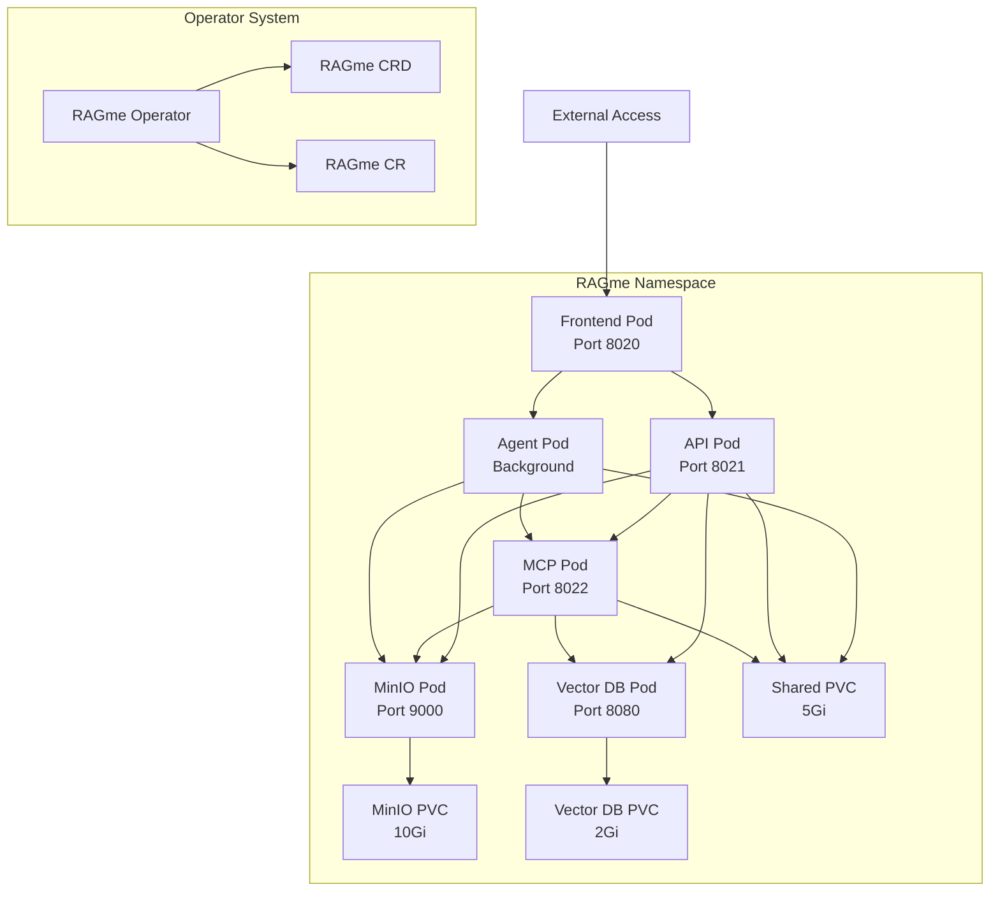

# RAGme Kubernetes Deployment

This directory contains everything needed to deploy RAGme on Kubernetes, including containerization, orchestration manifests, and a custom operator.

## 🚀 Quick Start

### Prerequisites

- [Podman](https://podman.io/) or Docker for container management
- [Kind](https://kind.sigs.k8s.io/) for local Kubernetes cluster
- [kubectl](https://kubernetes.io/docs/tasks/tools/) for Kubernetes management
- [Go 1.21+](https://golang.org/) for operator development

### Local Development with Kind

1. **Deploy RAGme to local Kind cluster:**
   ```bash
   cd deployment
   ./deploy.sh
   ```

2. **Access services:**
   - Frontend: http://localhost:30020
   - API: http://localhost:30021  
   - MCP: http://localhost:30022
   - MinIO Console: http://localhost:30901

3. **Check deployment status:**
   ```bash
   ./deploy.sh status
   ```

4. **Clean up:**
   ```bash
   ./deploy.sh destroy
   ```

### Production Deployment with GKE ⭐ **ENHANCED!**

RAGme now supports comprehensive Google Kubernetes Engine (GKE) deployment with automatic configuration management, dynamic environment variable injection, and architecture-aware container builds.

#### 🚀 Complete GKE Deployment from Scratch

**Prerequisites:**
- Google Cloud SDK (`gcloud`) installed and authenticated
- `kubectl` configured for GKE access
- `.env` file with your API keys and OAuth credentials
- Google Cloud project with Container Registry API enabled

**Step-by-Step Deployment:**

1. **Create GKE Cluster:**
   ```bash
   cd deployment
   CLUSTER_NAME=ragme-test ZONE=us-central1-a ./scripts/gke/create-gke-cluster.sh
   ```

2. **Build Container Images for GKE:**
   ```bash
   # Build with linux/amd64 architecture for GKE
   ./scripts/build-containers.sh --target gke --registry gcr.io/YOUR_PROJECT_ID
   ```

3. **Deploy to GKE with Dynamic Configuration:**
   ```bash
   CLUSTER_NAME=ragme-test ZONE=us-central1-a ./scripts/gke/deploy-gke.sh deploy
   ```

4. **Access Services:**
   - Frontend: http://[EXTERNAL-IP] (LoadBalancer)
   - API: http://[EXTERNAL-IP]:30021 (LoadBalancer)
   - MCP: http://[EXTERNAL-IP]:30022 (LoadBalancer)

5. **Verify Deployment:**
   ```bash
   # Check deployment status
   CLUSTER_NAME=ragme-test ZONE=us-central1-a ./scripts/gke/deploy-gke.sh status
   
   # View pod status
   CLUSTER_NAME=ragme-test ZONE=us-central1-a kubectl get pods -n ragme
   
   # Check external IP
   CLUSTER_NAME=ragme-test ZONE=us-central1-a kubectl get service -n ragme ragme-frontend-lb
   ```

6. **Clean Up:**
   ```bash
   # Clean up secrets from configmap file (recommended after successful deployment)
   ./scripts/gke/deploy-gke.sh cleanup-secrets
   
   # Destroy deployment
   CLUSTER_NAME=ragme-test ZONE=us-central1-a ./scripts/gke/deploy-gke.sh destroy
   
   # Delete cluster
   CLUSTER_NAME=ragme-test ZONE=us-central1-a ./scripts/gke/create-gke-cluster.sh delete
   ```

#### 🔧 Dynamic Configuration Management

The GKE deployment automatically reads configuration from your `.env` file and applies it to the Kubernetes ConfigMap:

**Supported Environment Variables:**
- **Vector Database**: `VECTOR_DB_TYPE`, `WEAVIATE_URL`, `WEAVIATE_API_KEY`
- **OpenAI API**: `OPENAI_API_KEY`
- **OAuth Providers**: All `*_OAUTH_*` client IDs and secrets
- **External URLs**: Automatic LoadBalancer IP detection for OAuth redirect URIs

**Required .env Configuration:**
```bash
# Vector Database (Weaviate Cloud recommended)
VECTOR_DB_TYPE=weaviate-cloud
WEAVIATE_URL=your-cluster.weaviate.cloud
WEAVIATE_API_KEY=your-weaviate-api-key

# OpenAI API
OPENAI_API_KEY=sk-proj-your-openai-key

# OAuth Authentication (optional)
GOOGLE_OAUTH_CLIENT_ID=your-google-client-id
GOOGLE_OAUTH_CLIENT_SECRET=your-google-client-secret
GITHUB_OAUTH_CLIENT_ID=your-github-client-id
GITHUB_OAUTH_CLIENT_SECRET=your-github-client-secret
APPLE_OAUTH_CLIENT_ID=your-apple-client-id
APPLE_OAUTH_CLIENT_SECRET=your-apple-client-secret
```

#### 🛠️ GKE Deployment Features

- **Architecture-Aware Builds**: Automatically builds `linux/amd64` images for GKE
- **Dynamic ConfigMap Updates**: Reads `.env` values and updates Kubernetes ConfigMap
- **LoadBalancer Integration**: Automatically configures OAuth redirect URIs with external IP
- **Resource Optimization**: Optimized resource requests/limits for GKE nodes
- **High Availability**: Multi-replica deployments with automatic load balancing
- **Container Registry**: Direct push to Google Container Registry (GCR)
- **Secret Management**: Secure handling of API keys and OAuth credentials

#### 🔍 Troubleshooting GKE Deployment

**Common Issues and Solutions:**

1. **Architecture Mismatch (`exec format error`):**
   ```bash
   # Ensure building for correct architecture
   ./scripts/build-containers.sh --target gke --registry gcr.io/YOUR_PROJECT_ID
   ```

2. **Configuration Not Applied:**
   ```bash
   # Check if .env file exists and has correct values
   cat .env | grep -E "(WEAVIATE|OPENAI|OAUTH)"
   
   # Verify ConfigMap was updated
   CLUSTER_NAME=ragme-test ZONE=us-central1-a kubectl get configmap ragme-config -n ragme -o yaml
   ```

3. **OAuth Redirect URI Issues:**
   ```bash
   # Check external IP
   CLUSTER_NAME=ragme-test ZONE=us-central1-a kubectl get service -n ragme ragme-frontend-lb
   
   # Verify OAuth configuration in ConfigMap
   CLUSTER_NAME=ragme-test ZONE=us-central1-a kubectl get configmap ragme-config -n ragme -o yaml | grep OAUTH
   ```

4. **Resource Constraints:**
   ```bash
   # Check pod status and events
   CLUSTER_NAME=ragme-test ZONE=us-central1-a kubectl get pods -n ragme
   CLUSTER_NAME=ragme-test ZONE=us-central1-a kubectl describe pod <pod-name> -n ragme
   ```

5. **Secrets in ConfigMap File:**
   ```bash
   # Clean up actual secrets from configmap-gke.yaml after deployment
   ./scripts/gke/deploy-gke.sh cleanup-secrets
   
   # This restores placeholder values and makes the file safe to commit
   ```

## 📁 Directory Structure

```
deployment/
├── containers/           # Container definitions and build scripts
│   ├── Dockerfile.api   # API service container
│   ├── Dockerfile.mcp   # MCP service container  
│   ├── Dockerfile.agent # Local agent container
│   ├── Dockerfile.frontend # Frontend service container
│   ├── .dockerignore    # Docker ignore patterns
│   └── docker-compose.yml # Local development compose file
├── k8s/                 # Kubernetes manifests
│   ├── namespace.yaml   # RAGme namespace
│   ├── configmap.yaml   # Configuration and secrets
│   ├── shared-storage.yaml # Persistent volume claims
│   ├── *-deployment.yaml # Service deployments (Kind)
│   ├── *-deployment-gke.yaml # GKE-specific deployments
│   ├── services-gke.yaml # GKE LoadBalancer services
│   ├── ingress-gke.yaml # GKE Ingress configuration
│   ├── kustomization.yaml # Kustomize configuration (Kind)
│   └── kustomization-gke.yaml # Kustomize configuration (GKE)
├── operator/            # Kubernetes operator (Go)
│   ├── api/v1/         # CRD definitions
│   ├── cmd/main.go     # Operator entry point
│   ├── internal/controller/ # Controller logic
│   ├── config/         # Operator manifests
│   └── Makefile        # Build automation
├── scripts/             # Deployment automation scripts
│   ├── build-containers.sh # Container build script
│   └── push-containers.sh  # Container push script
├── tests/               # Deployment tests
│   ├── unit/           # Unit tests
│   └── integration/    # Integration tests
├── deploy.sh           # Main deployment script (Kind)
├── deploy-gke.sh       # GKE deployment script
├── create-gke-cluster.sh # GKE cluster creation script
└── README.md           # This file
```

## 🐳 Containerization

RAGme services are containerized for Kubernetes deployment:

### Available Containers

| Service | Container | Port | Description |
|---------|-----------|------|-------------|
| **API** | `ragme-api:latest` | 8021 | FastAPI REST service |
| **MCP** | `ragme-mcp:latest` | 8022 | Model Context Protocol service |
| **Agent** | `ragme-agent:latest` | - | File monitoring background service |
| **Frontend** | `ragme-frontend:latest` | 8020 | Node.js web interface |

### Building Containers

```bash
# Build all containers
./deployment/scripts/build-containers.sh

# Build specific service only (for faster iteration)
./deployment/scripts/build-containers.sh --service frontend
./deployment/scripts/build-containers.sh --service api
./deployment/scripts/build-containers.sh --service mcp
./deployment/scripts/build-containers.sh --service agent

# Build for specific platform (GKE requires AMD64)
./deployment/scripts/build-containers.sh --target gke --platform linux/amd64

# Build without cache (for clean builds)
./deployment/scripts/build-containers.sh --no-cache

# Push to registry
./deployment/scripts/push-containers.sh <registry-url>
```

### Local Testing with Compose

```bash
cd deployment/containers
podman-compose up
```

## ☸️ Kubernetes Deployment

### Manual Deployment

1. **Apply manifests directly:**
   ```bash
   kubectl apply -k deployment/k8s/
   ```

2. **Check deployment:**
   ```bash
   kubectl get pods -n ragme
   kubectl get services -n ragme
   ```

### Operator-Based Deployment

1. **Install the operator:**
   ```bash
   cd deployment/operator
   make install     # Install CRDs
   make deploy      # Deploy operator
   ```

2. **Create RAGme instance:**
   ```bash
   kubectl apply -f deployment/operator/config/samples/ragme_v1_ragme.yaml
   ```

3. **Monitor deployment:**
   ```bash
   kubectl get ragme -n ragme
   kubectl describe ragme ragme-sample -n ragme
   ```

## 🛠️ Operator

The RAGme operator provides declarative management of RAGme deployments through custom resources.

### Custom Resource Definition

```yaml
apiVersion: ragme.io/v1
kind: RAGme
metadata:
  name: my-ragme
  namespace: ragme
spec:
  version: "latest"
  replicas:
    api: 2
    mcp: 2
    agent: 1
    frontend: 2
  storage:
    minio:
      enabled: true
      storageSize: "10Gi"
  vectorDB:
    type: "weaviate"
    weaviate:
      enabled: true
      storageSize: "2Gi"
```

### Operator Development

```bash
cd deployment/operator

# Build and test
make build
make test

# Generate manifests
make generate
make manifests

# Build operator container
make container-build IMG=ragme-operator:latest
```

## ⚙️ Configuration

### Environment Variables

Configuration is managed through `config.yaml` and environment variables. See [`env.example`](../env.example) for required variables:

#### Deployment-Specific Variables

```bash
# Container configuration
CONTAINER_REGISTRY=localhost:5001
CONTAINER_TAG=latest

# Kubernetes configuration  
K8S_CLUSTER_NAME=ragme-cluster
K8S_NAMESPACE=ragme
K8S_STORAGE_CLASS=standard
K8S_ACCESS_TYPE=NodePort
K8S_INGRESS_HOST=ragme.local
K8S_OPERATOR_NAMESPACE=ragme-operator-system
RAGME_OPERATOR_IMAGE=ragme-operator:latest
```

### Deployment Configuration

The [`config.yaml.example`](../config.yaml.example) file includes a new `deployment:` section:

```yaml
deployment:
  mode: "kubernetes"  # local, docker, kubernetes
  containers:
    registry: "${CONTAINER_REGISTRY:-localhost:5001}"
    tag: "${CONTAINER_TAG:-latest}"
  kubernetes:
    cluster:
      name: "${K8S_CLUSTER_NAME:-ragme-cluster}"
      namespace: "${K8S_NAMESPACE:-ragme}"
    replicas:
      api: 2
      mcp: 2
      agent: 1
      frontend: 2
    storage:
      shared_volume:
        size: "5Gi"
      minio:
        enabled: true
        storage_size: "10Gi"
    external_access:
      type: "NodePort"
```

## 🧪 Testing

### Unit Tests

Test deployment configuration and container definitions:

```bash
./test.sh deployment-unit
```

### Integration Tests

Test full deployment on Kind cluster:

```bash
./test.sh deployment-integration
```

### CI/CD

Deployment tests run automatically in GitHub Actions:
- **Unit tests:** Configuration validation, manifest syntax
- **Integration tests:** Kind cluster deployment, operator functionality
- **Container tests:** Image building and basic functionality

## 🏗️ Architecture

### Kubernetes Components



### Service Architecture

| Component | Replicas | Resources | Storage | Access |
|-----------|----------|-----------|---------|---------|
| **Frontend** | 2 | 256Mi/250m CPU | Logs only | NodePort 30020 |
| **API** | 2 | 512Mi/500m CPU | Shared + Logs | NodePort 30021 |
| **MCP** | 2 | 512Mi/500m CPU | Shared + Logs | NodePort 30022 |
| **Agent** | 1 | 256Mi/250m CPU | Shared + Logs | Internal only |
| **MinIO** | 1 | 256Mi/250m CPU | 10Gi PVC | NodePort 30900/30901 |
| **Weaviate** | 1 | 1Gi/500m CPU | 2Gi PVC | NodePort 30080 |

### High Availability Configuration

RAGme is deployed with high availability in mind:

#### **Multi-Replica Services**
- **Frontend (2 replicas)**: Ensures web interface remains available during pod restarts or failures
- **API (2 replicas)**: Provides redundancy for REST API endpoints and query processing
- **MCP (2 replicas)**: Maintains Model Context Protocol service availability

#### **Automatic Load Balancing**
Kubernetes Services provide built-in load balancing:
- **Round-robin distribution**: Traffic automatically distributed across healthy pods
- **Health checking**: Only routes to pods passing readiness/liveness probes
- **Automatic failover**: Failed pods are removed from rotation without manual intervention
- **Zero-downtime deployments**: Rolling updates ensure continuous service availability

#### **Load Balancing Architecture**
```
External Traffic → NodePort Services → ClusterIP Services → Multiple Pod Replicas
     ↓                    ↓                    ↓                    ↓
Port 30020/30021    Load Balancing    Health Checking    Round-Robin Distribution
```

#### **Benefits**
- **Fault Tolerance**: Service continues if individual pods fail
- **Scalability**: Easy to increase replicas for higher load
- **Maintenance**: Rolling updates without service interruption
- **Resource Efficiency**: Workload distributed across multiple instances
- **Production Readiness**: Mirrors real-world deployment patterns

## 📚 Additional Documentation

- [Containerization Guide](../docs/DEPLOYMENT_CONTAINERS.md)
- [Kubernetes Manifests Guide](../docs/DEPLOYMENT_KUBERNETES.md)
- [Operator Development Guide](../docs/DEPLOYMENT_OPERATOR.md)
- [Troubleshooting Guide](../docs/DEPLOYMENT_TROUBLESHOOTING.md)

## 🔧 Troubleshooting

### Common Issues and Solutions

#### 1. Vector DB and Collections Showing "Loading" Indefinitely

**Symptoms:**
- Frontend shows "Vector DB: Loading..." and "Collections: Loading..."
- No documents visible in the UI
- Frontend logs show "Could not connect to backend for configuration, using defaults"

**Root Cause:** Frontend server startup timing issue - backend API not ready when frontend tries to load configuration.

**Solution:**
```bash
# Quick fix - restart frontend deployment
kubectl rollout restart deployment/ragme-frontend -n ragme

# Wait for rollout to complete
kubectl rollout status deployment/ragme-frontend -n ragme

# Check frontend logs
kubectl logs -f deployment/ragme-frontend -n ragme
```

**Permanent Fix:** The frontend now includes automatic retry logic and health checks to handle backend startup timing.

#### 2. OAuth Providers Not Showing

**Symptoms:**
- Login screen appears but no OAuth buttons (Google, GitHub, Apple)
- Frontend logs show 404 errors for `/api/auth/providers`

**Root Cause:** Frontend server not properly proxying OAuth provider requests to backend.

**Solution:**
```bash
# Check if OAuth configuration is loaded
kubectl get configmap ragme-config -n ragme -o yaml | grep -A5 -B5 OAUTH

# Restart frontend to reload configuration
kubectl rollout restart deployment/ragme-frontend -n ragme

# Verify OAuth endpoints are accessible
kubectl port-forward svc/ragme-api 8021:8021 -n ragme &
curl http://localhost:8021/auth/providers
```

#### 3. Documents Not Showing

**Symptoms:**
- Empty document list in UI
- API logs show Weaviate connection errors
- "Failed to connect to Weaviate" in backend logs

**Root Cause:** Incorrect Weaviate configuration or connection issues.

**Solution:**
```bash
# Check Weaviate configuration in secrets
kubectl get secret ragme-secrets -n ragme -o yaml | grep WEAVIATE

# Check Weaviate pod status
kubectl get pods -n ragme | grep weaviate
kubectl logs -f deployment/ragme-weaviate -n ragme

# Test Weaviate connectivity
kubectl port-forward svc/ragme-weaviate 8080:8080 -n ragme &
curl http://localhost:8080/v1/meta

# If using Weaviate Cloud, verify API key
kubectl patch secret ragme-secrets -n ragme --type='json' -p='[{"op": "replace", "path": "/data/WEAVIATE_API_KEY", "value": "'$(echo -n "your-weaviate-api-key" | base64)'"}]'
```

#### 4. Queries Failing with OpenAI 401 Error

**Symptoms:**
- Chat queries return "Incorrect API key provided"
- Error: "your-ope************here" in logs

**Root Cause:** Placeholder OpenAI API key in Kubernetes secret.

**Solution:**
```bash
# Check current OpenAI API key in secret
kubectl get secret ragme-secrets -n ragme -o yaml | grep OPENAI_API_KEY

# Update with correct API key
kubectl patch secret ragme-secrets -n ragme --type='json' -p='[{"op": "replace", "path": "/data/OPENAI_API_KEY", "value": "'$(echo -n "sk-your-actual-openai-key" | base64)'"}]'

# Restart API deployment to pick up new secret
kubectl rollout restart deployment/ragme-api -n ragme

# Verify API key is loaded
kubectl exec deployment/ragme-api -n ragme -- env | grep OPENAI_API_KEY
```

#### 5. Pod Stuck in Pending State

**Symptoms:**
- Pods show "Pending" status
- Events show "Insufficient memory" or "Insufficient cpu"

**Root Cause:** Resource constraints in Kind cluster.

**Solution:**
```bash
# Check pod status and events
kubectl get pods -n ragme
kubectl describe pod <pod-name> -n ragme

# Check cluster resources
kubectl top nodes
kubectl top pods -n ragme

# Delete stuck pods to free resources
kubectl delete pod <pod-name> -n ragme

# If persistent, recreate cluster with more resources
./deploy.sh destroy
./deploy.sh deploy
```

#### 6. Configuration Not Applied After Deploy

**Symptoms:**
- Changes to `.env` or `config.yaml` not reflected in deployment
- API still using old configuration values

**Root Cause:** ConfigMap/Secret not properly updated during deployment.

**Solution:**
```bash
# Regenerate and apply ConfigMap manually
./deploy.sh generate-configmap
kubectl apply -f k8s/configmap-generated.yaml

# Restart deployments to pick up new configuration
kubectl rollout restart deployment/ragme-api -n ragme
kubectl rollout restart deployment/ragme-frontend -n ragme

# Verify configuration is loaded
kubectl exec deployment/ragme-api -n ragme -- env | grep WEAVIATE
```

#### 7. Frontend 404 Errors for `/api/config`

**Symptoms:**
- Frontend logs show "404 - Resource not found: GET /api/config"
- Frontend can't load configuration

**Root Cause:** Frontend server not properly configured or backend not ready.

**Solution:**
```bash
# Check frontend pod logs
kubectl logs -f deployment/ragme-frontend -n ragme

# Check if backend is ready
kubectl get pods -n ragme | grep api
kubectl logs -f deployment/ragme-api -n ragme

# Test backend health
kubectl port-forward svc/ragme-api 8021:8021 -n ragme &
curl http://localhost:8021/health

# Restart frontend if needed
kubectl rollout restart deployment/ragme-frontend -n ragme
```

#### 8. Kind Cluster Already Exists Error

**Symptoms:**
- `./deploy.sh deploy` fails with "node(s) already exist for a cluster"

**Root Cause:** Previous Kind cluster still exists.

**Solution:**
```bash
# List existing clusters
kind get clusters

# Delete existing cluster
kind delete cluster --name ragme-cluster

# Or use existing cluster
./deploy.sh deploy  # Script will detect and offer options
```

### Useful Debugging Commands

#### Check Deployment Status
```bash
# Overall status
kubectl get all -n ragme

# Pod status with details
kubectl get pods -n ragme -o wide

# Service endpoints
kubectl get svc -n ragme
kubectl get endpoints -n ragme
```

#### View Logs
```bash
# All pods in namespace
kubectl logs -f -l app=ragme -n ragme

# Specific deployment
kubectl logs -f deployment/ragme-api -n ragme
kubectl logs -f deployment/ragme-frontend -n ragme

# Previous container instance
kubectl logs -f deployment/ragme-api -n ragme --previous
```

#### Check Configuration
```bash
# ConfigMap
kubectl get configmap ragme-config -n ragme -o yaml

# Secrets (base64 encoded)
kubectl get secret ragme-secrets -n ragme -o yaml

# Decode secret values
kubectl get secret ragme-secrets -n ragme -o jsonpath='{.data.WEAVIATE_URL}' | base64 -d
```

#### Test Connectivity
```bash
# Port forward for testing
kubectl port-forward svc/ragme-api 8021:8021 -n ragme &
kubectl port-forward svc/ragme-frontend 8020:8020 -n ragme &
kubectl port-forward svc/ragme-weaviate 8080:8080 -n ragme &

# Test endpoints
curl http://localhost:8021/health
curl http://localhost:8020/api/config
curl http://localhost:8080/v1/meta
```

#### Force Restart Services
```bash
# Restart all deployments
kubectl rollout restart deployment/ragme-api -n ragme
kubectl rollout restart deployment/ragme-frontend -n ragme
kubectl rollout restart deployment/ragme-mcp -n ragme
kubectl rollout restart deployment/ragme-agent -n ragme

# Wait for rollouts
kubectl rollout status deployment/ragme-api -n ragme
kubectl rollout status deployment/ragme-frontend -n ragme
```

### Getting Help

- Check the [main documentation](../docs/README.md)
- Review [troubleshooting guide](../docs/DEPLOYMENT_TROUBLESHOOTING.md)
- Examine pod logs: `kubectl logs -f <pod-name> -n ragme`
- Check events: `kubectl get events -n ragme --sort-by='.lastTimestamp'`
- Verify configuration: `kubectl get configmap,secret -n ragme -o yaml`

## 🚀 Production Deployment

For production deployments:

1. **Use external registries:**
   ```bash
   REGISTRY=docker.io/myorg ./deployment/scripts/push-containers.sh
   ```

2. **Configure ingress:**
   ```yaml
   externalAccess:
     type: "Ingress"
     ingress:
       enabled: true
       host: "ragme.example.com"
       tlsEnabled: true
   ```

3. **Use external storage and databases:**
   ```yaml
   vectorDB:
     type: "weaviate"
     weaviate:
       enabled: false  # Use external Weaviate
   storage:
     minio:
       enabled: false  # Use external S3/MinIO
   ```

4. **Set resource limits:**
   ```yaml
   resources:
     api:
       requests: { memory: "1Gi", cpu: "1000m" }
       limits: { memory: "2Gi", cpu: "2000m" }
   ```

## 📝 License

This deployment configuration is part of RAGme and follows the same license terms as the main project.