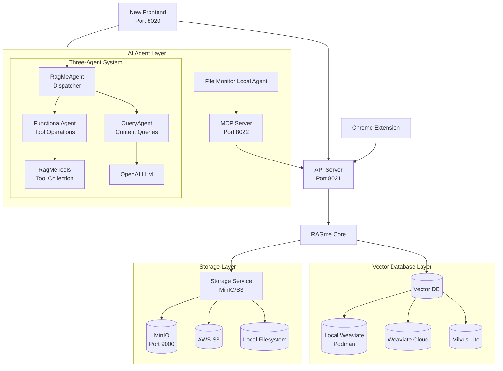

# 🏗️ RAGme Architecture

This document provides a comprehensive overview of RAGme's technical architecture, including the three-agent system, vector database abstraction, storage service, and system components.

## 🎯 System Overview

RAGme.io uses a multi-service architecture with a sophisticated three-agent system for intelligent document processing and querying.



## 🤖 Three-Agent Architecture

RAGme.io features a sophisticated three-agent architecture that provides intelligent query routing and specialized processing:

### 1. **RagMeAgent (Dispatcher)**
- **Purpose**: Routes user queries to appropriate specialized agents
- **Capabilities**: 
  - Intelligent query classification (functional vs. content queries)
  - Seamless routing to specialized agents
  - Provides agent information and capabilities
- **Location**: `src/ragme/agents/ragme_agent.py`

### 2. **FunctionalAgent**
- **Purpose**: Handles tool-based operations and document management
- **Capabilities**:
  - Document collection operations (add, delete, list, reset)
  - URL crawling and web page processing
  - Vector database management
  - Uses LlamaIndex FunctionAgent for reliable tool execution
- **Location**: `src/ragme/agents/functional_agent.py`

### 3. **QueryAgent**
- **Purpose**: Answers questions about document content using advanced RAG
- **Capabilities**:
  - Vector similarity search across documents
  - LLM-powered content summarization and question answering
  - Intelligent document retrieval and context building
  - Configurable document retrieval (top-k documents)
- **Location**: `src/ragme/agents/query_agent.py`

### 4. **RagMeTools**
- **Purpose**: Centralized tool collection for all RagMe operations
- **Capabilities**:
  - Unified tool interface for all operations
  - Clean separation of tools from agent logic
  - Easy extensibility for new tools
- **Location**: `src/ragme/agents/tools.py`

### Query Routing Intelligence

The system automatically routes queries based on content:

- **Functional Queries** → FunctionalAgent
  - "add this URL to my collection"
  - "list all documents"
  - "delete document 123"
  - "reset the collection"

- **Content Queries** → QueryAgent
  - "who is maximilien"
  - "what is the content of this document"
  - "explain the architecture"
  - "summarize the project"

## 🗄️ Vector Database Abstraction

The `RagMe` class has been refactored to be vector database agnostic, allowing you to easily switch between different vector database implementations without changing your core application logic.

### Architecture

The vector database abstraction consists of:

1. **`VectorDatabase`** - Abstract base class defining the interface
2. **`WeaviateVectorDatabase`** - Implementation for Weaviate Cloud (⭐ Recommended)
3. **`WeaviateLocalVectorDatabase`** - Implementation for local Weaviate (Podman) (⭐ Recommended for local development)
4. **`MilvusVectorDatabase`** - Implementation for Milvus (alternative for local development)
5. **`create_vector_database()`** - Factory function for creating database instances
6. **Updated `RagMe`** - Now accepts any vector database implementation

### File Structure

The vector database implementation is organized into modular files:

```
src/ragme/
├── vector_db.py              # Compatibility layer (imports from modules)
├── vector_db_base.py         # Abstract base class
├── vector_db_weaviate.py     # Weaviate Cloud implementation
├── vector_db_weaviate_local.py # Local Weaviate implementation
├── vector_db_milvus.py       # Milvus implementation (default)
└── vector_db_factory.py      # Factory function
```

### Supported Vector Databases

#### Weaviate (Recommended) ⭐ **RECOMMENDED**
- **Cloud-based**: Managed vector database service
- **Local support**: Podman-based local deployment
- **Automatic vectorization**: Built-in embedding capabilities
- **Query agents**: Advanced query capabilities
- **Easy setup**: No server setup required for local development

#### Milvus (Alternative)
- **Milvus Lite**: Local development with no server setup required
- **High-performance**: Vector search and similarity matching
- **Easy setup**: Automatic local database file creation
- **Production ready**: Can scale to Milvus Server for production

### Usage Examples

#### Default Weaviate Usage ⭐ **RECOMMENDED**

```python
from src.ragme.ragme import RagMe
import os

# Uses Weaviate by default (recommended)
os.environ["VECTOR_DB_TYPE"] = "weaviate-local"
os.environ["WEAVIATE_LOCAL_URL"] = "http://localhost:8080"
ragme = RagMe()
ragme.write_webpages_to_weaviate(["https://example.com"])
documents = ragme.list_documents()
ragme.cleanup()
```

#### Using Weaviate Cloud

```python
from src.ragme.ragme import RagMe
import os

# Configure for Weaviate Cloud
os.environ["VECTOR_DB_TYPE"] = "weaviate"
os.environ["WEAVIATE_URL"] = "https://your-cluster.weaviate.cloud"
os.environ["WEAVIATE_API_KEY"] = "your-api-key"

# Initialize RagMe with Weaviate Cloud
ragme = RagMe()
ragme.write_webpages_to_weaviate(["https://example.com"])
documents = ragme.list_documents()
ragme.cleanup()
```

#### Using Milvus (Alternative)

```python
from src.ragme.ragme import RagMe
import os

# Configure for Milvus
os.environ["VECTOR_DB_TYPE"] = "milvus"
os.environ["MILVUS_URI"] = "milvus_demo.db"  # Local Milvus Lite

# Initialize RagMe with Milvus
ragme = RagMe()
ragme.write_webpages_to_weaviate(["https://example.com"])
documents = ragme.list_documents()
ragme.cleanup()
```

## 💾 Storage Service Architecture

RAGme.io includes a comprehensive S3-compatible file storage service that provides persistent storage for documents and images. The storage service supports multiple backends and is designed for both local development and production deployments.

### Architecture

The storage service uses a clean abstraction layer that supports multiple storage backends:

- **MinIO**: Local development and testing
- **AWS S3**: Production deployments
- **Local Filesystem**: Simple file-based storage

### Service Independence

**Important**: MinIO runs as an independent service. RAGme never modifies MinIO source code - it only interacts with MinIO through its S3-compatible API.

### StorageService API

The `StorageService` class provides a comprehensive interface for file operations:

```python
class StorageService:
    def upload_file(self, file_path: str, object_name: str = None) -> str
    def download_file(self, object_name: str, file_path: str) -> bool
    def list_files(self, prefix: str = "") -> List[Dict]
    def delete_file(self, object_name: str) -> bool
    def get_presigned_url(self, object_name: str, expiration: int = 3600) -> str
    def file_exists(self, object_name: str) -> bool
    def get_file_size(self, object_name: str) -> int
    def get_file_metadata(self, object_name: str) -> Dict
```

### Local Development with MinIO

#### Automatic Setup

MinIO is automatically installed and configured during the setup process:

```bash
# Run the setup script (includes MinIO installation)
./setup.sh

# Start all services including MinIO
./start.sh
```

#### MinIO Console

- **URL**: http://localhost:9001
- **Default Credentials**: minioadmin / minioadmin
- **Default Bucket**: ragme-storage

## 🔧 System Components

### Frontend (Port 8020)
- **Modern Three-Pane Layout**: Chat history, main chat area, document management
- **Real-time Updates**: WebSocket communication for live interactions
- **Interactive Visualizations**: D3.js-powered charts with click-to-scroll functionality
- **Responsive Design**: Collapsible sidebars and smooth animations

### API Server (Port 8021)
- **REST API**: URL and JSON ingestion endpoints
- **FastAPI Framework**: Modern Python web framework
- **CORS Support**: Cross-origin resource sharing configuration
- **File Upload**: Document and image upload handling

### MCP Server (Port 8022)
- **Model Context Protocol**: Standardized agent communication
- **Document Processing**: PDF and DOCX file handling
- **Authentication**: MCP server authentication flow
- **Tool Management**: Configure and enable/disable MCP tool servers

### File Monitor Agent
- **Watch Directory**: Monitors `watch_directory/` for new files
- **Automatic Processing**: Detects and processes new PDF/DOCX files
- **Smart Chunking**: Large documents automatically split at sentence boundaries
- **Consistent Processing**: Same chunking logic across all input methods

### Chrome Extension
- **Browser Integration**: One-click web page capture
- **Manifest V3**: Modern Chrome extension architecture
- **API Communication**: Connects to RAGme API server
- **User-Friendly**: Simple popup interface for page capture

## 🔄 Process Management

RAGme uses a comprehensive process management system for reliable service operation:

### Service Lifecycle

```bash
# Start all services
./start.sh

# Stop all services
./stop.sh

# Restart all services
./stop.sh restart

# Check service status
./stop.sh status

# Stop specific services
./stop.sh frontend    # Stop frontend only
./stop.sh api         # Stop API only
./stop.sh mcp         # Stop MCP only
./stop.sh minio       # Stop MinIO only
```

### Development Workflow

```bash
# Compile frontend after configuration or code changes
./start.sh compile-frontend

# Restart only the frontend server
./start.sh restart-frontend

# Restart only backend services (API, MCP, Agent)
./start.sh restart-backend
```

### Log Monitoring

```bash
# Monitor all service logs
./tools/tail-logs.sh all

# Monitor specific services
./tools/tail-logs.sh api        # API logs (port 8021)
./tools/tail-logs.sh mcp        # MCP logs (port 8022)
./tools/tail-logs.sh frontend   # Frontend logs (port 8020)
./tools/tail-logs.sh minio      # MinIO logs (port 9000)
```

## 🎯 Performance Optimization

### Query Threshold Optimization

RAGme includes an automated binary search tool to find optimal `text_relevance_threshold` values:

```bash
# Find optimal threshold for your document collection
./tools/optimize.sh query-threshold

# Custom range optimization
./tools/optimize.sh query-threshold 0.3 0.9
```

### Vector Database Management

```bash
# Show virtual structure (chunks, grouped images, documents)
./tools/vdb.sh virtual-structure

# Show how documents are grouped into chunks
./tools/vdb.sh document-groups

# Show how images are grouped by PDF source
./tools/vdb.sh image-groups

# Delete document and all its chunks/images
./tools/vdb.sh delete-document <file>

# Check VDB health and connectivity
./tools/vdb.sh health
```

## 🔮 Future Architecture Enhancements

1. **Multi-User Support**: SaaS architecture with user isolation
2. **Advanced Security**: HTTPS, authentication, and authorization
3. **Content Types**: Support for images, audio, and video
4. **Integration APIs**: Email, Slack, and social media ingestion
5. **Advanced Analytics**: Usage patterns and performance metrics
6. **Microservices**: Further service decomposition for scalability
7. **Containerization**: Docker and Kubernetes deployment support
