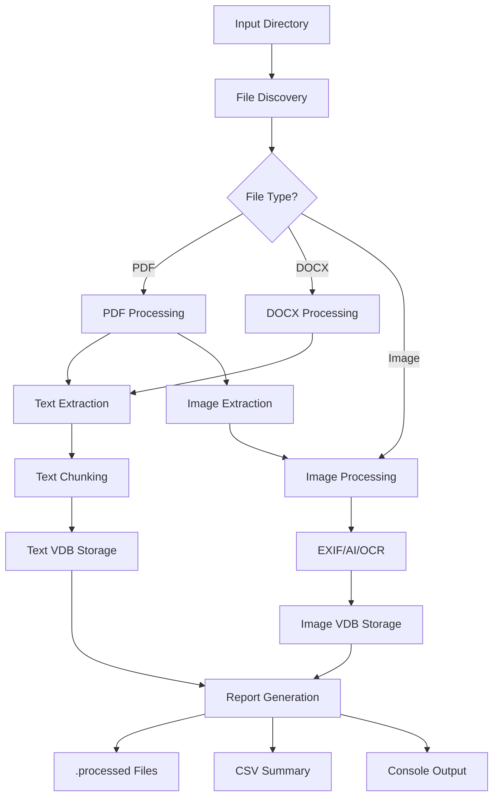

# RAGme Document Processing Pipeline

## Overview

The RAGme Document Processing Pipeline is a robust, scalable batch processing system designed to process collections of documents (PDFs, DOCX files) and images into RAGme's vector database collections. This pipeline provides comprehensive document analysis, text extraction, image processing, and detailed reporting capabilities.

## Features

### 🚀 Core Capabilities

- **Multi-format Support**: Process PDFs, DOCX files, and various image formats (JPEG, PNG, GIF, WebP, BMP, HEIC, TIFF)
- **Parallel Processing**: Configurable batch processing with optimal resource utilization
- **Intelligent Text Chunking**: Smart text segmentation with sentence boundary detection
- **PDF Image Extraction**: Automatic extraction and processing of embedded images from PDFs
- **Comprehensive Image Analysis**: EXIF metadata extraction, AI classification, and OCR text extraction
- **Vector Database Integration**: Direct storage into RAGme's text and image collections
- **Robust Error Handling**: Configurable retry logic with detailed error reporting
- **Progress Tracking**: Real-time processing status and timing information
- **Skip Already Processed**: Automatic detection and skipping of previously processed files

### 📊 Reporting & Analytics

- **Individual File Reports**: Human-readable `.processed` files for each document
- **CSV Summary Reports**: Comprehensive processing statistics and metrics
- **Console Progress**: Real-time status updates with emoji indicators
- **Timing Analysis**: Detailed breakdown of processing phases
- **Error Tracking**: Comprehensive error logging and retry statistics

### 🔧 Advanced Features

- **File Locking**: Prevents concurrent processing conflicts
- **Process Optimization**: Intelligent file ordering for balanced CPU/GPU utilization
- **Context Management**: Proper resource cleanup and signal handling
- **Configurable Parameters**: Customizable chunking, retry limits, and batch sizes
- **Integration Testing**: Full test suite with fixture-based validation

## Architecture

### System Components

```
┌─────────────────────────────────────────────────────────────┐
│                    RAGme Document Processing Pipeline        │
├─────────────────────────────────────────────────────────────┤
│  tools/data_processing.sh (Shell Entry Point)              │
│  ├─ Command line argument parsing                          │
│  ├─ Prerequisites checking                                 │
│  └─ Python pipeline orchestration                         │
├─────────────────────────────────────────────────────────────┤
│  src/ragme/data_processing/ (Python Modules)              │
│  ├─ pipeline.py (Main Orchestrator)                       │
│  │   ├─ File discovery and filtering                      │
│  │   ├─ Parallel processing coordination                  │
│  │   ├─ Lock file management                              │
│  │   └─ Progress tracking and reporting                   │
│  │                                                        │
│  ├─ processor.py (Core Processing Logic)                  │
│  │   ├─ PDF processing with fallback libraries           │
│  │   ├─ DOCX text and metadata extraction                │
│  │   ├─ Image processing integration                      │
│  │   ├─ Text chunking with overlap                        │
│  │   └─ Vector database storage                           │
│  │                                                        │
│  └─ report_generator.py (Reporting System)                │
│      ├─ Human-readable .processed files                   │
│      ├─ CSV report generation                             │
│      ├─ Statistics aggregation                            │
│      └─ Console summary output                            │
├─────────────────────────────────────────────────────────────┤
│  Integration with Existing RAGme Components               │
│  ├─ utils/config_manager.py (Configuration)               │
│  ├─ utils/image_processor.py (Image Analysis)             │
│  ├─ vdbs/ (Vector Database Abstraction)                   │
│  └─ Existing document processing code reuse               │
└─────────────────────────────────────────────────────────────┘
```

### Data Flow



## Installation & Setup

### Prerequisites

1. **RAGme System**: Properly configured RAGme installation with `config.yaml` and `.env`
2. **Vector Database**: Accessible and configured vector database (Weaviate or Milvus)
3. **Python Dependencies**: All RAGme dependencies installed (`pip install -r requirements.txt`)
4. **Optional Libraries**: 
   - PyMuPDF (`pip install pymupdf`) - For robust PDF processing
   - pdfplumber (`pip install pdfplumber`) - For complex PDF layouts
   - EasyOCR/pytesseract - For image text extraction

### Verification

```bash
# Verify prerequisites
./tools/data_processing.sh --help

# Check configuration
python -c "from src.ragme.data_processing import DocumentProcessingPipeline; print('✅ Pipeline ready')"
```

## Usage

### Basic Usage

```bash
# Process all files in a directory
./tools/data_processing.sh /path/to/documents

# Process with verbose output
./tools/data_processing.sh /path/to/documents --verbose

# Process with custom batch size
./tools/data_processing.sh /path/to/documents --batch-size 8

# Process with custom retry limit
./tools/data_processing.sh /path/to/documents --retry-limit 5
```

### Command Line Options

| Option | Description | Default |
|--------|-------------|---------|
| `<directory>` | Directory containing files to process | Required |
| `--batch-size, -b` | Number of parallel processing workers | 3 |
| `--retry-limit, -r` | Maximum retry attempts per file | 3 |
| `--verbose, -v` | Enable verbose progress reporting | false |
| `--help, -h` | Show help message | - |

### Supported File Types

#### Documents
- **PDF (.pdf)**: Text extraction with multiple fallback libraries, image extraction
- **Microsoft Word (.docx)**: Text, metadata, and table extraction

#### Images
- **JPEG (.jpg, .jpeg)**: Full image processing with EXIF, AI classification, OCR
- **PNG (.png)**: Lossless image processing
- **GIF (.gif)**: Animated and static image support
- **WebP (.webp)**: Modern web image format
- **BMP (.bmp)**: Bitmap image processing
- **HEIC (.heic, .heif)**: Apple HEIC format with automatic JPEG conversion
- **TIFF (.tiff, .tif)**: High-quality image format

## Processing Details

### Document Processing

#### PDF Processing
1. **Multi-library Fallback**: PyMuPDF → pdfplumber → PyPDF2
2. **Text Extraction**: Full-text extraction with metadata preservation
3. **Image Extraction**: Embedded images extracted and processed separately
4. **Metadata Collection**: Author, title, creation date, page count

#### DOCX Processing
1. **Text Extraction**: Paragraph and table text extraction
2. **Metadata Extraction**: Document properties and structure analysis
3. **Table Processing**: Table data extraction and counting

#### Text Chunking Strategy
- **Chunk Size**: Configurable (default: 1000 characters)
- **Overlap**: Smart overlap with sentence boundary detection
- **Boundary Detection**: Prefers sentence endings (. ! ?) for natural breaks
- **Metadata Preservation**: Original document metadata carried through all chunks

### Image Processing

#### EXIF Metadata Extraction
- Camera information, timestamps, GPS data
- Technical settings (ISO, aperture, shutter speed)
- Image dimensions and format details

#### AI Classification
- **Model**: ResNet50 pre-trained on ImageNet
- **Features**: Top-K classification with confidence scores
- **Categories**: 1000+ object and scene categories

#### OCR Text Extraction
- **Primary Engine**: EasyOCR with multi-language support
- **Fallback Engine**: pytesseract for additional coverage
- **Preprocessing**: Image enhancement for better OCR accuracy
- **Content Detection**: Smart OCR application based on image classification

### Vector Database Integration

#### Text Collection Storage
- **Single Chunks**: Direct storage for short documents
- **Multi-chunk Documents**: Individual chunk storage with cross-references
- **Metadata**: Comprehensive document metadata with processing timestamps
- **URL Generation**: Unique file:// URLs with chunk identifiers

#### Image Collection Storage
- **Native Image Support**: Direct image storage for compatible VDBs
- **Text Fallback**: Text representation for VDBs without image support
- **Metadata Integration**: Combined EXIF, classification, and OCR metadata
- **Processing Provenance**: Full pipeline processing history

## Output & Reporting

### Individual File Reports (.processed files)

Each successfully processed file generates a human-readable `.processed` file:

```
====================================================================
RAGme Document Processing Pipeline - Processing Summary
====================================================================

📄 FILE INFORMATION
--------------------
File Name: annual_report.pdf
File Size: 2,456.78 KB
File Type: document
Document Type: PDF
Processing Date: 2025-01-15T14:30:22.123456

⚡ PROCESSING RESULTS
-----------------------
Status: ✅ SUCCESS
Text Chunks: 15
Average Chunk Size: 41.2 KB
Pages: 28
Images Extracted: 3

🖼️ EXTRACTED IMAGES PROCESSING
--------------------------------
  Image 1:
    Size: 156.7 KB
    EXIF Extracted: ✅
    AI Classifications: 5
    OCR Success: ✅
    OCR Text Length: 234 chars

⏱️ TIMING BREAKDOWN
-------------------
Text Extraction: 2.341s
Image Processing: 4.567s
Text Chunking: 0.234s
VDB Storage: 1.123s
Total Time: 8.265s

📋 DOCUMENT METADATA
---------------------
Author: Corporate Communications
Title: 2024 Annual Report
Created: 2024-12-31T23:59:59
Modified: 2025-01-01T12:00:00
```

### CSV Summary Report (processing_results.csv)

Comprehensive tabular data for analysis:

| file_name | file_size_kb | file_type | chunk_count | extracted_images_count | total_errors | exif_extracted | ai_classification_features | ocr_success | processing_time_seconds | success |
|-----------|--------------|-----------|-------------|------------------------|--------------|----------------|----------------------------|-------------|-------------------------|---------|
| doc1.pdf | 1234.56 | document | 8 | 2 | 0 | true | 12 | true | 5.234 | true |
| img1.jpg | 567.89 | image | | | 0 | true | 5 | false | 1.456 | true |

### Console Output

Real-time progress with emoji indicators:

```bash
🔍 Discovering files to process...
📁 Found 25 files to process
✅ 3 files already processed (skipping)

🚀 Starting parallel processing with 3 workers...
────────────────────────────────────────────────────────────

🔄 Processing report_2023.pdf...
✅ 📄 report_2023.pdf - 12 chunks, 3 images (8.45s)

🔄 Processing screenshot.png...
✅ 🖼️ screenshot.png - 8 AI features, 156 OCR chars (2.12s)

📊 Progress: 22/22 files processed

📊 Generating reports...

====================================================================
🚀 RAGme Document Processing Pipeline - Summary Report
====================================================================

📊 OVERALL STATISTICS
----------------------
Total files processed: 25
✅ Successful: 23
❌ Failed: 2
📄 Documents: 15
🖼️ Images: 10

📈 PROCESSING RESULTS
---------------------
Total chunks created: 187
Images extracted from docs: 45
Total errors encountered: 3

⏱️ TIMING STATISTICS
--------------------
Total processing time: 156.78s
Average processing time: 6.271s
Average document time: 8.234s
Average image time: 2.145s
```

## Configuration

### Environment Variables

The pipeline uses RAGme's existing configuration system:

```bash
# Vector Database Configuration
VECTOR_DB_TYPE=weaviate-local  # or milvus-local
VECTOR_DB_TEXT_COLLECTION_NAME=ragme_documents
VECTOR_DB_IMAGE_COLLECTION_NAME=ragme_images

# OpenAI API Key (for AI classification)
OPENAI_API_KEY=your_api_key_here

# Optional: Weaviate Configuration
WEAVIATE_URL=https://your-cluster.weaviate.network
WEAVIATE_API_KEY=your_api_key

# Optional: Milvus Configuration
MILVUS_URI=your_milvus_endpoint
MILVUS_TOKEN=your_token
```

### config.yaml Settings

Key configuration sections:

```yaml
# Vector Database Settings
vector_databases:
  default: "weaviate-local"
  databases:
    - name: "weaviate-local"
      chunk_size: 1000           # Text chunk size
      chunk_overlap: 100         # Chunk overlap
      chunk_overlap_ratio: 0.2   # Overlap ratio

# PDF Image Extraction
pdf_image_extraction:
  enabled: true
  min_image_size_kb: 1
  max_image_size_mb: 10
  process_with_ai: true

# OCR Configuration
ocr:
  enabled: true
  engine: "easyocr"  # or "pytesseract"
  languages: ["en"]
  confidence_threshold: 0.5
```

## Performance & Optimization

### Processing Performance

#### Typical Performance Metrics
- **PDF Processing**: 2-10 seconds per document (depends on size and complexity)
- **Image Processing**: 1-5 seconds per image (includes AI classification and OCR)
- **Text Chunking**: <1 second per document
- **VDB Storage**: 1-3 seconds per document (network dependent)

#### Optimization Strategies
1. **Batch Size Tuning**: Adjust `--batch-size` based on available CPU/memory
2. **File Order Optimization**: Pipeline automatically optimizes processing order
3. **Resource Balancing**: Mixed document/image processing for optimal utilization
4. **Skip Processed Files**: Automatic detection prevents reprocessing

### Resource Requirements

#### System Requirements
- **CPU**: Multi-core processor recommended for parallel processing
- **Memory**: 2-4 GB RAM minimum (more for large documents)
- **Storage**: Sufficient space for temporary files and VDB
- **Network**: Stable connection for cloud vector databases

#### Scaling Recommendations
- **Small Collections** (<100 files): Batch size 1-3
- **Medium Collections** (100-1000 files): Batch size 3-8
- **Large Collections** (1000+ files): Batch size 8-16, consider multiple runs

## Error Handling & Troubleshooting

### Common Issues

#### 1. Configuration Errors
```bash
❌ Error: config.yaml not found
```
**Solution**: Run from RAGme project root directory

#### 2. VDB Connection Issues
```bash
❌ Error: Cannot connect to vector database
```
**Solution**: Verify VDB configuration in `config.yaml` and `.env`

#### 3. Missing Dependencies
```bash
❌ Error: Cannot import RAGme data processing pipeline
```
**Solution**: Install dependencies: `pip install -r requirements.txt`

#### 4. File Processing Failures
```bash
❌ bad_file.pdf - 2 errors, 3 retries
```
**Solution**: Check `.processed` files for detailed error information

### Error Categories

#### PDF Processing Errors
- **Corrupted Files**: Use multiple processing libraries as fallback
- **Password Protected**: Not supported, will be reported as error
- **Large Files**: May timeout, consider splitting large PDFs

#### Image Processing Errors
- **Unsupported Formats**: Limited to supported image types
- **HEIC Conversion**: Requires pillow-heif dependency
- **OCR Failures**: Language or image quality issues

#### VDB Storage Errors
- **Connection Timeouts**: Check network and VDB health
- **Collection Errors**: Verify collection names and permissions
- **Storage Limits**: Check VDB storage capacity

### Debugging

#### Enable Verbose Mode
```bash
./tools/data_processing.sh /path/to/docs --verbose
```

#### Check Individual File Reports
```bash
# View detailed error information
cat /path/to/docs/problematic_file.pdf.processed
```

#### Test Single File
```python
from src.ragme.data_processing import DocumentProcessor

processor = DocumentProcessor(retry_limit=1)
result = processor.process_file_with_retry("/path/to/file.pdf")
print(result)
```

## Testing

### Test Suite Structure

```
tests/
├── test_data_processing_processor.py      # Unit tests for processor
├── test_data_processing_report_generator.py # Unit tests for reporting
├── test_data_processing_pipeline.py       # Unit tests for pipeline
└── test_data_processing_integration.py    # Integration tests
```

### Running Tests

```bash
# Run all data processing tests
python -m pytest tests/test_data_processing*.py -v

# Run specific test module
python -m pytest tests/test_data_processing_processor.py -v

# Run integration tests only
python -m pytest tests/test_data_processing_integration.py -v

# Run with coverage
python -m pytest tests/test_data_processing*.py --cov=src.ragme.data_processing --cov-report=html
```

### Test Categories

#### Unit Tests
- **Processor Tests**: Text chunking, file type detection, processing logic
- **Report Generator Tests**: CSV generation, human-readable summaries, statistics
- **Pipeline Tests**: File discovery, lock management, parallel processing

#### Integration Tests
- **VDB Integration**: Real vector database storage and retrieval
- **Fixture Processing**: Test with actual PDF and image files
- **End-to-End**: Complete pipeline execution with real data

### Test Data

The test suite uses fixture files in `tests/fixtures/`:
- `pdfs/`: Sample PDF documents for testing
- `images/`: Sample images for processing validation

## API Reference

### DocumentProcessor Class

```python
class DocumentProcessor:
    def __init__(self, batch_size: int = 3, retry_limit: int = 3)
    def process_document(self, file_path: str) -> Dict[str, Any]
    def process_image(self, file_path: str) -> Dict[str, Any]
    def process_file_with_retry(self, file_path: str) -> Dict[str, Any]
    def chunk_text(self, text: str, filename: str = "unknown") -> List[str]
```

### DocumentProcessingPipeline Class

```python
class DocumentProcessingPipeline:
    def __init__(self, input_directory: str, batch_size: int = 3, 
                 retry_limit: int = 3, verbose: bool = False)
    def discover_files(self) -> Tuple[List[str], List[str]]
    def run(self) -> Dict[str, Any]
    def optimize_processing_order(self, files: List[str]) -> List[str]
```

### ReportGenerator Class

```python
class ReportGenerator:
    def __init__(self, output_directory: str)
    def create_processed_file(self, file_path: str, results: Dict[str, Any])
    def create_csv_report(self, results: List[Dict[str, Any]], filename: str)
    def aggregate_results(self, results: List[Dict[str, Any]]) -> Dict[str, Any]
    def print_summary(self, results: List[Dict[str, Any]], verbose: bool)
```

## Best Practices

### File Organization
1. **Separate Directories**: Keep different document types in organized directories
2. **Backup Originals**: Always maintain backups before processing
3. **Regular Cleanup**: Remove `.lock` files if processing is interrupted
4. **Monitor Space**: Ensure sufficient disk space for temporary files

### Processing Strategy
1. **Start Small**: Test with a small subset before processing large collections
2. **Monitor Resources**: Watch CPU and memory usage during processing
3. **Parallel Tuning**: Adjust batch size based on system capabilities
4. **Error Review**: Always review error reports for failed files

### Integration
1. **VDB Maintenance**: Regular VDB health checks and backups
2. **Configuration Management**: Keep config.yaml and .env in version control
3. **Progress Monitoring**: Use verbose mode for initial runs
4. **Result Validation**: Spot-check processed files for quality assurance

## Future Enhancements

### Planned Features
- **Kubernetes Scaling**: Cloud-native processing with horizontal scaling
- **Advanced OCR**: Multi-language OCR with layout detection
- **Document Classification**: Automatic document type classification
- **Incremental Processing**: Delta processing for modified files
- **Web Interface**: GUI for pipeline monitoring and management

### Extensibility
- **Custom Processors**: Plugin architecture for additional file types
- **Processing Hooks**: Pre/post-processing custom logic
- **Custom Reporters**: Additional output formats and integrations
- **Streaming Processing**: Real-time document processing capabilities

## Contributing

### Development Setup
1. Fork the RAGme repository
2. Create feature branch: `git checkout -b feature/pipeline-enhancement`
3. Install development dependencies: `pip install -r requirements-test.txt`
4. Run tests: `python -m pytest tests/test_data_processing*.py`
5. Submit pull request with comprehensive tests

### Code Style
- Follow existing RAGme code style and conventions
- Add comprehensive docstrings and type hints
- Include unit and integration tests for new features
- Update documentation for user-facing changes

## Support

### Community Resources
- **GitHub Issues**: Bug reports and feature requests
- **Documentation**: Comprehensive guides and API reference
- **Test Suite**: Extensive testing for reliability validation

### Getting Help
1. **Check Documentation**: Review this guide and API reference
2. **Run Diagnostics**: Use verbose mode and check error logs
3. **Test Configuration**: Verify RAGme system configuration
4. **Community Support**: Open GitHub issues with detailed information

---

*This documentation covers the RAGme Document Processing Pipeline v1.0. For the latest updates and features, please refer to the project repository.*