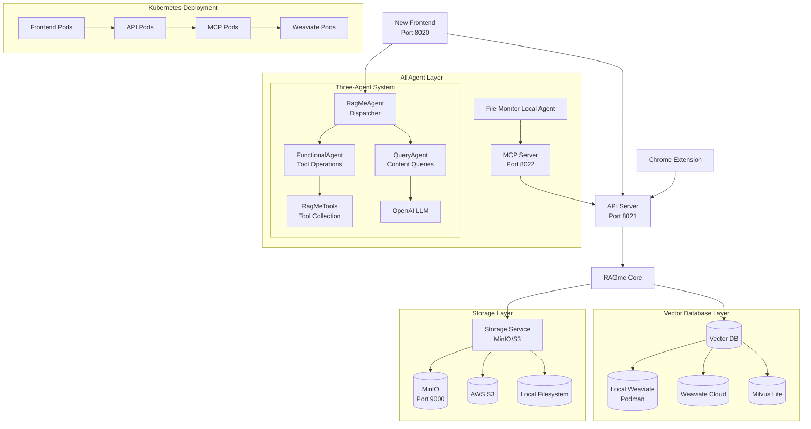

# RAGme.io: Personal RAG Agent for Web Content
## A Comprehensive Overview

**Maximilien.ai** 

<!-- 
To generate PDF or HTML from this presentation:
npx @marp-team/marp-cli@latest PRESENTATION.md -o ~/Desktop/ragme-io.pdf
npx @marp-team/marp-cli@latest PRESENTATION.md -o ~/Desktop/ragme-io.html

For HTML with speaker notes:
npx @marp-team/marp-cli@latest PRESENTATION.md --html --allow-local-files -o ~/Desktop/ragme-io.html
-->

---

## 🎯 What is RAGme.io?

**RAGme.io** is a personalized agent that uses [Retrieval-Augmented Generation (RAG)](https://en.wikipedia.org/wiki/Retrieval-augmented_generation) to process websites and documents you care about, enabling intelligent querying through an LLM agent.

### Core Concept
- **RAG**: Combines document retrieval with AI generation
- **Personal**: Focuses on your specific content and interests
- **Agentic**: Uses LLM agents for intelligent interaction
- **Multi-modal**: Supports web pages, PDFs, DOCX documents, and images
- **Vector Database Agnostic**: Supports multiple vector databases (Milvus, Weaviate, etc.)
- **Production Ready**: Kubernetes deployment with OAuth authentication
- **Enterprise Grade**: Comprehensive configuration, monitoring, and deployment options

---

## 🖼️ Modern Interface

### Three-Pane Layout with Real-time Features

<div style="display: flex; justify-content: center; margin: 20px 0;">
  
</div>

**Key Features:**
- **Left Sidebar**: Chat history with collapsible design
- **Center**: Main chat area with markdown support and real-time updates
- **Right Sidebar**: Document management with D3.js visualizations
- **WebSocket Communication**: Live interactions and real-time updates
- **OAuth Authentication**: Secure login with Google, GitHub, and Apple

---

## 📊 Advanced Document Management

### Interactive Document Dashboard with AI Features

<div style="display: flex; justify-content: center; margin: 20px 0;">
  
</div>

**Advanced Features:**
- **Smart Chunking**: Large documents automatically split at sentence boundaries
- **AI Summary Caching**: Intelligent caching system with force refresh capability
- **Date Filtering**: Filter by Current, This Month, This Year, or All
- **Bulk Operations**: Delete entire chunked documents with confirmation prompts
- **Progress Indicators**: Visual feedback during document processing
- **Enhanced Metadata**: Rich document information and chunk counts
- **OCR Integration**: Automatic text extraction from images and PDFs

---

## 📈 Data Visualization & Analytics

### D3.js Powered Interactive Charts

<div style="display: flex; justify-content: center; margin: 20px 0;">
  
</div>

**Visualization Features:**
- **Bar Charts**: Document type distribution
- **Pie Charts**: Content source analysis
- **Network Graphs**: Document relationship mapping
- **Click-to-Scroll**: Interactive navigation to documents
- **Responsive Design**: Adapts to different screen sizes
- **Real-time Updates**: Live data refresh via WebSocket

---

## 💡 Smart Prompt System

### AI-Powered Prompt Suggestions

<div style="display: flex; justify-content: center; margin: 20px 0;">
  
</div>

**Smart Features:**
- **Context-Aware Prompts**: Suggestions based on current chat state
- **Recent History**: Quick access to 5 most recent user prompts
- **Sample Prompts**: 3 curated prompts to help users get started
- **Bottom Sheet Interface**: Modern mobile-friendly popup design
- **Seamless Integration**: Click to fill, edit, and submit

---

## 🚀 Latest Features & Capabilities

### 1. **🚀 Document Processing Pipeline** ⭐ **NEW!**
- **Batch Processing**: Complete system for processing collections of PDFs, DOCX files, and images
- **Parallel Processing**: Intelligent text chunking with progress tracking
- **PDF Image Extraction**: Comprehensive image analysis with EXIF, AI classification, and OCR
- **Robust Error Handling**: Retry logic with detailed reporting (CSV summaries + .processed files)
- **Command**: `./tools/data_processing.sh /path/to/documents --verbose`

### 2. **🔐 OAuth Authentication System** ⭐ **NEW!**
- **Multi-Provider Support**: Google, GitHub, and Apple authentication
- **JWT Session Management**: Secure cookie storage and session handling
- **Beautiful Login Modal**: Mobile-responsive design with comprehensive error handling
- **Development Bypass**: Easy local development with bypass mode

### 3. **🌍 Internationalization (i18n)** ⭐ **NEW!**
- **80+ Language Support**: Automatic system language detection
- **Consistent LLM Responses**: Language specification in all system prompts
- **Frontend Integration**: Speech recognition with language support
- **Prevents Mixed Languages**: Ensures consistent language throughout the system

### 4. **🧠 AI Summary Caching** ⭐ **NEW!**
- **Intelligent Caching**: Stores AI-generated summaries in document metadata
- **Force Refresh**: On-demand summary regeneration with visual feedback
- **Cache Indicators**: Clear "Cached Summary" visual indicators
- **Performance Optimization**: Prevents redundant AI generation

### 5. **🖼️ Enhanced Image Processing** ⭐ **ENHANCED!**
- **PDF Image Extraction**: Automatic extraction with proper metadata
- **OCR Integration**: Text extraction from images and scanned documents
- **AI Image Classification**: Intelligent image analysis and categorization
- **Storage Optimization**: Removed base64_data duplication for better performance

### 6. **⚙️ Advanced Configuration** ⭐ **IMPROVED!**
- **Nested Config Structure**: Reorganized query section with rerank settings
- **Threshold Optimizer**: Automated binary search for optimal relevance thresholds
- **Dynamic Configuration**: Environment-based config processing
- **UI Controls**: Frontend controls for rerank settings

### 7. **🏗️ Enterprise Configuration System** ⭐ **NEW!**
- **Comprehensive Config Management**: Full `config.yaml` system for client deployments
- **Security Protection**: Built-in protection against secret leakage in API endpoints
- **Environment Switching**: Seamless switching between different application environments
- **Feature Flags**: Enable/disable functionality for different deployments
- **Client Branding**: Custom logos, colors, and welcome messages

### 8. **☸️ Kubernetes Deployment** ⭐ **NEW!**
- **Production Ready**: Full containerization with operator support
- **Horizontal Scaling**: Multiple replicas for all services
- **Health Monitoring**: Comprehensive health checks and auto-recovery
- **Resource Management**: Optimized resource requests for different node types
- **GKE Support**: Google Kubernetes Engine deployment with dynamic configuration

---

## 🏗️ Production-Ready Architecture

### Multi-Service Architecture with Kubernetes Support



### Three-Agent Architecture

RAGme.io features a sophisticated three-agent system that provides intelligent query routing and specialized processing:

#### **RagMeAgent (Dispatcher)**
- Routes user queries to appropriate specialized agents
- Intelligent query classification (functional vs. content queries)
- Seamless agent coordination and information provision

#### **FunctionalAgent**
- Handles tool-based operations and document management
- Document collection operations (add, delete, list, reset)
- URL crawling and vector database management
- Uses LlamaIndex FunctionAgent for reliable tool execution

#### **QueryAgent**
- Answers questions about document content using advanced RAG
- Vector similarity search and LLM-powered summarization
- Intelligent document retrieval and context building
- Configurable document retrieval (top-k documents)

---

## 🎮 Usage Examples

### 1. **Batch Document Processing**
```bash
# Process a collection of documents
./tools/data_processing.sh /path/to/research-papers --verbose

# Query the processed content
"What are the main findings across all research papers?"
```

### 2. **Web Content with Authentication**
```bash
# Add authenticated web content
"Crawl my private GitHub repository documentation"

# Query with context
"How do I set up the authentication system?"
```

### 3. **Multi-language Content**
```bash
# Add content in different languages
"Add these French research papers to my collection"

# Query in preferred language (automatically detected)
"Résumez les points principaux de ces articles"
```

---

## 🔌 API Endpoints

### Content Ingestion
```bash
# Add URLs with authentication
POST /add-urls
{
  "urls": ["https://private-docs.com", "https://research-paper.org"]
}

# Add JSON content with metadata
POST /add-json
{
  "data": {"content": "..."},
  "metadata": {"source": "...", "language": "en"}
}

# Batch document processing
POST /process-documents
{
  "path": "/path/to/documents",
  "options": {"extract_images": true, "ocr": true}
}
```

### Querying with AI Features
```bash
# Query with language specification
POST /query
{
  "query": "What are the main topics?",
  "language": "en",
  "force_refresh_summary": false
}

# Get cached summaries
GET /document-summary/{doc_id}?force_refresh=true
```

---

## 🛠️ Development & Deployment

### Local Development
```bash
# Quick start with OAuth bypass
./start.sh
# Access: http://localhost:8020

# With full OAuth (requires .env configuration)
# Configure OAuth providers in config.yaml
./start.sh
```

### Kubernetes Deployment
```bash
# Deploy to GKE
./deployment/scripts/deploy-gke.sh

# Deploy to local Kind cluster
./deployment/scripts/deploy-kind.sh

# Deploy with custom operator
kubectl apply -f deployment/operator/
```

### Production Features
- **Horizontal Scaling**: Multiple replicas for frontend, API, and MCP services
- **Health Checks**: Comprehensive health monitoring and auto-recovery
- **Resource Management**: Optimized resource requests for different node types
- **Security**: OAuth authentication, CSP headers, and secure cookie handling
- **Monitoring**: Comprehensive logging and debugging tools

---

## 📊 Data Flow & Processing

### 1. **Enhanced Content Ingestion**


### 2. **Intelligent Query Processing**


---

## 🎨 User Interface & Experience

### Modern Three-Pane Layout
- **Left Sidebar**: Chat history with collapsible design
- **Center**: Main chat area with markdown support and real-time updates
- **Right Sidebar**: Document management with D3.js visualizations
- **WebSocket Communication**: Live interactions and real-time updates
- **OAuth Authentication**: Secure login with Google, GitHub, and Apple

### Enhanced Settings Interface
- **Tabbed Organization**: General, Interface, Documents, Chat settings
- **Real-time Configuration**: Changes take effect immediately
- **UI Customization**: Panel widths, visibility, and layout preferences
- **Vector DB Info**: Display database type and collection information
- **Progress Indicators**: Visual feedback during document processing

### Smart Document Management
- **Automatic Chunking**: Large documents split at sentence boundaries
- **AI Summary Caching**: Intelligent caching with force refresh capability
- **Date Filtering**: Filter by Current, This Month, This Year, or All
- **Bulk Operations**: Delete entire chunked documents with confirmation
- **PDF Image Extraction**: Automatic extraction with proper metadata

## 📚 Content Management & Processing

### Multiple Content Ingestion Methods
1. **Web Pages via Chat**: Natural language commands to add URLs
2. **File Upload**: Drag and drop PDF, DOCX, TXT, MD, JSON, CSV files
3. **Watch Directory**: Automatic processing of files placed in `watch_directory/`
4. **Chrome Extension**: One-click web page capture
5. **JSON Data**: Programmatic content ingestion
6. **Batch Processing**: Complete document collections with `./tools/data_processing.sh`

### Advanced Image Processing
- **Multi-format Support**: JPG, PNG, GIF, WebP, BMP, HEIC, HEIF
- **AI Classification**: PyTorch ResNet50 for content classification
- **OCR Integration**: Automatic text extraction from images
- **EXIF Metadata**: Camera settings, GPS data, technical metadata
- **PDF Image Extraction**: Embedded images with page-level tracking

### Document Processing Pipeline
- **Parallel Processing**: Configurable batch processing with optimal resource utilization
- **Intelligent Text Chunking**: Smart text segmentation with sentence boundary detection
- **Comprehensive Image Analysis**: EXIF, AI classification, and OCR text extraction
- **Robust Error Handling**: Configurable retry logic with detailed error reporting
- **Progress Tracking**: Real-time processing status and timing information

## 💡 Advanced Use Cases

### Scenario 1: Research Assistant with Multi-language Support
```
User: "I'm researching quantum computing in French and English papers."
RAGme: "I've processed 10 papers in French and 15 in English. What specific aspects would you like to explore?"
User: "Quels sont les défis principaux en correction d'erreurs quantiques?"
RAGme: "Basé sur vos articles, les défis principaux sont..."
```

### Scenario 2: Enterprise Document Intelligence
```
User: "Process all our quarterly reports from the last 2 years"
RAGme: "Processing 8 quarterly reports with image extraction and OCR..."
User: "Generate executive summary of financial trends"
RAGme: "Based on the processed reports, the key financial trends are..."
```

### Scenario 3: Secure Content Management
```
User: *Authenticates with Google OAuth*
User: "Add my private Google Drive research folder"
RAGme: "Authenticated access granted. Processing 25 documents..."
User: "What are the common themes across my private research?"
RAGme: "Based on your private collection, the main themes are..."
```

### Scenario 4: Batch Document Processing
```
User: "./tools/data_processing.sh /path/to/research-papers --verbose"
RAGme: "Processing 50 PDFs with parallel processing..."
User: "What are the main findings across all research papers?"
RAGme: "Based on the processed papers, the key findings are..."
```

---

## 🎯 Key Benefits

### For Individuals
- **Personalized Knowledge Base**: Your own curated content collection with AI insights
- **Multi-language Support**: Process and query content in 80+ languages
- **Intelligent Search**: Natural language queries with context-aware responses
- **Automated Processing**: Batch processing with comprehensive error handling
- **Modern Interface**: Beautiful, responsive web interface with real-time features
- **Secure Access**: OAuth authentication for private content

### For Organizations
- **Enterprise Document Intelligence**: Extract insights from large document collections
- **Research Efficiency**: Rapid analysis with AI-powered summarization
- **Knowledge Discovery**: Find connections across different content sources and languages
- **Scalable Architecture**: Kubernetes deployment with horizontal scaling
- **Security**: OAuth authentication and secure data handling
- **Production Ready**: Comprehensive monitoring, health checks, and error handling

---

## 🔧 Technical Highlights

### Performance Optimizations
- **Batch Processing**: Efficient parallel document ingestion with progress tracking
- **AI Summary Caching**: Intelligent caching to prevent redundant AI generation
- **Vector Indexing**: Fast similarity search with configurable thresholds
- **Async Operations**: Non-blocking API responses with WebSocket updates
- **Memory Management**: Optimized storage with base64_data deduplication
- **Real-time Updates**: WebSocket-based live communication

### Production Features
- **Kubernetes Native**: Full containerization with operator support
- **OAuth Integration**: Secure authentication with multiple providers
- **Health Monitoring**: Comprehensive health checks and auto-recovery
- **Resource Optimization**: Dynamic resource allocation for different environments
- **Error Handling**: Robust error handling with retry logic and detailed reporting
- **Internationalization**: Full i18n support with automatic language detection

### Extensibility
- **Modular Design**: Easy to add new content types and processing pipelines
- **Plugin Architecture**: MCP server for extensible document processing
- **API-First**: RESTful interfaces for integration with external systems
- **Vector Database Agnostic**: Support for multiple database backends
- **Configuration Management**: Dynamic configuration with environment-based processing
- **Open Source**: MIT licensed for customization and contribution

---

## 🚀 Future Roadmap

### Phase 1: Infrastructure ✅ **COMPLETED**
- [x] ~~Decouple Weaviate dependency~~ **Completed!** Now supports Milvus, Weaviate, and extensible for others
- [x] ~~Add modern frontend UI~~ **Completed!** New three-pane interface with real-time features
- [x] ~~Add local Weaviate support~~ **Completed!** Podman-based local deployment
- [x] ~~Add debugging and monitoring tools~~ **Completed!** Comprehensive log monitoring
- [x] ~~Add OAuth authentication~~ **Completed!** Multi-provider OAuth with JWT sessions
- [x] ~~Add internationalization~~ **Completed!** 80+ language support with automatic detection
- [x] ~~Add batch document processing~~ **Completed!** Full pipeline with progress tracking
- [x] ~~Add Kubernetes deployment~~ **Completed!** Production-ready containerization
- [ ] Decouple LlamaIndex (docling integration)
- [ ] Add HTTPS security

### Phase 2: Content Types
- [ ] Video processing and analysis
- [ ] Audio content support with transcription
- [ ] Email integration (xyz@ragme.io)
- [ ] Real-time web scraping with change detection

### Phase 3: Collaboration & Enterprise
- [ ] Multi-user support with role-based access
- [ ] Team workspaces and shared collections
- [ ] Slack integration with bot commands
- [ ] X/Twitter content ingestion with real-time updates
- [ ] Advanced analytics and reporting dashboard

---

## 📈 Getting Started Guide

### 🚀 Quick Setup (Recommended)
```bash
# Clone and automated setup
gh repo clone maximilien/ragme-io
cd ragme-io
./setup.sh  # Automated setup with all dependencies
```

### 🛠️ Manual Setup
```bash
# Environment setup
uv venv && source .venv/bin/activate
uv sync --extra dev

# Configuration
cp env.example .env
cp config.yaml.example config.yaml
# Edit .env with your API keys

# Start all services
./start.sh
```

### 🔐 OAuth Authentication Setup
```bash
# Configure OAuth providers in .env
GOOGLE_OAUTH_CLIENT_ID=your-google-oauth-client-id
GITHUB_OAUTH_CLIENT_ID=your-github-oauth-client-id
APPLE_OAUTH_CLIENT_ID=your-apple-oauth-client-id

# Configure in config.yaml
authentication:
  bypass_login: false  # Set to true for development
  oauth:
    providers:
      google:
        enabled: true
        client_id: "${GOOGLE_OAUTH_CLIENT_ID}"
```

### ☸️ Production Deployment
```bash
# Deploy to GKE
./deployment/scripts/deploy-gke.sh

# Deploy to local Kind cluster
./deployment/scripts/deploy-kind.sh

# Process documents in batch
./tools/data_processing.sh /path/to/documents --verbose
```

### 🌐 Access Points
- **Frontend**: http://localhost:8020 (default)
- **API Docs**: http://localhost:8021/docs
- **Chrome Extension**: Load from `chrome_ext/` directory
- **MinIO Console**: http://localhost:9001 (minioadmin/minioadmin)

---

## 🤝 Contributing

For detailed contribution guidelines, see [CONTRIBUTING.md](CONTRIBUTING.md).

### How to Help
- **Bug Reports**: Open issues for problems
- **Feature Requests**: Suggest new capabilities
- **Code Contributions**: Submit pull requests
- **Documentation**: Improve guides and examples
- **Testing**: Help with integration and end-to-end testing

### Development Setup
```bash
# Install development dependencies
uv sync --extra dev

# Run tests
./test.sh

# Code formatting
./tools/lint.sh

# Integration testing
./tools/test-integration.sh
```

---

## 📞 Support & Resources

### Documentation
- **[README.md](../README.md)**: Comprehensive setup guide
- **[Architecture Guide](ARCHITECTURE.md)**: Technical architecture overview
- **[User Guide](USER_GUIDE.md)**: Complete user documentation
- **[Configuration Guide](CONFIGURATION.md)**: Configuration options and examples
- **[Development Guide](DEVELOPMENT.md)**: Development setup and guidelines
- **[Troubleshooting](TROUBLESHOOTING.md)**: Common issues and solutions
- **[Data Processing Pipeline](DATA_PROCESSING_PIPELINE.md)**: Batch processing documentation
- **API Documentation**: Available at `/docs` when API server is running

### Community
- **GitHub**: https://github.com/maximilien/ragme-io
- **Issues**: Bug reports and feature requests
- **Discussions**: Community support and ideas
- **Pull Requests**: Code contributions and improvements

### Creator
**Created with ❤️ by @maximilien**

---

## 🎉 Conclusion

RAGme.io represents the next generation of personal knowledge management:

- **🔍 Intelligent Content Discovery**: Automatically process and index your content with AI analysis
- **🤖 AI-Powered Insights**: Get intelligent responses from your personal knowledge base with caching
- **🔄 Seamless Integration**: Multiple ways to add and interact with content across languages
- **📈 Scalable Architecture**: Built for growth with Kubernetes deployment and horizontal scaling
- **🎨 Modern Interface**: Beautiful, responsive web interface with real-time features and OAuth
- **🔧 Flexible Deployment**: Support for multiple vector databases and production-ready deployment
- **🌍 Global Ready**: Full internationalization support for worldwide users
- **🔐 Enterprise Security**: OAuth authentication and secure data handling
- **⚡ Production Performance**: Optimized processing with batch operations and intelligent caching

**Ready to build your personal AI knowledge assistant?**

---

## 🛠️ Development & Configuration

### Development Environment
```bash
# Setup development environment
./setup.sh --force
source .venv/bin/activate
uv sync --extra dev

# Development workflow
./start.sh                    # Start all services
./start.sh compile-frontend   # Compile frontend after changes
./start.sh restart-backend    # Restart API, MCP, Agent
./start.sh restart-frontend   # Restart frontend only

# Monitor logs during development
./tools/tail-logs.sh all
```

### Comprehensive Testing
```bash
# Run all tests (unit + API + MCP + integration)
./test.sh all

# Safe integration testing with environment backup
./tools/test-with-backup.sh integration-fast

# Run specific test categories
./test.sh unit         # Unit tests only
./test.sh api          # API tests only  
./test.sh mcp          # MCP server tests only
./test.sh integration  # Integration tests only
```

### Code Quality & Linting
```bash
# Run linting checks (required before PRs)
./tools/lint.sh

# Auto-fix linting issues
uv run ruff check --fix src/ tests/

# Format code
uv run ruff format src/ tests/ examples/

# Validate configuration
./tools/config-validator.sh
```

### Enterprise Configuration System
```yaml
# config.yaml - Comprehensive configuration management
application:
  name: "RAGme"
  title: "🤖 RAGme.io Assistant"
  version: "0.1.0"

authentication:
  bypass_login: false
  oauth:
    providers:
      google:
        enabled: true
        client_id: "${GOOGLE_OAUTH_CLIENT_ID}"

vector_databases:
  default: "weaviate-local"
  databases:
    - name: "weaviate-local"
      type: "weaviate-local"
      url: "http://localhost:8080"

frontend:
  ui:
    show_vector_db_info: true
    document_list_width: 35
    chat_history_width: 10
```

### Performance Optimization Tools
```bash
# Find optimal query threshold
./tools/optimize.sh query-threshold

# Vector database management
./tools/vdb.sh health
./tools/vdb.sh virtual-structure
./tools/vdb.sh document-groups

# Storage management
./tools/storage.sh health
./tools/storage.sh buckets
./tools/storage.sh list
```

## 🔧 Troubleshooting & Support

### Common Issues & Solutions
- **Frontend Not Loading**: `./start.sh restart-frontend`
- **Services Not Starting**: `./stop.sh restart`
- **Port Conflicts**: `./stop.sh stop && ./start.sh`
- **Vector DB Errors**: Check `.env` configuration
- **Build Errors**: `cd frontend && npm install && npm run build`

### Health Monitoring
```bash
# Check all services
./stop.sh status

# Monitor logs in real-time
./tools/tail-logs.sh all

# System health checks
./tools/vdb.sh health
./tools/storage.sh health
./tools/config-validator.sh
```

### Recovery Procedures
```bash
# Complete system reset
./stop.sh
rm -rf minio_data/
rm -rf watch_directory/*
rm -f milvus_demo.db
cp env.example .env
cp config.yaml.example config.yaml
./start.sh
```

## 🤝 Contributing

### How to Help
- **Bug Reports**: Open issues for problems
- **Feature Requests**: Suggest new capabilities
- **Code Contributions**: Submit pull requests
- **Documentation**: Improve guides and examples

### Development Setup
```bash
# Install development dependencies
uv sync --extra dev

# Run tests
./test.sh

# Code formatting
./tools/lint.sh
```

### Commit Message Convention
```
type(scope): description

feat(agents): add new query classification rule
fix(api): resolve CORS issue with frontend
docs(config): update configuration examples
test(vdb): add comprehensive test coverage
```

---

*Thank you for your attention! Questions and feedback welcome.*
