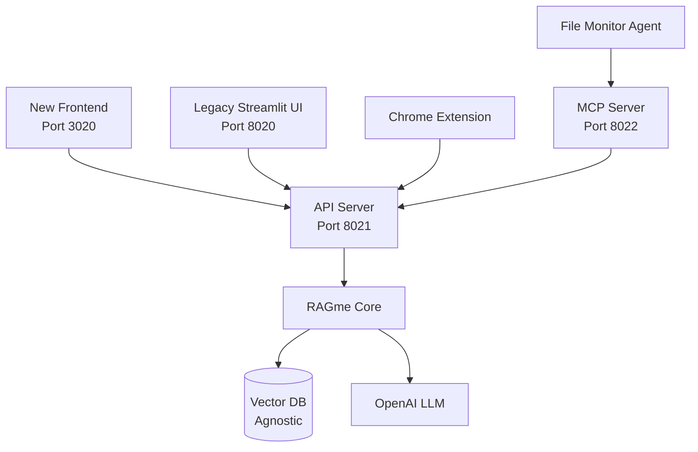
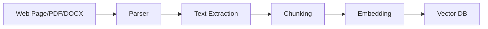
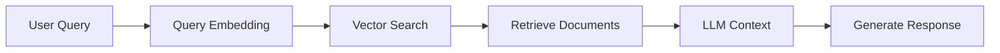

# RAGme.ai: Personal RAG Agent for Web Content
## A Comprehensive Overview

<!-- 
To generate PDF or HTML from this presentation:
npx @marp-team/marp-cli@latest PRESENTATION.md -o ~/Desktop/ragme-ai.pdf
npx @marp-team/marp-cli@latest PRESENTATION.md -o ~/Desktop/ragme-ai.html

For HTML with speaker notes:
npx @marp-team/marp-cli@latest PRESENTATION.md --html --allow-local-files -o ~/Desktop/ragme-ai.html
-->

---

## 🎯 What is RAGme.ai?

**RAGme.ai** is a personalized agent that uses [Retrieval-Augmented Generation (RAG)](https://en.wikipedia.org/wiki/Retrieval-augmented_generation) to process websites and documents you care about, enabling intelligent querying through an LLM agent.

### Core Concept
- **RAG**: Combines document retrieval with AI generation
- **Personal**: Focuses on your specific content and interests
- **Agentic**: Uses LLM agents for intelligent interaction
- **Multi-modal**: Supports web pages, PDFs, and DOCX documents
- **Vector Database Agnostic**: Supports multiple vector databases (Milvus, Weaviate, etc.)

---

## 🚀 Key Features & Use Cases

### 1. **Interactive Personal RAG**
- Add websites and documents (PDFs and DOCX)
- Query using natural language
- Get intelligent responses based on your content
- **Smart document chunking** for large files

### 2. **Content Collection & Processing**
- **Web Crawling**: Automatically discover and process web pages
- **Document Processing**: PDF and DOCX file ingestion with automatic chunking
- **Watch Directory**: Automatic processing of new files with consistent chunking
- **Chrome Extension**: One-click web page capture
- **Unified Processing**: Same chunking logic across all input methods

### 3. **Intelligent Querying**
- Ask questions about your collected content
- Get summaries and insights
- Cross-reference information across sources
- **Enhanced context**: Better handling of large documents through chunking

### 4. **Modern Web Interface** ⭐ **ENHANCED!**
- **Three-pane layout** with resizable and collapsible sidebars
- **Real-time chat** with markdown support and copy functionality
- **Interactive document visualization** with D3.js charts (bar, pie, network graphs)
- **Click-to-scroll functionality** - click visualization nodes to find documents
- **Responsive design** that works on desktop and mobile
- **WebSocket communication** for real-time updates
- **Smart document management** with chunked document grouping
- **Bulk operations** for document deletion and management

### 5. **Advanced Document Management** ⭐ **NEW!**
- **Automatic chunking**: Large documents split at sentence boundaries (1000 chars)
- **Chunked document grouping**: Multiple chunks displayed as single documents
- **Enhanced metadata**: Rich document information including chunk counts
- **Visual chunk indicators**: Clear display of document chunking status
- **Consistent processing**: Same chunking across upload, watch directory, and API
- **Improved performance**: Better handling of large documents

### 6. **Vector Database Flexibility** ⭐ **ENHANCED!**
- **Milvus Lite Default**: Local development with no server setup required
- **Local Weaviate Support**: Podman-based local deployment
- **Agnostic Architecture**: Easy to switch between vector databases
- **Extensible**: Simple to add Pinecone, Chroma, or other databases
- **Future-Proof**: Adapts to new vector database technologies

---

## 🏗️ Architecture Overview

### Multi-Service Architecture



### Core Components

| Component | Port | Purpose |
|-----------|------|---------|
| **New Frontend** | 3020 | Modern web interface with three-pane layout ⭐ **DEFAULT** |
| **Legacy Streamlit UI** | 8020 | Original web interface for user interaction |
| **API Server** | 8021 | REST API for content ingestion |
| **MCP Server** | 8022 | Document processing (PDF/DOCX) |
| **File Monitor** | - | Watches directory for new files |
| **Chrome Extension** | - | Browser-based content capture |
| **Vector DB Layer** | - | Abstracted database interface |

---

## 🔧 Technology Stack

### Backend Technologies
- **Python 3.12+**: Core application language
- **FastAPI**: High-performance API framework
- **Streamlit**: Rapid web app development (legacy UI)
- **Uvicorn**: ASGI server for FastAPI

### Frontend Technologies ⭐ **NEW!**
- **TypeScript**: Modern JavaScript with type safety
- **Express.js**: Node.js web framework
- **Socket.IO**: Real-time bidirectional communication
- **D3.js**: Data visualization and charts
- **Marked.js**: Markdown parsing
- **DOMPurify**: HTML sanitization

### AI & ML Stack
- **OpenAI GPT-4o-mini**: Primary LLM for reasoning
- **LlamaIndex**: Document processing and RAG framework
- **Vector Database Abstraction**: Support for multiple vector databases

### Document Processing
- **PyPDF2**: PDF text extraction
- **python-docx**: DOCX document processing
- **BeautifulSoup**: HTML parsing for web content

### Vector Database Support
- **Milvus Lite**: Default local development (no server setup)
- **Local Weaviate**: Podman-based local deployment
- **Weaviate Cloud**: Managed vector database service
- **Extensible**: Easy to add Pinecone, Chroma, etc.
- **Abstracted Interface**: Clean separation of concerns
- **Modular Architecture**: Each database in separate files for maintainability

---

## 📄 Smart Document Chunking ⭐ **NEW!**

### Automatic Chunking System
RAGme.ai now features intelligent document chunking that automatically handles large documents:

**How It Works**:
- **Size Detection**: Documents exceeding 1000 characters are automatically chunked
- **Smart Boundaries**: Chunks are split at sentence boundaries (., !, ?) for readability
- **Fallback Logic**: If no sentence boundary is found, splits at character limit
- **Metadata Preservation**: Original document information is maintained across chunks

**Benefits**:
- **Token Limit Compliance**: Prevents LLM token limit errors
- **Improved Retrieval**: Better context matching for queries
- **Consistent Processing**: Same chunking logic across all input methods
- **Enhanced Performance**: Faster processing of large documents

### Chunked Document Management
**Frontend Display**:
- **Grouped View**: Multiple chunks appear as single documents in the UI
- **Chunk Indicators**: Visual badges show chunk counts (e.g., "📄 5 chunks")
- **Unified Operations**: Delete entire chunked documents with one click
- **Metadata Display**: Shows original filename and chunk information

**Processing Methods**:
- **Manual Upload**: Files uploaded via "+Add Content" modal
- **Watch Directory**: Files placed in `watch_directory/` folder
- **API Integration**: Direct API calls with chunking support
- **Chrome Extension**: Web pages with automatic chunking

### Technical Implementation
**Chunking Algorithm**:
```python
def chunkText(text: str, chunk_size: int = 1000) -> list[str]:
    # Split at sentence boundaries when possible
    # Fallback to character limits if needed
    # Preserve document structure and readability
```

**Metadata Enhancement**:
```json
{
  "total_chunks": 5,
  "is_chunked": true,
  "chunk_sizes": [950, 1020, 980, 1050, 890],
  "original_filename": "large_document.pdf"
}
```

---

## 📦 Installation & Setup

### Prerequisites
```bash
# Required software
- Python 3.12+
- uv (Python package manager)
- Node.js 18+ (for new frontend)
```

### Environment Configuration
```bash
# .env file setup
OPENAI_API_KEY=sk-proj-*****-**
VECTOR_DB_TYPE=milvus  # Default for local development
# VECTOR_DB_TYPE=weaviate-local  # For local Weaviate
# VECTOR_DB_TYPE=weaviate  # For cloud Weaviate
RAGME_API_URL=http://localhost:8021
RAGME_MCP_URL=http://localhost:8022
```

### Quick Start
```bash
# Clone and setup
gh repo clone maximilien/ragme-ai
cd ragme-ai
uv venv
source .venv/bin/activate
uv sync

# Start all services (new frontend by default)
chmod +x start.sh
./start.sh
```

---

## 🎮 Usage Examples

### 1. **Web Content Processing**
```bash
# Add web pages to collection
"Crawl my https://example-blog.com up to 10 posts and add to my collection"

# Query the content
"What are the main topics discussed in the blog posts?"
```

### 2. **Document Analysis**
```bash
# Add PDF/DOCX to watch_directory/
# Automatically processed and indexed

# Query documents
"Summarize the key findings from the research papers"
```

### 3. **Current Affairs**
```bash
# Add news articles
"Add these Google News articles about AI developments"

# Get insights
"What are the latest trends in AI technology?"
```

---

## 🔌 API Endpoints

### Content Ingestion
```bash
# Add URLs
POST /add-urls
{
  "urls": ["https://example.com", "https://example.org"]
}

# Add JSON content
POST /add-json
{
  "data": {"content": "..."},
  "metadata": {"source": "..."}
}
```

### Querying
```bash
# Query the collection
POST /query
{
  "query": "What are the main topics?"
}

# List documents
GET /list-documents?limit=10&offset=0
```

---

## 🛠️ Development Features

### New Frontend UI ⭐ **DEFAULT**

```javascript
// Real-time WebSocket communication
socket.emit('chat_message', { message: userInput });
socket.on('chat_response', (data) => {
    displayResponse(data.response);
});

// Document visualization with D3.js
const chart = d3.select('#document-chart')
    .append('svg')
    .attr('width', width)
    .attr('height', height);
```

### Chrome Extension
```javascript
// popup.js - Page capture functionality
async function captureCurrentPage() {
  const [tab] = await chrome.tabs.query({ active: true, currentWindow: true });
  const response = await fetch(`${RAGME_API_URL}/add-urls`, {
    method: 'POST',
    headers: { 'Content-Type': 'application/json' },
    body: JSON.stringify({ urls: [tab.url] })
  });
}
```

### File Monitoring
```python
# local_agent.py - Automatic file processing
class FileHandler(FileSystemEventHandler):
    def __init__(self, callback=None):
        self.supported_extensions = {'.pdf', '.docx'}
    
    def on_created(self, event):
        if file_path.suffix.lower() in self.supported_extensions:
            self.callback(file_path)
```

---

## 📊 Data Flow

### 1. **Content Ingestion**


### 2. **Query Processing**


---

## 🔒 Security & Limitations

### Current Limitations
- ✅ Single collection for all users
- ✅ ~~Tied to Weaviate as vector database~~ **Fixed!** Now supports multiple vector databases with Milvus as default
- ✅ Tied to LlamaIndex for RAG operations
- ✅ No HTTPS by default

### Security Considerations
- API keys stored in environment variables
- CORS enabled for development
- No user authentication (single-user system)

---

## 🚀 Future Roadmap

### Phase 1: Infrastructure ✅ **COMPLETED**
- [x] ~~Decouple Weaviate dependency~~ **Completed!** Now supports Milvus, Weaviate, and extensible for others
- [x] ~~Add modern frontend UI~~ **Completed!** New three-pane interface with real-time features
- [x] ~~Add local Weaviate support~~ **Completed!** Podman-based local deployment
- [x] ~~Add debugging and monitoring tools~~ **Completed!** Comprehensive log monitoring
- [ ] Decouple LlamaIndex (docling integration)
- [ ] Add HTTPS security

### Phase 2: Content Types
- [ ] Image and video processing
- [ ] Audio content support
- [ ] Email integration (xyz@ragme.io)

### Phase 3: Collaboration
- [ ] Multi-user support (SaaS)
- [ ] Slack integration
- [ ] X/Twitter content ingestion

---

## 💡 Use Case Scenarios

### Scenario 1: Research Assistant
```
User: "I'm researching quantum computing. Add these papers to my collection."
RAGme: "I've added 5 research papers. What specific aspects would you like to explore?"
User: "What are the main challenges in quantum error correction?"
RAGme: "Based on your papers, the main challenges are..."
```

### Scenario 2: News Aggregator
```
User: "Add today's tech news articles about AI"
RAGme: "I've crawled and added 15 articles from tech news sites."
User: "What are the emerging AI trends this week?"
RAGme: "Based on the articles, the key trends are..."
```

### Scenario 3: Document Manager
```
User: *drops PDF into watch_directory*
RAGme: "New document detected and processed: quarterly_report.pdf"
User: "Summarize the financial highlights"
RAGme: "The quarterly report shows..."
```

---

## 🎯 Key Benefits

### For Individuals
- **Personalized Knowledge Base**: Your own curated content collection
- **Intelligent Search**: Natural language queries across all your content
- **Automated Processing**: Seamless ingestion of various content types
- **Insight Generation**: AI-powered analysis and summaries
- **Modern Interface**: Beautiful, responsive web interface with real-time features

### For Organizations
- **Document Intelligence**: Extract insights from internal documents
- **Research Efficiency**: Rapid analysis of large document collections
- **Knowledge Discovery**: Find connections across different content sources
- **Scalable Architecture**: Multi-service design for enterprise deployment
- **Flexible Deployment**: Support for multiple vector databases and deployment options

---

## 🔧 Technical Highlights

### Performance Optimizations
- **Batch Processing**: Efficient document ingestion
- **Vector Indexing**: Fast similarity search
- **Async Operations**: Non-blocking API responses
- **Memory Management**: Proper cleanup and resource handling
- **Real-time Updates**: WebSocket-based live communication

### Extensibility
- **Modular Design**: Easy to add new content types
- **Plugin Architecture**: MCP server for document processing
- **API-First**: RESTful interfaces for integration
- **Vector Database Agnostic**: Support for multiple database backends
- **Open Source**: MIT licensed for customization

---

## 📈 Getting Started Guide

### Step 1: Setup Environment
```bash
# Install dependencies
uv sync

# Configure environment
cp .env.example .env
# Edit .env with your API keys
```

### Step 2: Start Services
```bash
# Quick start (new frontend by default)
./start.sh

# Or start with legacy UI
./start.sh legacy-ui

# Or manually
uv run uvicorn src.ragme.api:app --port 8021 &
uv run uvicorn src.ragme.mcp:app --port 8022 &
uv run python -m src.ragme.local_agent &
cd frontend && npm install && npm run build && npm start &
```

### Step 3: Add Content
```bash
# Via UI: http://localhost:3020 (new frontend)
# Via Legacy UI: http://localhost:8020
# Via Chrome Extension
# Via watch_directory/ folder
# Via API calls
```

### Step 4: Query & Explore
```bash
# Ask questions about your content
# Generate summaries
# Discover insights
# Cross-reference information
```

---

## 🤝 Contributing

### How to Help
- **Bug Reports**: Open issues for problems
- **Feature Requests**: Suggest new capabilities
- **Code Contributions**: Submit pull requests
- **Documentation**: Improve guides and examples

### Development Setup
```bash
# Install development dependencies
uv sync --dev

# Run tests
uv run pytest

# Code formatting
uv run ruff format src/
uv run ruff check src/
```

---

## 📞 Support & Resources

### Documentation
- **README.md**: Comprehensive setup guide
- **API Documentation**: Available at `/docs` when API server is running
- **Code Comments**: Well-documented source code

### Community
- **GitHub**: https://github.com/maximilien/ragme-ai
- **Issues**: Bug reports and feature requests
- **Discussions**: Community support and ideas

### Creator
**Created with ❤️ by @maximilien**

---

## 🎉 Conclusion

RAGme.ai represents a powerful approach to personal knowledge management:

- **🔍 Intelligent Content Discovery**: Automatically process and index your content
- **🤖 AI-Powered Insights**: Get intelligent responses from your personal knowledge base
- **🔄 Seamless Integration**: Multiple ways to add and interact with content
- **📈 Scalable Architecture**: Built for growth and customization
- **🎨 Modern Interface**: Beautiful, responsive web interface with real-time features
- **🔧 Flexible Deployment**: Support for multiple vector databases and deployment options

**Ready to build your personal AI knowledge assistant?**

---

*Thank you for your attention! Questions and feedback welcome.* 