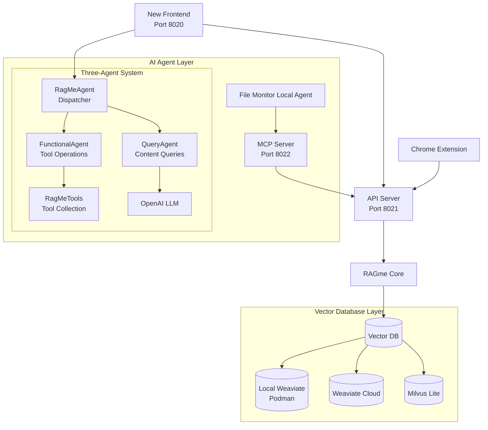
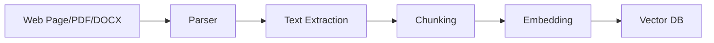

# RAGme.io: Personal RAG Agent for Web Content
## A Comprehensive Overview

**Maximilien.ai** 

<!-- 
To generate PDF or HTML from this presentation:
npx @marp-team/marp-cli@latest PRESENTATION.md -o ~/Desktop/ragme-io.pdf
npx @marp-team/marp-cli@latest PRESENTATION.md -o ~/Desktop/ragme-io.html

For HTML with speaker notes:
npx @marp-team/marp-cli@latest PRESENTATION.md --html --allow-local-files -o ~/Desktop/ragme-io.html
-->

---

## 🎯 What is RAGme.io?

**RAGme.io** is a personalized agent that uses [Retrieval-Augmented Generation (RAG)](https://en.wikipedia.org/wiki/Retrieval-augmented_generation) to process websites and documents you care about, enabling intelligent querying through an LLM agent.

### Core Concept
- **RAG**: Combines document retrieval with AI generation
- **Personal**: Focuses on your specific content and interests
- **Agentic**: Uses LLM agents for intelligent interaction
- **Multi-modal**: Supports web pages, PDFs, DOCX documents, and images
- **Vector Database Agnostic**: Supports multiple vector databases (Milvus, Weaviate, etc.)
- **AI Accelerated**: Optional cloud-based AI acceleration for enhanced processing

---

## 🖼️ New Frontend Interface

### Modern Three-Pane Layout

<div style="display: flex; justify-content: center; margin: 20px 0;">
  
</div>

**Key Features:**
- **Left Sidebar**: Chat history with collapsible design
- **Center**: Main chat area with markdown support and voice input
- **Right Sidebar**: Document management with D3.js visualizations
- **Real-time Updates**: WebSocket communication for live interactions
- **Voice-to-Text**: Microphone button for hands-free querying

---

## 📊 Document Management & Visualizations

### Interactive Document Dashboard

<div style="display: flex; justify-content: center; margin: 20px 0;">
  
</div>

**Advanced Features:**
- **Smart Chunking**: Large documents automatically split at sentence boundaries
- **Date Filtering**: Filter by Current, This Month, This Year, or All
- **Bulk Operations**: Delete entire chunked documents with one click
- **Enhanced URL-Based Deletion**: Delete documents by URL with support for various formats (full URLs, filenames, file:// URLs) and confirmation prompts for destructive operations
- **Destructive Operation Confirmation**: All destructive operations require user confirmation before execution to prevent accidental data loss
- **Enhanced Metadata**: Rich document information and chunk counts
- **Pattern-Based Deletion**: Delete documents matching regex patterns

---

## 📈 Data Visualization & Analytics

### D3.js Powered Charts

<div style="display: flex; justify-content: center; margin: 20px 0;">
  
</div>

**Visualization Features:**
- **Bar Charts**: Document type distribution
- **Pie Charts**: Content source analysis
- **Network Graphs**: Document relationship mapping
- **Click-to-Scroll**: Interactive navigation to documents
- **Responsive Design**: Adapts to different screen sizes
- **Real-time Updates**: Synchronized with document operations

---

## 🎤 Voice Input & Enhanced Settings

### Modern User Experience

<div style="display: flex; justify-content: center; margin: 20px 0;">
  
</div>

**Enhanced Features:**
- **Voice-to-Text Input**: Microphone button using browser's Web Speech API
- **Enhanced Settings UI**: Complete redesign with organized tabbed interface
- **Recent Prompts & Ideas**: Quick access to sample prompts and chat history
- **Comprehensive Configuration**: All config.yaml options accessible via UI
- **Real-time Configuration**: Settings changes apply immediately

---

## 🚀 Key Features & Use Cases

### 1. **Interactive Personal RAG**
- Add websites, documents (PDFs and DOCX), and images
- Query using natural language or voice input
- Get intelligent responses based on your content
- **Smart document chunking** for large files

### 2. **Content Collection & Processing**
- **Web Crawling**: Automatically discover and process web pages
- **Document Processing**: PDF and DOCX file ingestion with automatic chunking
- **Image Processing**: AI-powered image classification and OCR text extraction
- **Watch Directory**: Automatic processing of new files with consistent chunking
- **Chrome Extension**: One-click web page capture
- **Unified Processing**: Same chunking logic across all input methods

### 3. **Intelligent Querying**
- Ask questions about your collected content
- Get summaries and insights
- Cross-reference information across sources
- **Enhanced context**: Better handling of large documents through chunking
- **Image Summarization**: Get AI-generated summaries of image collections by date range

### 4. **Modern Web Interface** ⭐ **ENHANCED!**
- **Three-pane layout** with resizable and collapsible sidebars
- **Real-time chat** with markdown support and copy functionality
- **🎤 Voice Input**: Microphone button for hands-free querying
- **💡 Recent Prompts & Ideas**: Quick access to sample prompts and recent chat history via bottom sheet interface
- **Interactive document visualization** with D3.js charts (bar, pie, network graphs)
- **Click-to-scroll functionality** - click visualization nodes to find documents
- **Responsive design** that works on desktop and mobile
- **WebSocket communication** for real-time updates
- **Smart document management** with chunked document grouping
- **Bulk operations** for document deletion and management

### 5. **🖼️ AI-Powered Image Support** ⭐ **NEW!**
- **Complete Image Processing Pipeline**: PyTorch ResNet50 classification and EXIF metadata extraction
- **OCR Text Extraction**: Automatic text extraction from images containing text
- **AI Classification**: Intelligent content classification with confidence scores
- **Image Summarization**: Get comprehensive summaries of image collections by date range
- **Drag-and-Drop Interface**: Easy image upload and processing
- **Natural Language Queries**: Ask questions about your images using text

### 6. **⚡ AI Acceleration** ⭐ **NEW!**
- **FriendliAI Integration**: Optional cloud-based AI acceleration for enhanced processing
- **Parallel Processing**: Classification and OCR run simultaneously instead of sequentially
- **Faster Response Times**: Reduced processing time for complex images
- **Enhanced Accuracy**: Better classification and OCR with confidence scores
- **Fallback Processing**: Automatic fallback to local processing if AI acceleration fails
- **Configurable**: Enable/disable via settings interface

### 7. **💾 S3-Compatible File Storage** ⭐ **NEW!**
- **MinIO Integration**: Local development with S3-compatible storage
- **Multiple Backends**: Support for MinIO, AWS S3, and local filesystem
- **Automatic Bucket Management**: Creates and manages storage buckets
- **Presigned URLs**: Secure file access with time-limited URLs
- **Comprehensive File Operations**: Upload, download, delete, and metadata management
- **Production Ready**: Easy migration to cloud storage services

### 8. **🎛️ Enhanced Settings & Configuration** ⭐ **NEW!**
- **Complete Settings UI**: All config.yaml options accessible via web interface
- **Organized Tabs**: General, Interface, Documents, Chat, and AI Acceleration settings
- **Real-time Configuration**: Settings changes apply immediately
- **Client Customization**: Easy branding and customization options
- **Environment Switching**: Seamless switching between different application environments

### 9. **Advanced Document Management** ⭐ **ENHANCED!**
- **Automatic chunking**: Large documents split at sentence boundaries (1000 chars)
- **Chunked document grouping**: Multiple chunks displayed as single documents
- **Enhanced metadata**: Rich document information including chunk counts
- **Visual chunk indicators**: Clear display of document chunking status
- **Consistent processing**: Same chunking across upload, watch directory, and API
- **Improved performance**: Better handling of large documents

### 7. **Vector Database Flexibility** ⭐ **ENHANCED!**
- **Milvus Lite Default**: Local development with no server setup required
- **Local Weaviate Support**: Podman-based local deployment
- **Agnostic Architecture**: Easy to switch between vector databases
- **Extensible**: Simple to add Pinecone, Chroma, or other databases
- **Future-Proof**: Adapts to new vector database technologies

---

## 🏗️ Architecture Overview

### Multi-Service Architecture with Three-Agent System



### Three-Agent Architecture ⭐ **NEW!**

RAGme.io features a sophisticated three-agent system that provides intelligent query routing and specialized processing:

#### **RagMeAgent (Dispatcher)**
- Routes user queries to appropriate specialized agents
- Intelligent query classification (functional vs. content queries)
- Seamless agent coordination and information provision

#### **FunctionalAgent**
- Handles tool-based operations and document management
- Document collection operations (add, delete, list, reset)
- URL crawling and vector database management
- Uses LlamaIndex FunctionAgent for reliable tool execution

#### **QueryAgent**
- Answers questions about document content using advanced RAG
- Vector similarity search and LLM-powered summarization
- Intelligent document retrieval and context building
- Configurable document retrieval (top-k documents)

#### **RagMeTools**
- Centralized tool collection for all RagMe operations
- Unified tool interface with clean separation from agent logic
- Easy extensibility for new tools and operations

### Core Components

| Component | Port | Purpose |
|-----------|------|---------|
| **New Frontend** | 8020 | Modern web interface with three-pane layout ⭐ **DEFAULT** |
| **API Server** | 8021 | REST API for content ingestion |
| **MCP Server** | 8022 | Document processing (PDF/DOCX) |
| **File Monitor Local Agent** | - | Watches directory for new files |
| **RagMeAgent (Dispatcher)** | - | Routes queries to specialized agents ⭐ **NEW!** |
| **FunctionalAgent** | - | Handles tool-based operations ⭐ **NEW!** |
| **QueryAgent** | - | Handles content queries and RAG ⭐ **NEW!** |
| **Chrome Extension** | - | Browser integration for web content capture |
| **RAGme Core** | - | Main RAG processing logic using LlamaIndex |
| **AI Agent Layer** | - | Orchestrates AI interactions and document processing |
| **Vector Database Layer** | - | Modular support for multiple vector databases |

---

## 🎮 Usage Examples

### 1. **Web Content Processing**
```bash
# Add web pages to collection
"Crawl my https://example-blog.com up to 10 posts and add to my collection"

# Query the content
"What are the main topics discussed in the blog posts?"
```

### 2. **Document Analysis**
```bash
# Add PDF/DOCX to watch_directory/
# Automatically processed and indexed

# Query documents
"Summarize the key findings from the research papers"
```

### 3. **Current Affairs**
```bash
# Add news articles
"Add these Google News articles about AI developments"

# Get insights
"What are the latest trends in AI technology?"
```

---

## 🔌 API Endpoints

### Content Ingestion
```bash
# Add URLs
POST /add-urls
{
  "urls": ["https://example.com", "https://example.org"]
}

# Add JSON content
POST /add-json
{
  "data": {"content": "..."},
  "metadata": {"source": "..."}
}
```

### Querying
```bash
# Query the collection
POST /query
{
  "query": "What are the main topics?"
}

# List documents
GET /list-documents?limit=10&offset=0
```

---

## 🛠️ Development Features

### New Frontend UI ⭐ **DEFAULT**

```javascript
// Real-time WebSocket communication
socket.emit('chat_message', { message: userInput });
socket.on('chat_response', (data) => {
    displayResponse(data.response);
});

// Document visualization with D3.js
const chart = d3.select('#document-chart')
    .append('svg')
    .attr('width', width)
    .attr('height', height);
```

### Chrome Extension
```javascript
// popup.js - Page capture functionality
async function captureCurrentPage() {
  const [tab] = await chrome.tabs.query({ active: true, currentWindow: true });
  const response = await fetch(`${RAGME_API_URL}/add-urls`, {
    method: 'POST',
    headers: { 'Content-Type': 'application/json' },
    body: JSON.stringify({ urls: [tab.url] })
  });
}
```

### File Monitoring
```python
# local_agent.py - Automatic file processing
class FileHandler(FileSystemEventHandler):
    def __init__(self, callback=None):
        self.supported_extensions = {'.pdf', '.docx'}
    
    def on_created(self, event):
        if file_path.suffix.lower() in self.supported_extensions:
            self.callback(file_path)
```

---

## 📊 Data Flow

### 1. **Content Ingestion**


### 2. **Query Processing**


---

## 💡 Use Case Scenarios

### Scenario 1: Research Assistant
```
User: "I'm researching quantum computing. Add these papers to my collection."
RAGme: "I've added 5 research papers. What specific aspects would you like to explore?"
User: "What are the main challenges in quantum error correction?"
RAGme: "Based on your papers, the main challenges are..."
```

### Scenario 2: News Aggregator
```
User: "Add today's tech news articles about AI"
RAGme: "I've crawled and added 15 articles from tech news sites."
User: "What are the emerging AI trends this week?"
RAGme: "Based on the articles, the key trends are..."
```

### Scenario 3: Document Manager
```
User: *drops PDF into watch_directory*
RAGme: "New document detected and processed: quarterly_report.pdf"
User: "Summarize the financial highlights"
RAGme: "The quarterly report shows..."
```

---

## 🎯 Key Benefits

### For Individuals
- **Personalized Knowledge Base**: Your own curated content collection
- **Intelligent Search**: Natural language queries across all your content
- **Automated Processing**: Seamless ingestion of various content types
- **Insight Generation**: AI-powered analysis and summaries
- **Modern Interface**: Beautiful, responsive web interface with real-time features

### For Organizations
- **Document Intelligence**: Extract insights from internal documents
- **Research Efficiency**: Rapid analysis of large document collections
- **Knowledge Discovery**: Find connections across different content sources
- **Scalable Architecture**: Multi-service design for enterprise deployment
- **Flexible Deployment**: Support for multiple vector databases and deployment options

---

## 🔧 Technical Highlights

### Performance Optimizations
- **Batch Processing**: Efficient document ingestion
- **Vector Indexing**: Fast similarity search
- **Async Operations**: Non-blocking API responses
- **Memory Management**: Proper cleanup and resource handling
- **Real-time Updates**: WebSocket-based live communication

### Extensibility
- **Modular Design**: Easy to add new content types
- **Plugin Architecture**: MCP server for document processing
- **API-First**: RESTful interfaces for integration
- **Vector Database Agnostic**: Support for multiple database backends
- **Open Source**: MIT licensed for customization

---

## 🚀 Future Roadmap

### Phase 1: Infrastructure ✅ **COMPLETED**
- [x] ~~Decouple Weaviate dependency~~ **Completed!** Now supports Milvus, Weaviate, and extensible for others
- [x] ~~Add modern frontend UI~~ **Completed!** New three-pane interface with real-time features
- [x] ~~Add local Weaviate support~~ **Completed!** Podman-based local deployment
- [x] ~~Add debugging and monitoring tools~~ **Completed!** Comprehensive log monitoring
- [ ] Decouple LlamaIndex (docling integration)
- [ ] Add HTTPS security

### Phase 2: Content Types
- [ ] Image and video processing
- [ ] Audio content support
- [ ] Email integration (xyz@ragme.io)

### Phase 3: Collaboration
- [ ] Multi-user support (SaaS)
- [ ] Slack integration
- [ ] X/Twitter content ingestion

---

## 📈 Getting Started Guide

For detailed setup instructions, see the main [README.md](../README.md) in the project root.

### Quick Start
```bash
# Clone and setup
gh repo clone maximilien/ragme-io
cd ragme-io
uv venv
source .venv/bin/activate
uv sync --extra dev

# Configure environment
cp env.example .env
# Edit .env with your API keys

# Start all services (new frontend by default)
./start.sh
```

### Access Points
- **New Frontend**: http://localhost:8020 (default)
- **Legacy UI**: http://localhost:8020
- **API Docs**: http://localhost:8021/docs
- **Chrome Extension**: Load from `chrome_ext/` directory

---

## 🤝 Contributing

For detailed contribution guidelines, see [CONTRIBUTING.md](CONTRIBUTING.md).

### How to Help
- **Bug Reports**: Open issues for problems
- **Feature Requests**: Suggest new capabilities
- **Code Contributions**: Submit pull requests
- **Documentation**: Improve guides and examples

### Development Setup
```bash
# Install development dependencies
uv sync --extra dev

# Run tests
./test.sh

# Code formatting
./tools/lint.sh
```

---

## 📞 Support & Resources

### Documentation
- **[README.md](../README.md)**: Comprehensive setup guide
- **[Vector Database Abstraction](VECTOR_DB_ABSTRACTION.md)**: Database architecture guide
- **[Process Management](PROCESS_MANAGEMENT.md)**: Service management guide
- **[Troubleshooting](TROUBLESHOOTING.md)**: Common issues and solutions
- **API Documentation**: Available at `/docs` when API server is running

### Community
- **GitHub**: https://github.com/maximilien/ragme-io
- **Issues**: Bug reports and feature requests
- **Discussions**: Community support and ideas

### Creator
**Created with ❤️ by @maximilien**

---

## 🎉 Conclusion

RAGme.io represents a powerful approach to personal knowledge management:

- **🔍 Intelligent Content Discovery**: Automatically process and index your content
- **🤖 AI-Powered Insights**: Get intelligent responses from your personal knowledge base
- **🔄 Seamless Integration**: Multiple ways to add and interact with content
- **📈 Scalable Architecture**: Built for growth and customization
- **🎨 Modern Interface**: Beautiful, responsive web interface with real-time features
- **🔧 Flexible Deployment**: Support for multiple vector databases and deployment options

**Ready to build your personal AI knowledge assistant?**

---

*Thank you for your attention! Questions and feedback welcome.* 